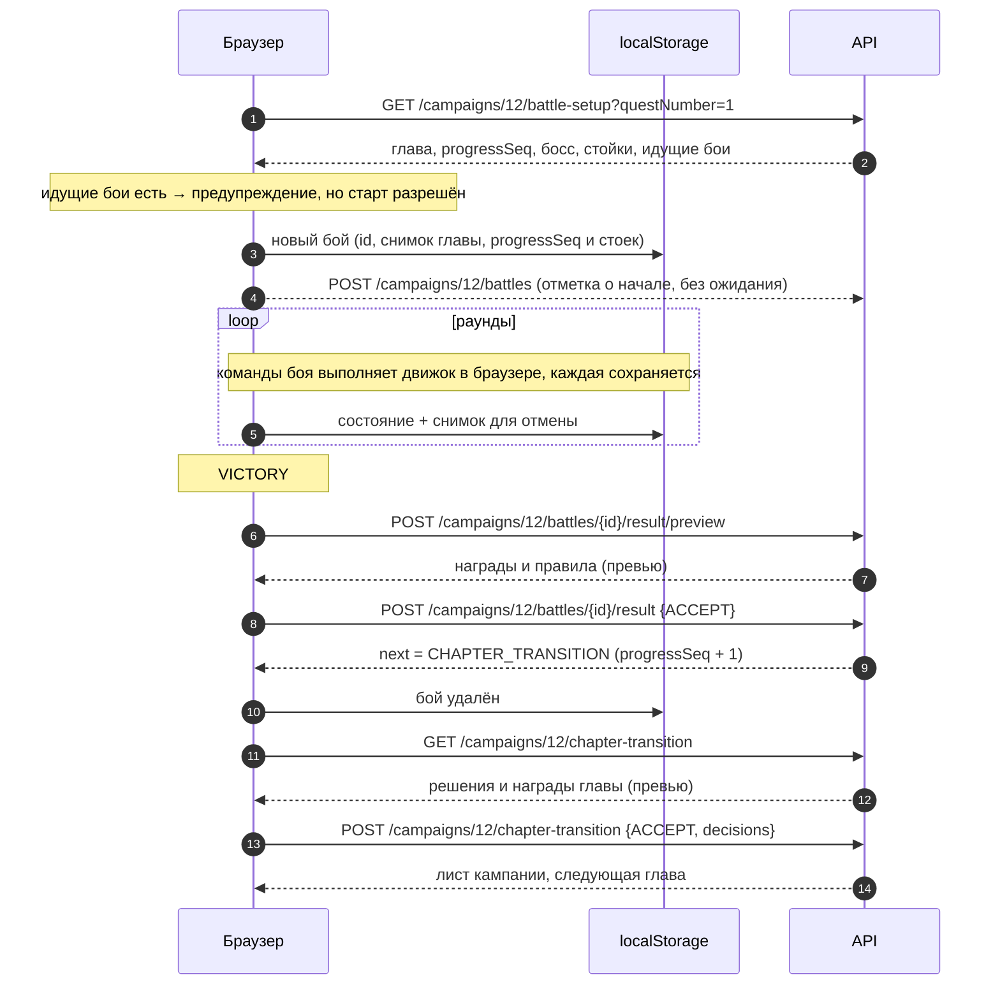
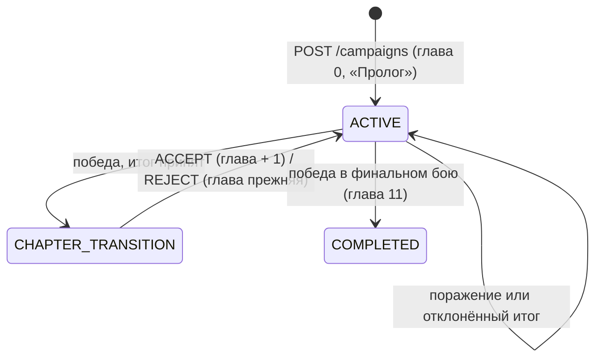

# Primal Web — REST API

Контракт между SPA и бэкендом. Общий обзор — [`architecture.md`](architecture.md), таблицы и язык
эффектов — [`data-model.md`](data-model.md). Машиночитаемая версия генерируется springdoc
(`/v3/api-docs`, профиль `dev`), по ней фронтенд собирает типизированный клиент (orval,
`frontend/src/api/generated`, хранится в git). Правила контракта: все поля ответов присутствуют всегда и в
схеме обязательны; `null` допускается только у полей с аннотацией `@ApiNullable`; ответы —
`application/json`; у контроллера — тег модуля (`catalog`), по нему orval раскладывает клиент по файлам.

Бой идёт в браузере ([`battle.md`](battle.md)), поэтому команд боя в API нет. Экспедиция использует
только каталог и работает без входа. Для кампании сервер отдаёт подсказки к подготовке боя, хранит
отметки о начатых боях для предупреждения участников (§6) и принимает итоговый результат (§7).

---

## 1. Соглашения

| Тема | Правило |
|------|---------|
| База | `/api/v1`, JSON UTF-8, поля в camelCase, время — ISO-8601 UTC |
| Перечисления | Коды `UPPER_SNAKE` (`FIRE`, `DAREON`, `IN_PROGRESS`); русские названия — из `GET /catalog/dictionaries` |
| Аутентификация | Cookie устройства `PRIMAL_DEVICE` (HttpOnly, Secure, SameSite=Lax). Выдаётся после регистрации или входа по логину и паролю (пользователь) или при входе по ссылке (гость). HTTP-сессий нет. Каталог и экспедиция — без входа |
| CSRF | Cookie `XSRF-TOKEN` → заголовок `X-XSRF-TOKEN` во всех POST/PUT/PATCH/DELETE; без заголовка — `403 FORBIDDEN`. Cookie приходит с ответом на любой запрос; перед первым изменяющим запросом её можно получить `GET /auth/csrf` → 204 |
| Конкурентность | Правка кампании и переход главы передают `expectedVersion`; при расхождении — `409 VERSION_CONFLICT` с актуальным состоянием в `current`. Результат боя идемпотентен по своему `id` (§7) |
| Доступ | Владелец или обладатель ссылки (§9). Нет доступа → `404` (факт существования не раскрывается); действие только для владельца → `403 OWNER_ONLY` |
| Обновления | SSE-поток кампании `…/events` уведомляет о новой версии (§9.3) |
| Кэш каталога | `ETag` = контрольная сумма каталога, `Cache-Control: max-age=3600` |
| Ошибки | RFC 9457 `application/problem+json` с полем `code` |
| Номер запроса | Каждый ответ несёт `X-Request-Id` (свой или от прокси); по нему запрос ищется в логах сервера (поле `requestId`) |

### 1.1 Ошибки

```json
HTTP/1.1 409 Conflict
Content-Type: application/problem+json

{
  "type": "https://primal.app/problems/version-conflict",
  "title": "Состояние изменилось",
  "status": 409,
  "code": "VERSION_CONFLICT",
  "detail": "Кампания уже изменена на другом устройстве (версия 42, ожидалась 41).",
  "current": { "...": "актуальный CampaignSheet" }
}
```

| HTTP | `code` | Когда |
|------|--------|-------|
| 400 | `VALIDATION_FAILED` | Нарушены ограничения полей; подробности в `errors: [{field, message}]` |
| 401 | `UNAUTHENTICATED` | Нет действующего устройства (cookie отсутствует, устройство отозвано или простаивало больше года) |
| 403 | `OWNER_ONLY` | Удаление кампании или управление ссылкой — только владельцу |
| 403 | `ACCOUNT_REQUIRED` | Гость пытается создать кампанию |
| 404 | `NOT_FOUND` | Нет ресурса или нет доступа к нему |
| 404 | `SHARE_LINK_INVALID` | Ссылка подделана, отозвана или перевыпущена |
| 409 | `VERSION_CONFLICT` | `expectedVersion` устарел |
| 409 | `CHAPTER_TRANSITION_PENDING` | Сначала завершите переход главы |
| 409 | `CAMPAIGN_CHANGED` | Пока шёл бой, кампания изменилась (например, принята чужая победа — первая принятая победа закрывает главу); причины — в `reasons` (§7.3) |
| 422 | `CAMPAIGN_LIMIT_REACHED` | У пользователя уже 10 кампаний |
| 422 | `SKILL_LOCKED` | Ступень 2 без ступени 1, ступень уже открыта, снятие ступени 1 при открытой 2 |
| 422 | `NOT_ENOUGH_RESOURCES` | Количество ресурса ушло бы ниже 0 |
| 422 | `QUEST_NOT_OPEN` | Подготовка боя или «Выполнено» по заданию, которое не открыто |
| 422 | `QUEST_NOT_COMPLETED` | «Отмена» у задания, которое не выполнено |
| 422 | `BOSS_REQUIRED` | Результат боя без задания, босс не выбран (42.4) |
| 422 | `FINAL_BOSS_REQUIRED` | В главе 11 доступен только бой с финальным боссом |
| 422 | `DECISION_REQUIRED` | «Принять» переход главы без ответа на решение |
| 400 | `INVALID_CREDENTIALS` | Неверный логин или пароль; при смене пароля — неверный текущий пароль |
| 409 | `LOGIN_TAKEN` | Логин уже зарегистрирован (регистрация или смена логина) |
| 429 | `RATE_LIMITED` | Слишком частые регистрации, попытки входа или входы по ссылкам; `Retry-After` — через сколько секунд повторить |

---

## 2. Обзор эндпоинтов

| Метод и путь | Назначение | Аналог в `app` |
|--------------|-----------|----------------|
| **Вход и устройства** | | |
| `POST /auth/register` | Регистрация: логин, пароль, имя; запомнить устройство | — |
| `POST /auth/login` | Вход по логину и паролю, запомнить устройство | — |
| `GET /auth/me` · `PATCH /auth/me` | Кто я (пользователь или гость), имя | — |
| `PUT /auth/me/login` · `PUT /auth/me/password` | Смена логина и пароля | — |
| `POST /auth/logout` | Выйти на этом устройстве | — |
| `GET /auth/devices` · `DELETE /auth/devices/{id}` · `POST /auth/devices/revoke-others` | Мои устройства, отзыв | — |
| **Ссылки и совместная игра** | | |
| `GET /share/{token}` · `POST /share/{token}/join` | Что за приглашение; получить доступ | — |
| `GET` · `POST` · `DELETE /campaigns/{id}/share-link` | Ссылка на кампанию: показать, создать или перевыпустить, отозвать | — |
| `GET /campaigns/{id}/events` | SSE-уведомления об изменениях кампании | — |
| **Каталог** (без входа) | | |
| `GET /catalog/dictionaries` | Стихии, материи, растения, классы, ветви: коды и названия | `displayName` в enum |
| `GET /catalog/bosses` | Боссы со стойками по сложностям | `bosses` |
| `GET /catalog/quests` · `GET /catalog/quests/{number}` | Задания: босс, награды, правила с формулировками | `task_info` |
| `GET /catalog/chapters` | Главы: эффекты и решения с формулировками | `chapter_info` |
| `GET /catalog/achievements` | Известные достижения (автодополнение) | — |
| **Кампании** | | |
| `GET /campaigns` · `POST /campaigns` | Список и создание | `onCampaignModeSelected`, `onStartCampaign` |
| `GET /campaigns/{id}` | Лист кампании целиком | `loadCampaignSheet` |
| `PATCH /campaigns/{id}` | Название, заметки, ручная правка главы | `onSaveNotes`, `onUpdateChapter` |
| `DELETE /campaigns/{id}` | Удаление | `onDeleteCampaign` |
| `PATCH /campaigns/{id}/hunters/{hunterId}` | Имя игрока | — |
| `POST /campaigns/{id}/hunters/{hunterId}/skills` | Открыть ступень навыка | `onUnlockSkill` |
| `DELETE /campaigns/{id}/hunters/{hunterId}/skills/{branch}/{tier}` | Снять ступень (исправление ошибки) | — |
| `POST /campaigns/{id}/hunters/{hunterId}/resources/adjust` | ± ресурсы | `onResourceIncrement/Decrement` |
| `POST /campaigns/{id}/quests/{number}/complete` | «Выполнено» + открыть зависимые | `onCompleteQuest` |
| `POST /campaigns/{id}/quests/{number}/reopen` | «Отмена» у выполненного | `onUncompleteQuest` |
| `PUT /campaigns/{id}/quests/open` | Редактор открытых заданий | `onSaveQuestEdits` |
| `POST /campaigns/{id}/achievements` · `DELETE …/{achievementId}` | Добавить и удалить достижение | `onAddAchievement`, `onDeleteAchievement` |
| **Бой кампании** (сам бой — в браузере, `battle.md`) | | |
| `GET /campaigns/{id}/battle-setup` | Подсказки для подготовки боя | `startBattleInternal`, `syncPreBattleBoss` |
| `POST /campaigns/{id}/battles` | Отметка о начале боя (предупреждение другим, не блокирует) | — |
| `GET /campaigns/{id}/battles` | Идущие бои и история | — |
| `DELETE /campaigns/{id}/battles/{battleId}` | Снять отметку («Бросить бой») | `resetBattle` |
| `POST /campaigns/{id}/battles/{battleId}/result/preview` | Превью наград по результату боя | `QuestRewardsDialog` |
| `POST /campaigns/{id}/battles/{battleId}/result` | Принять (в том числе с правками) или отклонить результат | `onQuestRewardsAccept`, `onConfirmVictory`, `onDefeatRewardsAccept` |
| **Переход главы** | | |
| `GET /campaigns/{id}/chapter-transition` | Превью перехода главы (с учётом ответов на решения) | `ChapterDecisionDialog`, `ChapterRewardsDialog` |
| `POST /campaigns/{id}/chapter-transition` | Принять или отклонить переход главы | `onChapterRewardsAccept/Reject` |

Все пути ниже указаны относительно `/api/v1`.

---

## 3. Регистрация, вход и устройства

Вход — по логину и паролю: логин — свободное поле (задачи 8.1–8.3; до задачи 8.3 логином был номер
телефона). Регистрация сразу выполняет вход. Браузер запоминается cookie устройства, поэтому вводить пароль
каждый раз не нужно.

```http
POST /auth/register
{ "login": "alice", "password": "correct horse", "displayName": "Алиса" }
→ 201, Set-Cookie: PRIMAL_DEVICE=…; Path=/api; Max-Age=34560000; HttpOnly; SameSite=Lax  (+ Secure на https)
{
  "user": { "id": 7, "login": "alice", "displayName": "Алиса", "passwordSet": true },
  "device": { "id": "a41f…", "userAgent": "Chrome, Android" }
}

POST /auth/login
{ "login": "alice", "password": "correct horse" }
→ 200, Set-Cookie: PRIMAL_DEVICE=…            // тело — как у регистрации
```

Правила полей (нарушение — `400 VALIDATION_FAILED` с `errors: [{field, message}]`):

| Поле | Правило |
|------|---------|
| `login` | Обязательно — это логин. Латиница, цифры, «.», «_», «-», 3–32 символа. Пробелы по краям убираются, регистр приводится к нижнему (`Alice` → `alice`). Уже зарегистрирован — `409 LOGIN_TAKEN`. Другим участникам кампаний логин не показывается |
| `password` | 8–64 символа и не больше 72 байт в UTF-8 (предел bcrypt: 36 кириллических букв). Хранится только хеш `{bcrypt}…` |
| `displayName` | Обязательно, до 60 символов: имя видят участники кампаний в истории боёв |

У старых аккаунтов, где логином был телефон, он перенесён как есть: `+79123456789` → `89123456789`
(миграция `V5__free_login.sql`). Аккаунты по почте получили логин `user<id>`.

Незарегистрированный логин и неверный пароль неразличимы: `400 INVALID_CREDENTIALS` «Неверный логин или
пароль.», по времени ответа тоже (для неизвестного логина сверяется пароль с фиктивным хешем). Ограничения
частоты — `429 RATE_LIMITED` с заголовком `Retry-After` и полем `retryAfter` (секунды): с одного IP —
20 регистраций (`PRIMAL_REGISTRATIONS_PER_IP_HOUR`) и 60 попыток входа (`PRIMAL_LOGINS_PER_IP_HOUR`) в час;
по одному логину — 10 попыток входа и смены пароля за 15 минут.

Если в этом браузере был выполнен вход другим аккаунтом, прежнее устройство отзывается. Если браузер уже
был гостевым устройством (открывал ссылку), новое устройство не создаётся: гостевое привязывается к
пользователю, и его доступы по ссылкам переходят на аккаунт.

```http
GET /auth/me
→ 200 { "kind": "USER", "user": { "id": 7, "login": "alice", "displayName": "Алиса", "passwordSet": true }, "device": { "id": "a41f…", "displayName": null } }
→ 200 { "kind": "GUEST", "user": null, "device": { "id": "c9d0…", "displayName": "Вадим" } }
→ 401 UNAUTHENTICATED                       // нет действующего устройства

PATCH /auth/me
{ "displayName": "Алиса" }                  // у пользователя — имя аккаунта, у гостя — имя устройства
→ 200 (как GET /auth/me)                    // имя показывается в истории боёв кампании

PUT /auth/me/login
{ "login": "alice2" }                       // новый логин; пусто — 400, занят — 409 LOGIN_TAKEN
→ 200 (как GET /auth/me)                    // гость — 403 ACCOUNT_REQUIRED

PUT /auth/me/password
{ "currentPassword": "correct horse", "newPassword": "brand new pass" }
→ 204                                       // неверный текущий — 400 INVALID_CREDENTIALS; гость — 403

POST /auth/logout → 204                     // отзывает текущее устройство и удаляет cookie (и у гостя)

GET /auth/devices                           // только пользователь; гость — 403 ACCOUNT_REQUIRED
→ 200 [ { "id": "a41f…", "userAgent": "Chrome, Android", "createdAt": "…", "lastSeenAt": "…", "current": true } ]
DELETE /auth/devices/{id}          → 204    // чужое или отозванное — 404; отзыв текущего стирает cookie
POST   /auth/devices/revoke-others → 204    // «Выйти на всех других устройствах»

GET /auth/csrf → 204                        // выдаёт cookie XSRF-TOKEN, если её ещё нет
```

Пустое `displayName` в `PATCH /auth/me` сбрасывает имя (пробелы по краям обрезаются, до 60 символов).
Пустое имя пользователя показывается другим участникам как «Игрок» — логин им не виден.
`passwordSet: false` — у аккаунтов, созданных входом по почте до задачи 8.1: их логин — `user<id>`, они
работают на запомненных устройствах и задают логин (`PUT /auth/me/login`) и пароль (`PUT /auth/me/password`
без `currentPassword`), после чего входят по ним где угодно.
Устройство, не заходившее больше года, отключается (`401`); cookie продлевается тем же токеном, если с
прошлой выдачи прошло больше 30 дней.

---

## 4. Каталог

```http
GET /catalog/dictionaries
→ 200
{
  "elements":  [ { "code": "FIRE", "name": "Огонь", "expansion": null }, …, { "code": "ICE", "name": "Лёд", "expansion": "ICE" } ],
  "materials": [ { "code": "SCALES", "name": "Чешуя" }, … ],
  "plants":    [ { "code": "NILLEA", "name": "Ниллея" }, … ],
  "hunterClasses": [ { "code": "DAREON", "name": "Дареон" }, … ],
  "skillBranches": [ { "code": "A", "name": "А" }, … ],
  "difficultyByChapter": [ { "chapters": [0], "difficulty": 0 }, { "chapters": [1,2,3], "difficulty": 1 },
                           { "chapters": [4,5,6,7], "difficulty": 2 }, { "chapters": [8,9,10,11], "difficulty": 3 } ]
}

GET /catalog/bosses
→ 200
[
  {
    "code": "VIRAXEN", "name": "Вираксен", "element": "FIRE", "sortOrder": 10,
    "difficulties": {
      "0": [ { "stance": 1, "toughnessPerHunter": 2, "stanceChange": { "mode": "HEALTH", "atHealth": 7 } },
             { "stance": 2, "toughnessPerHunter": 3, "stanceChange": { "mode": "HEALTH", "atHealth": 3 } },
             { "stance": 3, "toughnessPerHunter": 4, "stanceChange": { "mode": "FINAL", "atHealth": null } } ],
      "1": [ … ]
    }
  },
  { "code": "AWAKENED", "name": "Пробуждённый", "element": null, "difficulties": { "3": [ … 5 стоек … ] } }
]

GET /catalog/quests/1
→ 200
{
  "number": 1, "name": "Память пустыни",
  "boss": { "code": "TORAMAT", "name": "Торамат", "element": "HORN" },
  "expansion": null,
  "victory": {
    "resources": { "BONES": 2, "ZLATIA": 2, "NILLEA": 2, "TARMARET": 1, "ALBALACEA": 1, "SELICORNIA": 1 },
    "openQuests": [], "achievements": [], "rewardCards": [], "messages": [],
    "rules": [ "Если текущая глава 1 или 2, то добавить задание 4, иначе добавить задание 6" ]
  },
  "defeat": { "resources": {}, "openQuests": [6], "achievements": [], "rewardCards": [], "messages": [], "rules": [] }
}
```

Достижения в наградах — объекты `{ "code": "TAYNY_PROSHLOGO", "name": "Тайны прошлого" }`. `rules` —
формулировки условий верхнего уровня; безусловные эффекты разложены по полям.

```http
GET /catalog/chapters
→ 200
[
  {
    "chapter": 7,
    "resources": {}, "openQuests": [], "expireQuests": [7, 9, 11],
    "expireAllQuests": false, "forgeLevelUp": false, "labLevelUp": false, "hunterKitUpgrade": true,
    "achievements": [], "messages": [], "finalBattle": null,
    "rules": [ "Если есть достижение «Гербарий», добавить задание 24",
               "Если есть достижение «Фолиант о чудовищах», добавить задание 33" ],
    "decisions": [
      { "code": "TRAIN_WITH_VOLTYAR", "question": "Хотите ли вы тренироваться в лагере у Волтьяра?",
        "options": [ { "code": "YES", "label": "Да", "achievements": [ { "code": "GOLOS_VOLTYARA", "name": "Голос Волтьяра" } ] },
                     { "code": "NO", "label": "Нет", "achievements": [] } ] }
    ]
  },
  …
]
```

Сами эффекты в формате YAML/`jsonb` наружу не выходят: клиенту нужны готовые списки и формулировки.
В главах условие с «иначе» формулируется как «открыть задание N, иначе добавить задание M» (как в app),
вложенное условие — после двоеточия: «Если есть достижение «Горящий уголёк»: если текущая глава 8, то
добавить задание 34, иначе добавить задание 27».

---

## 5. Кампании

### 5.1 Список и создание

```http
GET /campaigns
→ 200
[
  {
    "id": 12, "name": "Кампания Алисы", "chapter": 3, "status": "ACTIVE",
    "access": "OWNER",                    // OWNER | LINK (доступна по ссылке)
    "ownerName": "Алиса",
    "hunters": [ { "class": "DAREON", "playerName": "Алиса" }, { "class": "MIRA", "playerName": "Вадим" } ],
    "pendingTransition": false, "updatedAt": "2026-09-27T18:04:11Z"
  }
]

POST /campaigns
{
  "name": "Кампания Алисы",
  "hunters": [ { "class": "DAREON", "playerName": "Алиса" }, { "class": "MIRA", "playerName": "" } ]
}
→ 201, Location: /api/v1/campaigns/12, тело — CampaignSheet (глава 0 «Пролог»)
```

Проверки: название не пустое (≤ 100); **от 2 до 5 охотников** с неповторяющимися классами (иначе
`400 VALIDATION_FAILED`: «В отряде от 2 до 5 охотников» или «Классы охотников не должны повторяться», поле
`hunters` в `errors`); порядок охотников в запросе — порядок в отряде; все дополнения подключены, выбора в первой
версии нет; пустое имя игрока заменяется названием класса;
у пользователя меньше 10 собственных кампаний (иначе `422 CAMPAIGN_LIMIT_REACHED`; доступные по ссылке
не считаются). Создавать кампании может только пользователь с аккаунтом (`403 ACCOUNT_REQUIRED`).
После создания фронтенд сразу открывает подготовку пролога: Вираксен, сложность 0 (как в `app`).

### 5.2 Лист кампании

```http
GET /campaigns/12
→ 200 CampaignSheet
{
  "id": 12, "name": "Кампания Алисы", "version": 41,
  "chapter": 3, "status": "ACTIVE",
  "access": "OWNER",                     // OWNER | LINK; от него зависят «Удалить» и «Поделиться»
  "ownerName": "Алиса",
  "difficulty": 1,                       // уровень враждебности по главе
  "forgeLevel": 1, "labLevel": 1,
  "finalBoss": null,                     // { code, name } в главе 11
  "notes": "Мира нашла карту…",
  "hunters": [
    {
      "id": 31, "class": "DAREON", "playerName": "Алиса", "position": 1,
      "skills": [ { "branch": "A", "tier": 1 } ],
      "unlockableSkills": [ { "branch": "A", "tier": 2 }, { "branch": "B", "tier": 1 }, … ],
      "resources": { "BONES": 3, "BLOOD": 2, "FIRE": 2, "NILLEA": 2 }   // нулевые не передаются
    }
  ],
  "quests": {
    "open":      [ { "number": 4, "name": "Вожак стаи", "boss": { "code": "FELAXIR", "name": "Фелаксир", "element": "CRYSTAL" } } ],
    "completed": [ { "number": 1, "name": "Память пустыни", "boss": { … }, "closedInChapter": 2 } ],
    "expired":   [ { "number": 36, "name": "…", "boss": { … }, "closedInChapter": 3 } ]
  },
  "achievements": [ { "id": 5, "code": "ZATISHE", "name": "Затишье", "source": "QUEST", "grantedInChapter": 2 } ],
  "trophies": [ { "boss": { "code": "VIRAXEN", "name": "Вираксен", "element": "FIRE" }, "chapters": [0] } ],
  "activeBattles": [                     // идущие бои — баннер «Идёт бой: Вадим, задание 1, с 18:30» (§6.3)
    { "id": "5d1a…", "startedBy": { "kind": "GUEST", "name": "Вадим" }, "startedAt": "…", "quest": { … }, "boss": { … } }
  ],
  "recentBattles": [                     // 5 последних завершённых, полный список — §6.3
    { "id": "0b8f…", "result": "VICTORY", "questNumber": 1, "boss": { … }, "chapter": 2,
      "status": "APPLIED", "submittedBy": { "kind": "GUEST", "name": "Вадим" }, "submittedAt": "…" }
  ],
  "pendingTransition": false             // ждёт перехода главы
}
```

`quests.open[].closedInChapter` — `null`; `achievements[].code` — `null` у своих достижений, введённых
вручную; `finalBoss.element` у Пробуждённого — `null`. `activeBattles` — идущие бои без устаревших отметок
(§6.3), `recentBattles` — принятые и отклонённые итоги (задача 5.2).

Сам ход боя и неотправленный результат хранятся в браузере: лист знает только, что бой начат и кем.
Баннер «Результат боя не отправлен» показывает только тот браузер, где шёл бой (`battle.md` §9).

### 5.3 Правка кампании

```http
PATCH /campaigns/12
{ "expectedVersion": 41, "notes": "…", "name": "…", "chapter": 4 }   // все поля необязательны
→ 200 CampaignSheet
```

`expectedVersion` обязателен; остальные поля — только те, что меняются. Пустое название — `400`, заметки
— до 20 000 символов. Версия растёт при любом изменении кампании (охотники, навыки, ресурсы, задания,
достижения тоже). Две одновременные правки: вторая получает `409 VERSION_CONFLICT` (без `current`, если
конфликт обнаружила БД). Ручная правка главы растит `progress_seq`: бои, начатые раньше, устаревают (§7).
Ручная правка главы (0–11) недоступна, пока ждёт переход главы (`409 CHAPTER_TRANSITION_PENDING`).
Уровни кузни и лаборатории меняются только переходами глав. `DELETE /campaigns/{id}` — только владельцу
(`403 OWNER_ONLY`).

### 5.4 Охотники: навыки и ресурсы

```http
POST /campaigns/12/hunters/31/skills
{ "branch": "B", "tier": 1 }
→ 201 Hunter                              // 422 SKILL_LOCKED — ступень 2 без ступени 1 или уже открыта

DELETE /campaigns/12/hunters/31/skills/B/1
→ 200 Hunter                              // 422 SKILL_LOCKED — открыта ступень 2

POST /campaigns/12/hunters/31/resources/adjust
{ "changes": { "BONES": 1, "FIRE": -1 } }
→ 200 { "resources": { "BONES": 4, "FIRE": 1, … } }   // 422 NOT_ENOUGH_RESOURCES — всё или ничего
```

### 5.5 Задания

```http
POST /campaigns/12/quests/1/complete        // «Выполнено» вручную
→ 200
{
  "quest": { "number": 1, "status": "COMPLETED" },
  "opened": [4],
  "rules": [ { "description": "Если текущая глава 1 или 2, то добавить задание 4, иначе добавить задание 6",
               "result": "Добавлено задание 4." } ]
}
```
Открываются только задания из наград победы (безусловные и по условиям); материи, растения и
достижения не начисляются (qa 70). В `rules` — только правила, которые открывают задания. Задание должно
быть открыто (`422 QUEST_NOT_OPEN`).

```http
POST /campaigns/12/quests/1/reopen          // «Отмена» у выполненного: снова OPEN;
→ 200 CampaignSheet.quests                  // открытые им задания и награды не меняются (qa 119)
                                            // 422 QUEST_NOT_COMPLETED — задание не выполнено

PUT /campaigns/12/quests/open               // редактор: итоговый набор открытых заданий
{ "numbers": [2, 4, 36] }
→ 200 CampaignSheet.quests
```
Редактор добавляет недостающие задания как `OPEN` и удаляет открытые, которых нет в списке. Выполненные
и истёкшие задания он не трогает (D-5). Задание вне каталога — `400 VALIDATION_FAILED`.

### 5.6 Достижения

```http
POST /campaigns/12/achievements
{ "name": "голос  волтьяра" }
→ 201 { "id": 9, "code": "GOLOS_VOLTYARA", "name": "Голос Волтьяра", "source": "MANUAL", "grantedInChapter": 7,
        "matchedCatalog": true }             // своё достижение: code = null, matchedCatalog = false
```
Имя нормализуется (регистр, ё/е, пробелы) и сопоставляется с каталогом. Если в кампании уже есть
равнозначное достижение в другом написании, оно заменяется новым (как в `app`, 42.1).

```http
DELETE /campaigns/12/achievements/9 → 204
```

---

## 6. Бой кампании: подготовка и старт

Сам бой идёт в браузере (`battle.md`). Сервер помогает подготовиться и хранит отметки о начатых боях,
чтобы предупредить других участников. Отметки ничего не блокируют: начать бой можно всегда.

### 6.1 Подготовка

```http
GET /campaigns/12/battle-setup?questNumber=1
→ 200
{
  "campaignId": 12,
  "chapter": 2,                          // снимок главы
  "progressSeq": 7,                      // снимок счётчика прогресса: браузер отправит его с результатом
  "purpose": "QUEST",                    // PROLOGUE | QUEST | FREE | FINAL
  "difficulty": 1,                       // по главе; игрок может изменить
  "hunterCount": 3,                      // по составу кампании
  "openQuests": [ { "number": 1, "name": "Память пустыни", "boss": { "code": "TORAMAT", "name": "Торамат", "element": "HORN" }, "closedInChapter": null }, … ],
  "boss": { "code": "TORAMAT", "name": "Торамат", "element": "HORN" },
  "stances": [                           // стойки босса выбранной сложности: браузер сохраняет их в бою
    { "stance": 1, "toughnessPerHunter": 5,  "stanceChange": { "mode": "HEALTH", "atHealth": 7 } },
    { "stance": 2, "toughnessPerHunter": 7,  "stanceChange": { "mode": "HEALTH", "atHealth": 3 } },
    { "stance": 3, "toughnessPerHunter": 10, "stanceChange": { "mode": "FINAL" } }
  ],
  "forcedBoss": null,                    // в главе 11 — { "code": "AWAKENED", … }: выбора задания нет
  "activeBattles": [                     // идущие бои (§6.3) — для предупреждения
    { "id": "5d1a…", "startedBy": { "kind": "GUEST", "name": "Вадим" }, "startedAt": "2026-09-27T18:30:00Z",
      "quest": { "number": 1, "name": "Память пустыни", "boss": { … }, "closedInChapter": null },
      "boss": { "code": "TORAMAT", "name": "Торамат", "element": "HORN" } }
  ]
}
```

- `purpose` определяется по кампании: задан финальный босс (глава 11) → `FINAL`, глава 0 → `PROLOGUE`
  (Вираксен, сложность 0), `questNumber` передан → `QUEST`, иначе `FREE` («Продолжить без задания», 42.4).
- `boss` — босс задания, пролога или финала; в бою без задания `null` — босса выбирает игрок. `forcedBoss`
  заполнен в прологе и финальном бою: выбрать задание или другого босса нельзя. `stances` — стойки `boss`
  на уровне `difficulty`.
- Сложность — по главе (0; 1–3 → 1; 4–7 → 2; 8–11 → 3). Если у босса нет такой сложности, а доступна одна,
  берётся она (Пробуждённый — 3, 42.4).
- Отказы: `409 CHAPTER_TRANSITION_PENDING`; `409 CAMPAIGN_CHANGED` — кампания пройдена; `422 QUEST_NOT_OPEN`
  — задание не открыто или передано в прологе; `422 FINAL_BOSS_REQUIRED` — задание в главе 11. Идущие бои к
  отказу не приводят.
- Непустой `activeBattles` → перед стартом окно-предупреждение: «Уже идёт бой: Вадим, задание 1 «Память
  пустыни», с 18:30. Глава засчитывается по первой принятой победе: если она будет не ваша, результат
  вашего боя не примут. Начать бой?» [Отмена] [Начать бой].
- Экспедиция этот запрос не использует: боссы и стойки берутся из `GET /catalog/bosses`.

### 6.2 Отметка о начале боя

```http
POST /campaigns/12/battles
{
  "id": "0b8f6c1e-8a51-4a3e-9d7c-2f0f6a3f9b11",   // UUID боя, создан браузером
  "questNumber": 1,                                // null — пролог, финал или бой без задания
  "bossCode": "TORAMAT",                           // null — параметры введены вручную
  "difficulty": 1,
  "chapter": 2,
  "progressSeq": 7,
  "startedAt": "2026-09-27T18:35:00Z"
}
→ 201 { "id": "0b8f…", "status": "IN_PROGRESS", "otherActiveBattles": [ … ] }
```

- Повтор с тем же `id` → `200` с существующей записью (проверки не повторяются: кампания могла измениться).
- Проверки те же, что в подготовке; идущие бои не проверяются. В финальном бою `bossCode` — только финальный
  босс (`422 FINAL_BOSS_REQUIRED`); неизвестный `bossCode` — `400`.
- `purpose` записи — по кампании на момент старта; `chapter` и `progressSeq` — снимок из подготовки.
  `startedAt` — время браузера, но не позже времени сервера. Автор — устройство запроса.
- Отметка не меняет версию кампании: это не состояние кампании, а предупреждение для других.
- Если запрос не прошёл (нет сети), бой в браузере всё равно начинается; запись появится при отправке
  результата.

### 6.3 Бои кампании: идущие и история

```http
GET /campaigns/12/battles?status=IN_PROGRESS       // без status — вся история, новые сначала
→ 200 [ { "id": "0b8f…", "status": "IN_PROGRESS", "purpose": "QUEST", "questNumber": 1, "boss": { … },
          "difficulty": 1, "chapter": 2, "result": null, "roundsPlayed": null,
          "startedBy": { "kind": "USER", "name": "Алиса" }, "startedAt": "…",
          "submittedBy": null, "submittedAt": null, "stale": false } ]
```

`stale = true` — отметка `IN_PROGRESS` старше 24 часов (`primal.campaign.battle-warning-hours`) или бой
начат при другом `progressSeq` (до последней принятой победы или ручной правки главы). Такие бои в
предупреждениях (`activeBattles`, `otherActiveBattles`, лист кампании) не показываются.

```http
DELETE /campaigns/12/battles/0b8f…      → 204   // «Бросить бой» или снять чужую забытую отметку
```

Статус становится `ABANDONED`. Снять отметку может любой участник — это влияет только на предупреждения:
результат такого боя всё равно можно отправить. Браузер снимает отметку сам, когда игрок бросает бой
кампании или заменяет его новым боем.

---

## 7. Результат боя кампании

### 7.1 Результат

Браузер отправляет результат, когда бой закончился победой или поражением. Тело запроса одинаково для
превью и для применения:

```json
{
  "questNumber": 1,
  "bossCode": "TORAMAT",
  "difficulty": 1,
  "chapter": 2,                                    // из подготовки боя
  "progressSeq": 7,                                // из подготовки боя
  "result": "VICTORY",                             // VICTORY | DEFEAT
  "defeatReason": null,                            // ROUNDS | SURRENDER
  "roundsPlayed": 6,
  "startedAt": "2026-09-27T18:35:00Z",
  "finishedAt": "2026-09-27T19:05:00Z"
}
```

Поля старта повторяются на случай, если отметка о начале (§6.2) не дошла до сервера. Сервер не проверяет,
честно ли прошёл бой: игра кооперативная, а он не видит хода боя. Проверяется только согласованность
результата с кампанией (§7.3).

- `purpose` выводится из снимка: `questNumber` → `QUEST`, глава 0 → `PROLOGUE`, глава 11 → `FINAL`, иначе
  `FREE`. Боссом трофея в прологе всегда будет Вираксен, в финале — финальный босс, в бою по заданию — босс
  задания, в бою без задания — `bossCode`.
- У поражения обязательна `defeatReason` (`400`); у победы она не сохраняется.

### 7.2 Превью наград

```http
POST /campaigns/12/battles/0b8f…/result/preview
{ …результат… }
→ 200
{
  "result": "VICTORY",
  "purpose": "QUEST",
  "quest": { "number": 1, "name": "Память пустыни" },
  "rewards": {
    "trophy": { "code": "TORAMAT", "name": "Торамат" },
    "perHunter": { "HORN": 2, "BONES": 2, "ZLATIA": 2, "NILLEA": 2, "TARMARET": 1, "ALBALACEA": 1, "SELICORNIA": 1 },
    "achievements": [],
    "openQuests": [4],
    "rewardCards": [],
    "messages": []
  },
  "rules": [
    { "kind": "QUEST",
      "description": "Если текущая глава 1 или 2, то добавить задание 4, иначе добавить задание 6",
      "result": "Добавлено задание 4." }
  ],
  "next": "CHAPTER_TRANSITION",          // CHAPTER_TRANSITION | CAMPAIGN_SHEET | CAMPAIGN_COMPLETED
  "otherActiveBattles": [ … ],           // окно наград: «Приняв победу, вы закроете главу — результаты этих боёв не примут»
  "dismissConsequences": [               // текст окна подтверждения «Отклонить»
    "Задание 1 «Память пустыни» не будет отмечено выполненным.",
    "Трофей «Торамат» не будет получен.",
    "Охотники не получат ресурсы: Рог 2, Кости 2, Златия 2, Ниллея 2, Тармарет 1, Альбалацея 1, Селикорния 1.",
    "Не будет добавлено задание 4.",
    "Переход в главу 3 не состоится, глава останется 2.",
    "Награды можно внести вручную на листе кампании."
  ]
}
```

- Поражение: `trophy = null`, в `perHunter` нет стихий; `openQuests` и `achievements` — из наград за
  поражение (D-15, R-7); `next = CAMPAIGN_SHEET`.
- Пролог: трофей Вираксена и 2 «Огня» каждому охотнику. Фронтенд принимает их без показа окна (36.1).
- Бой без задания: трофей и стихии выбранного босса; задание не завершается (42.4).
- Бой без задания без выбранного босса (параметры введены вручную): превью без трофея и стихий, «Принять» →
  `422 BOSS_REQUIRED` «Босс не выбран — укажите его через «Редактировать»» (как в `app`).
- `perHunter` — стихии босса первыми, затем ресурсы задания; `openQuests` и `achievements` — только то, чего у
  кампании ещё нет. `rewardCards` и `messages` — инструкции игрокам, состояние кампании они не меняют.
- Превью ничего не записывает. Несогласованный с кампанией результат → `409 CAMPAIGN_CHANGED` (§7.3); превью
  боя с уже сохранённым итогом — тоже `409`.

### 7.3 Принять или отклонить

```http
POST /campaigns/12/battles/0b8f…/result
{ …результат…, "action": "ACCEPT" }                 // «Принять»
→ 200 { "next": "CHAPTER_TRANSITION", "campaign": CampaignSheet }

POST /campaigns/12/battles/0b8f…/result             // «Редактировать» → «Принять»
{
  …результат…, "action": "ACCEPT",
  "overrides": {
    "bossCode": "TORAMAT",
    "perHunter": { "HORN": 2, "BONES": 2, "ZLATIA": 1 },
    "openQuests": [4],
    "achievements": ["TAYNY_PROSHLOGO"]
  }
}

POST /campaigns/12/battles/0b8f…/result             // «Отклонить» после подтверждения
{ …результат…, "action": "DISMISS" }
→ 200 { "next": "CAMPAIGN_SHEET", "campaign": CampaignSheet }
```

- **Однократность.** Итог боя сохраняется один раз. Повтор запроса для уже принятого или отклонённого боя
  (обрыв сети, двойное нажатие) возвращает `200` с сохранённым итогом и ничего не применяет повторно.
- **Первая принятая победа закрывает главу.** Принятая победа увеличивает `progressSeq` кампании.
  Результат с устаревшим `progressSeq` не принимается — ни победа, ни поражение. Отклонённая игроком
  победа и принятое поражение главу не закрывают.
- **Согласованность** проверяется при превью и `ACCEPT`. `409 CAMPAIGN_CHANGED`, если с момента старта боя:
  - `progressSeq` изменился: принята чужая победа или сменилась глава;
  - кампания ждёт перехода главы или уже пройдена;
  - задание `questNumber` больше не открыто (его выполнили или оно истекло);
  - в главе 11 бой был не с финальным боссом.

  ```json
  { "status": 409, "code": "CAMPAIGN_CHANGED",
    "detail": "Пока шёл бой, кампания изменилась.",
    "reasons": ["Глава 2 уже завершена: принята победа в бою с боссом «Торамат» (результат от: Вадим). Результаты боёв, начатых раньше, не принимаются."],
    "closedBy": { "submittedBy": { "kind": "GUEST", "name": "Вадим" }, "submittedAt": "2026-09-27T19:02:00Z",
                  "boss": { "code": "TORAMAT", "name": "Торамат", "element": "HORN" } } }
  ```
  `closedBy` — победа, закрывшая главу: время экран показывает в часовом поясе браузера. Если главу
  изменили вручную, `closedBy` нет, а причина — «Глава изменилась, пока шёл бой».
  Экран предлагает «Отклонить результат»: `DISMISS` принимается всегда и только записывает бой в
  историю. При необходимости награды вносятся вручную на листе кампании.
- С `overrides` правила не вычисляются: применяются ровно переданные значения (как `PostVictoryDialog`),
  стихии босса сами не добавляются — они уже в `perHunter`. Задание по-прежнему выполняется победой, глава
  закрывается. Неизвестные коды — `400`; `overrides` сохраняются в записи боя.
- `action` обязателен (`400`). `DISMISS` записывает итог (`DISMISSED`) и автора, кампанию не меняет.
- Итог одной кампании применяется под блокировкой её строки: две победы одной главы не проходят проверку
  одновременно.
- `ACCEPT` в одной транзакции: трофей, ресурсы, задания, достижения, статус кампании
  (`CHAPTER_TRANSITION` или `COMPLETED`), `progressSeq + 1` для победы, итог и автор в записи боя.

---

## 8. Переход главы

После принятой победы кампания в статусе `CHAPTER_TRANSITION`. Превью учитывает ответы на решения
главы, переданные в запросе (`decision=<CODE>:<OPTION>`, параметр повторяется для каждого решения).

```http
GET /campaigns/12/chapter-transition?decision=TRAIN_WITH_VOLTYAR:YES
→ 200
{
  "fromChapter": 6, "toChapter": 7,
  "version": 44,
  "decisions": [
    { "code": "TRAIN_WITH_VOLTYAR", "question": "Хотите ли вы тренироваться в лагере у Волтьяра?",
      "options": [ { "code": "YES", "label": "Да" }, { "code": "NO", "label": "Нет" } ],
      "selected": "YES" }
  ],
  "decisionsComplete": true,
  "perHunter": {},
  "openQuests": [24],
  "expireQuests": [ { "number": 7, "wasOpen": true }, { "number": 9, "wasOpen": false } ],
  "achievements": [ { "code": "GOLOS_VOLTYARA", "name": "Голос Волтьяра" } ],
  "forgeLevelUp": false,
  "labLevelUp": false,
  "hunterKitUpgrade": true,
  "rewardCards": [],
  "messages": [],
  "finalBattle": null,
  "rules": [
    { "kind": "QUEST", "description": "Если есть достижение «Гербарий», добавить задание 24", "result": "Добавлено задание 24." },
    { "kind": "QUEST", "description": "Если есть достижение «Фолиант о чудовищах», добавить задание 33", "result": "Условие не выполнено, задание не добавляется." }
  ],
  "rejectConsequences": [                  // текст окна подтверждения «Отклонить»
    "Глава останется 6. После следующей победы переход в главу 7 будет предложен снова.",
    "Не будет получено достижение «Голос Волтьяра» (решение главы).",
    "Не будет добавлено задание 24.",
    "Не истечёт время заданий 7.",
    "Не будет улучшения набора охотника.",
    "Главу, задания и достижения можно изменить вручную на листе кампании."
  ]
}
```

`rejectConsequences` строит тот же планировщик, что и превью, поэтому список точно соответствует тому,
что не будет применено. Пункты без содержания (нет ресурсов, нет повышения кузни) не выводятся.

- Условия решений и главы вычисляются по одному снимку кампании до перехода: достижение, выданное ответом
  на решение, на условия этой же главы не влияет.
- `achievements` и `openQuests` — только то, чего у кампании ещё нет; `expireQuests[].wasOpen = false` —
  задание не открыто, его истечение ничего не изменит (в `rejectConsequences` такие не попадают).
- `rules[].kind` — вид правила: `QUEST` («Условные задания»), `ACHIEVEMENT`, `KIT`, `MESSAGE` («Условные
  награды»). Так же в превью итога боя (§7.2).
- Перехода нет (кампания `ACTIVE` или `COMPLETED`) → `409 CAMPAIGN_CHANGED`; неизвестное решение или
  вариант → `400`.

```http
POST /campaigns/12/chapter-transition
{ "action": "ACCEPT", "decisions": { "TRAIN_WITH_VOLTYAR": "YES" }, "expectedVersion": 44 }
→ 200 CampaignSheet                        // глава 7, статус ACTIVE

POST /campaigns/12/chapter-transition
{ "action": "REJECT", "expectedVersion": 44 }
→ 200 CampaignSheet                        // эффекты не применены, глава прежняя (как «Отклонить» в app)
```

«Отклонить» работает как в `app`, но сначала фронтенд показывает окно подтверждения:

> **Отклонить награды главы 7?**
> Приложение не применит эффекты главы:
> • *пункты `rejectConsequences`*
>
> [Вернуться] [Отклонить]

Только после «Отклонить» в этом окне отправляется `REJECT`. `expectedVersion` гарантирует, что
подтверждённый список относится к актуальному состоянию: если кто-то по ссылке успел изменить кампанию,
вернётся `409`, и окно покажет обновлённый список.

`ACCEPT` применяет в одной транзакции: `chapter = N`, `status = ACTIVE`, `progress_seq + 1` → эффекты
выбранных вариантов решений (достижения — `source = DECISION`) → эффекты главы (`CHAPTER`, в том числе
`final_boss_code` в главе 11). Задания и достижения записываются уже в новой главе. Без ответа на решение
— `422 DECISION_REQUIRED`. `REJECT`: `status = ACTIVE`, глава и `progress_seq` прежние.
Победа в финальном бою сразу переводит кампанию в `COMPLETED` (`next = CAMPAIGN_COMPLETED` в итоге боя).

---

## 9. Совместная игра

### 9.1 Ссылка: владелец

```http
POST /campaigns/12/share-link              // создать; если ссылка уже есть — перевыпустить (старая отзывается)
→ 201
{
  "url": "https://primal.app/s/Q2hhcHRlcjEy…",
  "createdAt": "2026-09-27T18:20:00Z",
  "joined": [ { "kind": "GUEST", "name": "Вадим", "joinedAt": "…" }, { "kind": "USER", "name": "Мира", "joinedAt": "…" } ]
}

GET    /campaigns/12/share-link → 200 (то же) | 404, если ссылки нет
DELETE /campaigns/12/share-link → 204      // отозвать: доступ по ссылке сразу пропадает у всех
```
Ссылкой делятся только кампанией: экспедиция проходит в одном браузере и на сервере не хранится. Все три
метода — только владельцу (`403 OWNER_ONLY`). Ссылку можно скопировать в любой момент: токен вычисляется
из id ссылки и серверного ключа. Окно «Поделиться» показывает ссылку и QR-код — удобно раздать телефонам
у стола.

### 9.2 Ссылка: приглашённый

```http
GET /share/{token}                         // без входа: что за приглашение
→ 200 { "kind": "CAMPAIGN", "name": "Кампания Алисы", "ownerName": "Алиса" } | 404 SHARE_LINK_INVALID

POST /share/{token}/join
{ "displayName": "Вадим" }                 // необязательно; гостю — имя в истории боёв
→ 200 { "kind": "CAMPAIGN", "id": 12 }
   Set-Cookie: PRIMAL_DEVICE=…             // если cookie ещё не было — создаётся гостевое устройство
```

- **Гость** (без cookie или с гостевым устройством): доступ записывается на устройство.
- **Вошедший пользователь**: доступ записывается на аккаунт и виден на всех его устройствах; кампания
  появляется в его списке с `access = LINK`.
- **Владелец**, открывший свою ссылку, ничего не получает — просто переходит к кампании.

Страница `/s/:token` вызывает `join`, заменяет адрес на `/campaigns/12` (`history.replaceState`) и
открывает лист кампании. Гостю доступно всё, кроме удаления кампании и управления ссылкой: он правит
лист, начинает бои и отправляет их результаты.

- Повторный `join` ничего не дублирует; гостю с именем в запросе оно обновляется.
- Подделанный, отозванный или перевыпущенный токен — `404 SHARE_LINK_INVALID` (и у `GET /share/{token}`).
- Не больше 30 вызовов `join` в час с одного IP (`PRIMAL_JOINS_PER_IP_HOUR`) — `429 RATE_LIMITED`.
- Гость, вошедший затем по логину и паролю (или зарегистрировавшийся) в этом браузере, сохраняет доступы: они переходят на аккаунт (§3).

### 9.3 Обновления в реальном времени

Ход боя другие участники не видят — он идёт в одном браузере. Они видят изменения листа кампании:
ресурсы, задания, отметки о начатых и брошенных боях, принятый результат боя, переход главы.

```http
GET /campaigns/12/events                   // Accept: text/event-stream

event: campaign.updated
data: {"campaignId":12,"version":42,"battles":false,"actor":{"kind":"GUEST","name":"Вадим"}}

event: access.revoked
data: {}
```

События только уведомляют: клиент сравнивает `version` со своей и при расхождении перезапрашивает
состояние (инвалидация запроса TanStack Query). Поэтому поток не передаёт данных сверх того, что
доступно по обычным запросам, а права проверяются при подписке. При отзыве ссылки или устройства
сервер отправляет `access.revoked` и закрывает поток. Каждые 25 секунд уходит комментарий-«пульс», чтобы
прокси не закрывали соединение; при обрыве браузер переподключается сам (`EventSource`).

- Поток открывается комментарием `:connected`, затем идут события. Подписка без доступа — `404`.
- `campaign.updated` отправляется после коммита изменения: правки листа (навыки, ресурсы, задания,
  достижения, заметки, глава), отметки о начале и брошенные бои, итоги боёв (в том числе отклонённые),
  переход главы. Несколько изменений одной кампании в одном запросе дают одно событие; откат — ни одного.
  `actor` — автор запроса (`null`, если изменение без запроса пользователя). `battles = true` — изменились
  бои (отметка о начале, брошенный, отклонённый или принятый бой): версия кампании при этом может не
  вырасти, но клиенту нужно перезапросить баннер идущих боёв и историю.
- `access.revoked` — отзыв или перевыпуск ссылки (у кого доступа больше нет), удаление кампании, выход или
  отзыв устройства подписчика.

---

## 10. Сценарии и состояния

### 10.1 Глава кампании



Состояния самого боя — `battle.md` §10.

### 10.2 Кампания


