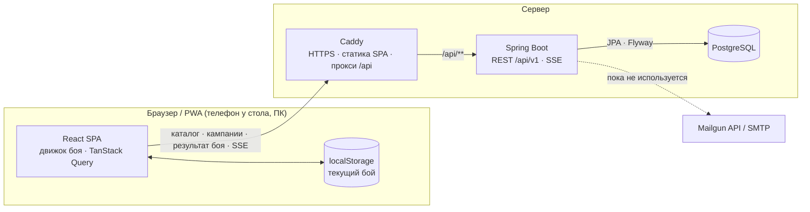

# Primal Web — архитектура

Веб-версия помощника для настольной игры «Primal. Пробуждение» — клиент-серверный аналог мобильного
приложения из `app/`. Источники требований: правила игры (`app/Primal. Пробуждение.md`), документация
мобильного приложения (`app/doc/*.md`) и его код (`app/shared`), где зафиксированы решения по спорным
местам правил (коды R-x, D-x, qa N).

Документы пакета:

| Документ | Содержание |
|----------|------------|
| `architecture.md` (этот) | Границы, стек, модули, ключевые решения, фронтенд, тестирование, этапы |
| [`battle.md`](battle.md) | Бой в браузере: состояние, команды, алгоритмы, отмена, хранение, отправка результата |
| [`data-model.md`](data-model.md) | Глоссарий, схема PostgreSQL (DDL), формат каталога и язык эффектов, перенос из Room |
| [`api.md`](api.md) | REST API: соглашения, ошибки, эндпоинты, сценарии |
| [`setup.md`](setup.md) | Как запустить сайт локально и на сервере |
| [`../implementationTasks.md`](../implementationTasks.md) | План реализации: задачи вместе с тестами |

---

## 1. Границы системы

**Паритет с мобильным приложением (MVP):**

- **Экспедиция** — отдельный бой: босс из базы или ручной ввод, уровень враждебности 0–3, любое число
  охотников (> 0, D-12); урон, раны, стойки I–IX, перенос урона при смене стойки (R-2), «Затвердевший» и
  «Устойчивость» (R-3), заживление раны (R-4), ярость и выплеск ярости (R-8), 10 раундов, «Сдаться»,
  отмена до 10 действий (D-4). **Доступна без входа.**
- **Кампания** — пролог и 11 глав; отряд из 2–5 охотников (8 классов; пятый игрок — в одном из
  дополнений), древо навыков (5 ветвей × 2 ступени), ресурсы (6 материй, 6 растений, 9 стихий); задания
  (каталог из 49), достижения, трофеи, кузня и лаборатория; награды задания и главы с условными
  правилами; решение главы 7; финальный бой с Пробуждённым (R-6).

**Как устроен бой.** Бой полностью проводится в браузере ([`battle.md`](battle.md)). Сервер отдаёт
характеристики монстров, а для кампании хранит отметки о начатых боях и принимает итоговый результат.
Бой кампании может начать любой участник, у которого есть доступ к кампании: владелец или получивший
ссылку. Если бой уже идёт, остальные видят предупреждение, но могут начать и свой. Главу закрывает первая
принятая победа.

**Новое по сравнению с `app`:**

- вход по логину и паролю (логин — свободное поле); устройство
  запоминается, повторно входить не нужно;
- прямая ссылка на кампанию: любой, у кого она есть, играет и вносит изменения без регистрации;
- лист кампании общий: изменения других участников приходят сразу (SSE);
- бой не теряется при закрытии вкладки — он сохраняется в браузере;
- экспедиция работает без интернета после первого открытия сайта (PWA).

**Сознательно не поддерживается:** один бой на нескольких устройствах одновременно и перенос
незаконченного боя на другое устройство — это следствие боя в браузере.

**Вне MVP** (см. §10): ссылки только для просмотра, вариант «Опытные охотники», учёт снаряжения, зелий
и карт наград, обмен ресурсами, админка каталога.

---

## 2. Технологический стек

| Слой | Выбор | Почему |
|------|-------|--------|
| Язык / платформа бэкенда | Java 25 (LTS) | Требование: Java. Records, sealed-интерфейсы и pattern matching хорошо ложатся на язык эффектов |
| Фреймворк | Spring Boot 4.x: Web MVC, Data JPA (Hibernate 7), Security, Mail, Validation, Actuator | Требование: Spring. MVC (не WebFlux): нагрузка небольшая, блокирующий код проще |
| Почта | Mailgun по HTTP API или любой SMTP-провайдер (прод), Mailpit (разработка и тесты); выбор — `MAIL_PROVIDER` | Коды входа. У Mailpit есть HTTP API — автотесты читают из него коды |
| Обновления в реальном времени | Server-Sent Events (`SseEmitter`) | Обновления листа кампании у всех участников. Поток «сервер → клиент» проще WebSocket и без настройки проходит через обратный прокси |
| БД | PostgreSQL 17+ | Требование. Используем `jsonb`, частичные уникальные индексы, `ON CONFLICT` |
| Миграции | Flyway: версионные — схема, repeatable — каталог | Правка данных каталога без цепочки миграций-пересевов (см. решение 7) |
| API-контракт | springdoc-openapi (code-first) → `openapi.json` в сборке | Фронтенд генерирует типизированный клиент из того же контракта |
| Сборка | Gradle (Kotlin DSL), version catalog | Как в `app/` |
| Фронтенд | React 19 + TypeScript + Vite | Самая большая экосистема; типы из OpenAPI |
| Бой | Движок на TypeScript (`src/domain/battle`), состояние в `localStorage` | Бой в браузере: без сети и задержек, переживает закрытие вкладки |
| Данные на клиенте | TanStack Query + клиент, сгенерированный orval | Кэш, повторные запросы, инвалидация после изменений |
| UI-кит | Mantine | Готовые мобильные компоненты (модальные окна, степперы, вкладки) |
| PWA | vite-plugin-pwa | Установка на телефон «как приложение»; кэш статики и каталога — экспедиция без сети |
| Развёртывание | Docker Compose: `postgres`, `backend`, `web` (Caddy: статика + прокси `/api` + HTTPS); локально + `mailpit` | Один домен — cookie без CORS. Caddy сам получает и продлевает сертификат Let's Encrypt — на сервере не нужны certbot и ручная настройка TLS |

Если команда предпочитает проверенную ветку — Spring Boot 3.5 + Java 21: архитектура от этого не меняется.



---

## 3. Бэкенд: модульный монолит

Сервисов на такой объём не нужно: один деплой, пакеты по фичам, границы проверяются ArchUnit.

```
com.primal
├── common        ошибки (ProblemDetail), часы, общие типы, конфигурация Jackson
├── identity      регистрация и вход по логину и паролю, пользователи, устройства, аутентификация по cookie
├── access        права на кампании (владелец или ссылка), ссылки-приглашения
├── mail          отправка писем (SMTP или Mailgun); пока не используется
├── realtime      SSE-уведомления об изменениях кампании
├── catalog       справочники: боссы и стойки, задания, главы, достижения; read-only, кэш в памяти
├── rules         ЧИСТАЯ Java без Spring и JPA: язык эффектов (планировщик и формулировки)
├── campaign      кампании, охотники, навыки, ресурсы, задания, достижения, трофеи, заметки
└── progression   бои кампании: подготовка, отметки о начале, результаты; переход главы (превью → применение)
```

Внутри фичи: `api` (контроллеры, DTO) → `app` (сервисы, транзакции) → `domain` (сущности) → `infra`
(репозитории). Правила ArchUnit: `rules` не зависит ни от чего, кроме JDK; контроллеры не обращаются к
репозиториям напрямую; фичи общаются через сервисы `app`, а не через чужие репозитории.

`progression` зависит от `campaign` (состояние кампании для боя — `CampaignService.battleContext`), но не
наоборот: лист кампании получает идущие и последние бои через интерфейс `campaign.CampaignBattles`, который
реализует `progression.CampaignBattleQueries`.

### 3.1 Модуль `rules`

Логика наград и условий — чистые функции над неизменяемыми значениями, прямой перенос
`ConditionOutcomes.kt`. Логика боя живёт на фронтенде (`battle.md`).

```java
// Язык эффектов: награды и условия заданий и глав (см. data-model.md §4)
public sealed interface Effect permits Resources, OpenQuest, ExpireQuests, ExpireAllQuests,
        GrantAchievement, ForgeLevelUp, LabLevelUp, HunterKitUpgrade, RewardCards, Message,
        FinalBattle, Conditional {}
public sealed interface Condition permits HasAchievement, ChapterIn, QuestAvailable, Not, All, Any {}

public final class EffectPlanner {
    /** Чистая функция: какие действия будут выполнены и почему. Одна и та же для превью и применения. */
    public Plan plan(List<Effect> effects, CampaignFacts facts) { ... }
}
public record Plan(List<Effect> actions, List<RuleExplanation> explanations) {}
```

---

## 4. Ключевые решения

**1. Бой проводится в браузере** (решение от 27.09.2026). Движок боя — чистый TypeScript
(`src/domain/battle`), перенос `MonsterExt.kt` и `BattleViewModel.kt`. Во время боя браузер не обращается
к серверу, поэтому бой идёт без задержек и работает без интернета.

| Что | Где |
|-----|-----|
| Раны, стойки, перенос урона, статусы, ярость, раунды, поражение, отмена | браузер: `src/domain/battle` |
| Ввод урона (таймер 2 с), подсветка, вибрация, окна, запрет выключения экрана | браузер: `src/features/battle` |
| Сохранение незаконченного боя | браузер: `localStorage` |
| Боссы и стойки, подсказки к подготовке боя кампании | сервер: `GET /catalog/bosses`, `GET /campaigns/{id}/battle-setup` |
| Отметка о начале боя кампании — предупреждение другим участникам | сервер: `POST /campaigns/{id}/battles` |
| Итог боя кампании, награды, переход главы | сервер: `…/battles/{id}/result`, `…/chapter-transition` |

Следствия: один бой — одно устройство; о бое кампании сервер знает только, что он начат и чем кончился;
экспедиция вообще не обращается к серверу, кроме загрузки каталога. Правила игры в браузере и расчёт
наград на сервере — две независимые половины, связанные только результатом боя.

**2. Сохранение и отмена в браузере.** После каждой команды бой записывается в `localStorage` вместе со
стеком из 10 снимков для отмены (D-4). Вкладку можно закрыть — главное меню предложит «Вернуться к бою».
Отменить можно любую команду, в том числе ошибочную «победу», пока результат не отправлен
(`battle.md` §6–7).

**3. Бои кампании: предупреждение при старте, первая победа закрывает главу** (решение от 27.09.2026).
Браузер создаёт `id` боя (UUID) и при старте отправляет отметку о начале. Если в кампании уже идёт бой,
экран подготовки предупреждает об этом, но начать ещё один бой можно всегда; не дошедшая до сервера
отметка тоже не мешает бою. У кампании есть счётчик `progress_seq`: он растёт при принятой победе и смене
главы, а бой запоминает его при старте. Результат с устаревшим счётчиком не принимается, поэтому первая
принятая победа закрывает главу для всех боёв, начатых раньше, — `409 CAMPAIGN_CHANGED` с причинами. Итог
боя сохраняется один раз: повторная отправка (обрыв сети, двойное нажатие) не применит награды дважды.
Честность самого боя сервер не проверяет: игра кооперативная, а сервер не видит хода боя.

**4. Оптимистичная блокировка кампании.** У `campaign` есть `version`; правки листа и переход главы
передают `expectedVersion`. Если версия не совпала — `409 VERSION_CONFLICT` с актуальным состоянием.
Это защищает от двойного нажатия и от одновременных правок участников и заменяет флаги `isSaving` из
`app`. Клиент, получивший 409, показывает «Состояние обновилось» и данные заново.

**5. Итоги: превью → применение.** Награды за бой и за переход главы сначала вычисляются чистой функцией
и показываются (`…/battles/{id}/result/preview`, `GET …/chapter-transition`); «Принять» применяет тот же расчёт
в одной транзакции. Отсюда следствия:
- показанное всегда совпадает с применённым (в `app` это достигалось общей функцией `evaluate…`);
- решение главы 7 передаётся вместе с «Принять», поэтому не нужно выдавать достижение и отзывать его
  при «Отклонить» (D-10);
- неотправленный результат боя не теряется: он хранится в браузере, где шёл бой, а меню и лист кампании
  в этом браузере показывают баннер (D-13);
- «Отклонить» переход главы и отказ от наград боя требуют подтверждения. Окно перечисляет, что не будет
  применено; этот список сервер возвращает вместе с превью (`rejectConsequences`, `dismissConsequences`).

**6. Единый язык эффектов.** Награды и условия заданий и глав описываются одним списком эффектов с
условиями `if / then / else` (data-model.md §4). Один планировщик и один генератор формулировок
(«Если есть достижение «Затишье», добавить задание 9» → «Добавлено задание 9.») заменяют пять видов
`TaskCondition`, `ConditionalQuestOpen` с `requireAll`/`negated`, `ConditionalMessage`,
`hunterKitUpgradeAchievement` и `rewardAchievement`.

**7. Каталог — YAML в репозитории → таблицы БД.** Боссы, задания, главы и достижения лежат в
`src/main/resources/catalog/*.yaml`. Repeatable-миграция Flyway (Java, контрольная сумма — хеш файлов)
делает upsert в таблицы каталога. Исправление данных — правка YAML; не нужны миграции-пересевы, как
11→12, 13→14, 14→15 и 16→17 в `app`. Внешние ключи из данных кампаний на каталог сохраняются. Отдельный
тест проверяет, что все ссылки внутри YAML существуют (задания, достижения, боссы).

**8. Главы нумеруются как в книге кампании: 0 — пролог, 1–11.** Это убирает сдвиг «глава приложения =
глава книги + 1» (R-1). `chapter_def(N)` — инструкции этапа сюжета главы N; они применяются при переходе
в главу N. Условие «если текущая глава 1 или 2» сравнивается напрямую. Уровень враждебности по правилам:
глава 0 → 0, 1–3 → 1, 4–7 → 2, 8–11 → 3.

**9. Достижения по коду.** В каталоге у достижений есть коды, условия ссылаются на коды. Ручной ввод
нормализуется (регистр, ё/е, пробелы — как в 42.1) и сопоставляется с каталогом; если совпадения нет,
сохраняется пользовательское достижение.

**10. Стойки описаны явно.** Вместо кодирования «hsc = 0 — последняя стойка, hsc = NULL — по запросу»
используется режим смены: `HEALTH` (порог здоровья), `ON_DEMAND` (кнопка «Сменить стойку»), `FINAL`.
Прочность может отсутствовать (стойка II Коровона).

**11. Вход по логину и паролю, устройство запоминается.** Пользователь регистрируется с логином, паролем
и именем и затем входит по ним: логин — свободное поле (задача 8.3), другим участникам он не показывается —
они видят имя. Сначала вход был по коду из письма, но бесплатная почтовая рассылка (sandbox Mailgun)
доставляет письма только на заранее разрешённые адреса — поэтому пока пароль (задача 8.1). Сначала логином
был номер телефона (задача 8.2), но это лишнее ограничение: логин сделали свободным полем (задача 8.3),
а у старых аккаунтов телефон перенесён в логин. Пароль хранится хешем bcrypt, восстановления доступа пока
нет. После входа браузер получает постоянный токен устройства в HttpOnly-cookie, сервер хранит
только его хеш. Повторный вход не нужен, пока устройство не отозвано и используется хотя бы раз в
год. Пользователь видит свои устройства и может отозвать любое или сразу все («Выйти на всех
устройствах»). HTTP-сессий нет: каждый запрос аутентифицируется по токену устройства (с минутным
кэшем), поэтому Spring Session не нужен. Токенов в `localStorage` нет. Экспедиции вход не нужен.

**12. Ссылка на кампанию с правом редактирования.** Владелец создаёт ссылку на кампанию. Открывший
ссылку получает доступ без входа: его браузер становится гостевым устройством. Если гость потом войдёт
или зарегистрируется в этом браузере, доступ переходит на его аккаунт и становится виден на всех его устройствах. Токен ссылки = id
ссылки + HMAC-подпись серверным ключом. Секрета в БД нет, и владелец в любой момент может снова
скопировать ссылку. Отзыв или перевыпуск ссылки сразу закрывает доступ всем, кто входил по старой. Гость
может всё, кроме удаления кампании и управления ссылкой: править лист, начинать бои, отправлять их
результаты. Экспедицией поделиться нельзя — она проходит в одном браузере.

**13. Совместная работа с кампанией.** Каждое изменение кампании, включая отметки о начатых боях,
публикуется в SSE-поток `/campaigns/{id}/events` уведомлением с новой версией; клиенты перезапрашивают
лист, и баннер «Идёт бой: Вадим, задание 1» появляется у всех сразу. Конфликты разрешают оптимистичная
блокировка (решение 4) и правило первой победы (решение 3). В истории боёв записаны, кто начал бой и кто
отправил результат: имя пользователя или гостя.

---

## 5. Фронтенд

### 5.1 Экраны

| Маршрут | Экран | Вход | Аналог в `app` |
|---------|-------|------|----------------|
| `/` | Главное меню: Экспедиция, Кампании, «Вернуться к бою» | не нужен | `MainMenuScreen` |
| `/expedition/new` | Подготовка к бою: босс, сложность, охотники, стойка I, колода реакций | не нужен | `QuickBattleHost` |
| `/battle` | Текущий бой из `localStorage`: окна смены стойки и выплеска ярости, победа и поражение | не нужен для экспедиции | `BattleScreen` |
| `/login` | Вход и регистрация по логину и паролю (`?mode=register` — сразу регистрация) | — | — |
| `/s/:token` | Вход по ссылке-приглашению: доступ без регистрации, затем лист кампании | — | — |
| `/settings` | Имя (у гостя тоже), список устройств, «Выйти на всех устройствах» | нужен | — |
| `/campaigns` | Свои кампании (до 10) и доступные по ссылке | нужен | `CampaignListScreen` |
| `/campaigns/new` | Создание: название, 2–5 классов, имена игроков | аккаунт | `CampaignSetupScreen` |
| `/campaigns/:id` | Лист кампании: охотники (навыки, ресурсы), задания, достижения, трофеи, заметки, история боёв; «Поделиться» (ссылка и QR-код) | доступ к кампании | `CampaignSheetScreen` |
| `/campaigns/:id/battle/new` | Выбор задания и подготовка к бою | доступ к кампании | `QuestSelectDialog` + подготовка |
| `/campaigns/:id/outcome` | Награды за бой из этого браузера (победа / поражение), «Редактировать», «Отклонить» | доступ к кампании | `QuestRewardsDialog`, `PostVictoryDialog` |
| `/campaigns/:id/transition` | Решение главы и награды главы | доступ к кампании | `ChapterDecisionDialog`, `ChapterRewardsDialog` |

### 5.2 Структура

```
src/
├── domain/
│   └── battle/           движок боя: types, engine, messages, history, storage — чистый TypeScript
├── api/                  клиент, сгенерированный orval; fetch с CSRF; 401 → /login;
│                         подписка на SSE → инвалидация запросов TanStack Query
├── features/
│   ├── auth/             вход и регистрация по логину, настройки (имя, логин, пароль), устройства
│   ├── sharing/          окно «Поделиться» (ссылка, QR-код, перевыпуск, отзыв), страница /s/:token
│   ├── battle/           экран боя, useDamageInput, useHighlights, окна смены стойки и выплеска
│   ├── expedition/       подготовка экспедиции
│   ├── campaign/         список, создание, лист кампании
│   ├── progression/      подготовка боя кампании, отправка результата, награды, переход главы
│   └── catalog/          справочники (кэш, ETag)
└── shared/               ui-компоненты, иконки ресурсов, форматирование
```

- Правила боя живут только в `src/domain/battle`: без React, без сети, покрыты тестами. Награды и
  условия глав браузер не вычисляет — они приходят с сервера.
- Интерфейс рассчитан в первую очередь на телефон у игрового стола; ПК — вторичен.
- Сайт — PWA (`vite-plugin-pwa`): устанавливается на телефон как приложение, статика и справочники боссов
  берутся из кэша service worker, поэтому экспедиция и начатый бой работают без сети (баннер «Нет
  подключения»).
- Иконки материй, растений и стихий и картинки колод реакций переносятся из
  `app/androidApp/src/main/res/drawable*`.
- У интерактивных элементов есть `data-testid` — стабильные локаторы для UI-тестов.
- Тексты на русском, собраны в одном модуле, чтобы позже можно было подключить i18n.

### 5.3 Лист кампании

`features/campaign/CampaignSheetPage` с вкладками «Охотники», «Задания», «Достижения», «Трофеи»,
«Заметки»; выбранная вкладка — в адресе (`?tab=quests`), поэтому переживает перезагрузку.

- **Версия кампании.** Любое изменение растит версию на 1 (`api.md` §5.3). `useCampaignSheet` после
  успешного изменения применяет ответ к кэшу листа и сразу увеличивает `version` — иначе следующая правка с
  `expectedVersion` (глава, заметки) получила бы ложный `409`. Если ответ описывает изменение не целиком
  («Выполнено», добавление достижения), лист ещё и перезапрашивается. Любая ошибка изменения — уведомление
  и перезапрос листа; `409 VERSION_CONFLICT` — уведомление «Состояние обновилось» и лист из `current`.
- **Ресурсы.** Нажатия +/− видны сразу и копятся 400 мс, затем уходят одним
  `POST …/resources/adjust` («всё или ничего»); следующая пачка ждёт ответа на предыдущую. «−» недоступен
  при 0. Накопленное отправляется сразу при смене охотника и уходе со страницы.
- **Навыки.** Кнопка — `aria-pressed` и подпись «Открыт»/«Закрыт». Закрытая ступень недоступна, если её
  нет в `unlockableSkills`; открытая ступень 1 при открытой ступени 2 не снимается (`aria-disabled`), но
  выглядит открытой.
- **Задания.** Редактор показывает все задания каталога, как `app` (выбора дополнений в v1 нет);
  выполненные и истёкшие в нём неактивны.
- **Заметки** сохраняются сами через 800 мс после последнего изменения, при потере фокуса и при уходе со
  страницы; пока не сохранены, браузер предупреждает о закрытии вкладки. Конфликт версий, когда на сервере
  те же заметки (изменилось другое), повторяется с новой версией молча; если заметки изменили на другом
  устройстве — уведомление, а черновик остаётся в поле.
- **Глава** правится вручную (0–11) после предупреждения; недоступна, пока глава ждёт перехода.
  «Удалить кампанию» видит только владелец.

---

## 6. Безопасность

**Кто есть кто.** Запрос аутентифицирует фильтр `DeviceTokenAuthenticationFilter` по cookie
`PRIMAL_DEVICE` и определяет субъекта: `User` (устройство привязано к аккаунту) или `Guest` (устройство
пришло по ссылке). Без cookie доступны `/api/v1/auth/register`, `/api/v1/auth/login`, `/api/v1/auth/csrf`, `/api/v1/share/**` и
`/api/v1/catalog/**` —
этого достаточно для экспедиции. Spring Security работает без HTTP-сессий (`STATELESS`).

**Пароли:**
- в БД — только хеш bcrypt (`PasswordEncoder` Spring Security с префиксом `{bcrypt}`: алгоритм можно
  сменить без миграции); пароль 8–64 символа и не больше 72 байт — дальше bcrypt не учитывает;
- логин — свободное поле: латиница, цифры, «.», «_», «-», 3–32 символа; хранится в нижнем регистре,
  поэтому `Alice` и `alice` — один логин;
- незарегистрированный логин и неверный пароль неразличимы и по ответу, и по времени (для неизвестного
  логина пароль сверяется с фиктивным хешем); занятость логина видна только при регистрации и смене
  логина — иначе её не устроить;
- ограничения частоты (Bucket4j): 20 регистраций и 60 попыток входа в час с IP, 10 попыток входа и смены
  пароля за 15 минут на логин — перебор пароля не проходит (обратная сторона: чужие попытки могут на
  15 минут заблокировать вход по логину, запомненные устройства при этом работают);
- пароль не попадает в логи: `toString()` запросов его скрывает;
- восстановления доступа пока нет. Забытый пароль администратор заменяет
  временным прямо в БД (`setup.md`, раздел 6), пользователь затем меняет его в настройках.

**Токен устройства:**
- 32 случайных байта в cookie `PRIMAL_DEVICE` (HttpOnly, Secure, SameSite=Lax); в БД — SHA-256;
- браузеры ограничивают срок cookie 400 днями, поэтому сервер продлевает cookie, если последнее
  продление было больше 30 дней назад. Устройство, не заходившее 365 дней, отключается;
- отзыв устройства действует сразу на этом экземпляре бэкенда (кэш сбрасывается), на остальных —
  не позже чем через минуту.

**Ссылки-приглашения:**
- токен: `base64url(linkId ‖ HMAC-SHA256(key, linkId)[0..16])`; подделать его без ключа нельзя,
  отозвать — пометкой `revoked_at`;
- страница `/s/:token` сразу обменивает токен на доступ и убирает его из адресной строки
  (`history.replaceState`), а `Referrer-Policy: no-referrer` не даёт токену утечь в заголовке `Referer`;
- гостю запрещены удаление кампании и управление ссылкой (`403 OWNER_ONLY`); новые кампании создают
  только пользователи с аккаунтом.

**Бои кампании:**
- отметки о начале и результаты принимаются от любого участника с доступом к кампании;
- сервер доверяет браузеру в исходе боя и проверяет только согласованность с кампанией (решение 3):
  подделать победу может любой участник, но это кооперативная игра одной компании за столом;
- `id` боя — UUID, созданный браузером (`crypto.randomUUID`).

**Общее:**
- Проверка прав сосредоточена в `AccessService` (владелец или действующая ссылка). На чужой ресурс без
  доступа API отвечает `404`, не раскрывая, что ресурс существует.
- CSRF: cookie `XSRF-TOKEN` → заголовок `X-XSRF-TOKEN` (double-submit), cookie устройства — SameSite=Lax.
- Двойная защита данных: Bean Validation на входе, CHECK-ограничения и уникальные индексы в БД.

---

## 7. Тестирование

Тесты пишутся в той же задаче, что и код: у каждой задачи плана есть раздел «Тесты», и задача не
считается выполненной, пока они не написаны и не проходят. Отдельного процесса и отдельного файла задач
на тестирование нет (решение от 27.09.2026).

| Уровень | Инструменты | Что проверяем |
|---------|-------------|---------------|
| Движок боя | Vitest | `src/domain/battle`: переносим игровые сценарии `MonsterTest` и `BattleViewModelTest` из `app/shared/src/commonTest` — исполняемая спецификация паритета; отмена, хранение |
| Правила наград (unit) | JUnit 5, AssertJ | `EffectPlanner`: переносим `ConditionOutcomesTest`, `TaskInfoTest`, `ChapterInfoTest` и сценарии `CampaignViewModelTest` |
| Каталог | JUnit | YAML разбирается; все ссылки на задания, достижения и боссов существуют; у каждого босса стойки I–III на каждой доступной сложности |
| Интеграция | Testcontainers (PostgreSQL), MockMvc | Миграции, репозитории, сквозной проход: пролог → глава 1 → задание 1 → условия → глава 2; бои кампании: отметки не блокируют, первая принятая победа закрывает главу, повторная отправка; права: владелец, гость по ссылке, отозванная ссылка, отозванное устройство; регистрация и вход: хеш пароля, ошибки полей, перебор пароля, телефон |
| Архитектура | ArchUnit; ESLint (границы модулей) | Бэкенд — §3; фронтенд: `src/domain` не импортирует React и API |
| Интерфейс | Vitest, Testing Library | `useDamageInput` (таймер, переключение режимов), подсветка, восстановление боя |
| E2E / API | стек команды QA: Python + pytest + Allure, Page Object; Playwright for Python для UI, httpx для API | Переиспользование подхода из `test/` (Appium → Playwright). Коды входа тесты читают через HTTP API Mailpit; совместная работа — два контекста браузера (владелец и гость по ссылке) |

---

## 8. Развёртывание и эксплуатация

- `docker-compose.yml` — полный стек, один и тот же локально и на сервере: `postgres` (volume, порт
  наружу не открыт), `backend` (jar), `web` (Caddy со сборкой SPA: `/api/*` → `backend:8080`, остальное —
  статика с откатом на `index.html`). Различия задаёт `.env`: локально `SITE_ADDRESS=:80` (HTTP),
  на сервере — домен, и Caddy включает HTTPS сам. SSE Caddy пропускает без буферизации.
- Почта: способ отправки — `MAIL_PROVIDER`. `mailgun` — HTTP API Mailgun (`MailgunMailTransport`:
  `POST /v3/{домен}/messages`, ключ в `MAILGUN_API_KEY`); `smtp` — любой SMTP-сервер
  (`SmtpMailTransport`). Локально по умолчанию — контейнер `mailpit` (профиль Compose `local`), который
  перехватывает все письма (веб-интерфейс и HTTP API). Письмо уходит в фоне после коммита: отказ сервиса
  пишется в лог и не мешает ответу.
- Разработка: `docker-compose.dev.yml` поднимает только PostgreSQL и Mailpit; бэкенд запускается из IDE,
  Vite dev-server проксирует `/api` → `localhost:8080`; Swagger UI включён только в профиле `dev`.
- Порядок запуска для людей — [`setup.md`](setup.md).
- Масштабирование: MVP — один экземпляр бэкенда. Для нескольких экземпляров SSE-уведомления
  рассылаются через PostgreSQL `LISTEN/NOTIFY`, и через него же сбрасывается кэш устройств.
- Наблюдаемость: Actuator (`/api/actuator/health`, наружу открыт только `health`), структурированные
  JSON-логи с `requestId`.
- Резервные копии: ежедневный `pg_dump` — все данные кампаний живут в БД. Незаконченные бои живут в
  браузерах игроков и в копии не попадают.

---

## 9. Этапы

| Этап | Результат |
|------|-----------|
| 1. Каркас и каталог | Репозиторий `web/backend` + `web/frontend`, Docker Compose (с Mailpit), схема БД, каталог (YAML → БД, `/catalog`) |
| 2. Экспедиция | Движок боя на TypeScript с перенесёнными тестами, хранение и отмена в браузере, экраны подготовки и боя. **Первая полезная версия, без входа** |
| 3. Вход | Коды из письма, устройства, экраны входа и настроек |
| 4. Кампания | Создание, лист кампании, навыки, ресурсы, задания, достижения, планировщик эффектов |
| 5. Прогрессия | Бой кампании, отправка результата, награды, переход главы с подтверждением «Отклонить», пролог, финал. **Паритет с `app`** |
| 6. Совместная игра | Ссылки на кампании, гостевые устройства, SSE-обновления листа, автор результата |
| 7. Готовность | PWA (экспедиция без сети), CI, e2e-тесты, развёртывание, резервные копии |

---

## 10. Расширения после MVP

- **Ссылки только для просмотра**: поле `share_link.permission` уже заложено, сейчас в нём одно
  значение — `EDIT`.
- **Приглашение по почте с ролями** (VIEWER / EDITOR) — как альтернатива общей ссылке.
- **Вариант «Опытные охотники»** (правила, с. 64): шкала поражений (3 подряд — кампания окончена), очки
  отваги, победные очки = 90 − 2 × поражения + отвага. Данные уже есть в истории боёв (`campaign_battle`).
- **Выбор дополнений при создании кампании.** В первой версии подключены все, как в `app`. Пометка
  `expansion` у боссов, заданий и эффектов каталога уже есть: останется добавить поле кампании и
  фильтр в планировщике.
- **Снаряжение, зелья и карты наград**; обмен ресурсами 1 к 1 внутри типа (правила; в `app` удалён,
  D-17).
- **Подсказки по последствиям**: при истечении задания напоминать прочитать параграф «Последствия
  невыполненных заданий» книги кампании.
- **Импорт кампании** из мобильного приложения (экспорт Room → JSON).

---

## 11. Решения и открытые вопросы

### 11.1 Принятые решения (27.09.2026)

| Вопрос | Решение | Где отражено |
|--------|---------|--------------|
| Учётные записи | Нужны. Вход по логину и паролю: логин — свободное поле (задачи 8.1–8.3; сначала был вход по коду из письма, затем по номеру телефона). Устройство запоминается, повторный вход не нужен. Пользователь может дать прямую ссылку на игру любому человеку без регистрации, и тот вносит изменения | Решения 11–13, §6; data-model.md §3.1, §3.5; api.md §3, §9 |
| Число охотников в кампании | 2–5: в одном из дополнений максимум игроков увеличивается | data-model.md §3.3; api.md §5.1 |
| Бой кампании без задания | Как в `app` (42.4): трофей и 2 стихии выбранного босса, переход главы | data-model.md §4.3; api.md §7 |
| «Отклонить» награды главы | Как в `app` (эффекты не применяются, глава прежняя), но с окном подтверждения, описывающим действия приложения | Решение 5; api.md §8 |
| Число охотников в экспедиции | Без ограничений, как в `app` (D-12): любое целое больше 0 | battle.md §2 |
| Выбор дополнений | В первой версии не нужен: подключены все | data-model.md §4.3; §10 |
| Где проводится бой | Полностью в браузере. Сервер отдаёт характеристики монстров и принимает финальный результат. Бой на нескольких устройствах не поддерживается | Решения 1–3; battle.md; api.md §6–7 |
| Кто начинает бой кампании | Любой участник с доступом к кампании: владелец или по ссылке | Решение 12; battle.md §9 |
| Экспедиция | Доступна без входа | §5.1, §6; battle.md |
| Чем можно поделиться по ссылке | Только кампанией. Ранее решённая ссылка на экспедицию теряет смысл: экспедиция проходит в одном браузере | Решение 12; api.md §9 |
| Параллельные бои одной кампании | Сервер хранит отметку о начале боя. Она только предупреждает других участников и не мешает начать новый бой | Решение 3; data-model.md §3.4; api.md §6 |
| Какой результат засчитывается | Первая принятая победа закрывает главу: результаты всех боёв, начатых до неё, не принимаются | Решение 3; data-model.md §3.4; api.md §7.3 |
| Тестирование | Не выносится в отдельный процесс: тесты пишутся в каждой задаче вместе с кодом, одна команда агента | §7; implementationTasks.md |

### 11.2 Открытые вопросы

Нет.
