# Primal Web — бой в браузере

Бой полностью проводится в браузере. Сервер только отдаёт характеристики монстров
(`GET /catalog/bosses`), а в режиме кампании получает отметку о начале боя и итоговый результат
(`api.md` §6–7).

- **Экспедиция** доступна без входа. Кроме загрузки каталога, браузер не обращается к серверу.
- **Бой кампании** может начать любой, у кого есть доступ к кампании: владелец или участник по ссылке.
  Отметка о начале нужна только, чтобы предупредить остальных, — она не мешает начать ещё один бой.
  Главу закрывает первая принятая победа; результаты боёв, начатых до неё, не принимаются.
- **Один бой — одно устройство.** Вести один бой с нескольких телефонов нельзя; вкладку можно закрыть
  и продолжить бой позже в том же браузере.

Поведение боя переносится из мобильного приложения без изменений: `MonsterExt.kt`, `BattleViewModel.kt`,
`app/doc/behavior.md` §2–6 (решения R-2, R-3, R-4, R-8, D-2, D-3, D-4, D-14, D-18).

---

## 1. Где что лежит

| Часть | Папка фронтенда | Что делает |
|-------|-----------------|------------|
| Движок | `src/domain/battle/engine.ts`, `types.ts`, `messages.ts` | Чистые функции на TypeScript, без React и без сети: состояние + команда → новое состояние + события |
| Отмена | `src/domain/battle/history.ts` | Команда со снимком в историю (`perform`), отмена (`undo`), стек из 10 снимков |
| Бой браузера | `src/domain/battle/localBattle.ts` | Новая запись `LocalBattle`, признак незаконченного боя |
| Хранение | `src/domain/battle/storage.ts` | Запись в хранилище, проверка и перевод старого формата, работа в памяти без `localStorage` |
| Текущий бой | `src/features/battle/useActiveBattle.ts` | Загрузка при открытии сайта, команды, отмена, «Новый бой», служебные поля (`update`: отметка дошла, итог отправлен) — для всех экранов |
| Интерфейс | `src/features/battle/` | Экран боя, ввод урона, окна, подсветка, вибрация |
| Подготовка | `src/features/expedition/BattleSetupForm.tsx` | Общая форма подготовки экспедиции и боя кампании |
| Бой кампании | `src/features/progression/` | Выбор задания и подготовка, отметка о начале (`useBattleMark`), итог (`useResultSubmission`), переход главы (§9) |

Код `src/domain` не импортирует React, API-клиент и остальное приложение и не обращается к `window`,
`localStorage`, `fetch`: это проверяют правила ESLint (`eslint.config.js`, `domainRestrictions`) и тест
`src/domain/domain-imports.test.ts` (разрешены только импорты внутри `src/domain`).

---

## 2. Состояние боя

```ts
type StanceChange =
  | { mode: 'HEALTH'; atHealth: number }     // смена при здоровье ≤ atHealth
  | { mode: 'ON_DEMAND' }                     // кнопка «Сменить стойку»
  | { mode: 'FINAL' };                        // последняя стойка

interface StanceDef {                         // стойка из каталога (снимок на момент начала боя)
  stance: number;                             // 1–9
  toughnessPerHunter: number | null;          // прочность за охотника; null — нет порога раны
  stanceChange: StanceChange;
}

interface MonsterState {
  stance: number;                             // 1–9
  health: number;                             // 0–10
  accumulatedDamage: number;                  // жетоны урона на карте стойки
  toughness: number | null;                   // итоговая прочность = за охотника × охотники
  stanceChange: StanceChange;
  rage: number;
  hardened: boolean;                          // «Затвердевший»
  resilient: boolean;                         // «Устойчивость»
}

interface PendingStance {                     // окно «Смена стойки!» ждёт подтверждения
  stance: number;
  carriedDamage: number;                      // будет нанесён с новой прочностью
  carriedDamageResets: boolean;               // «Устойчивость»: урон сбросится
  prefill: StanceDef | null;                  // null — стойки нет в каталоге, поля пустые
}

interface BattleState {
  status: 'IN_PROGRESS' | 'VICTORY' | 'DEFEAT';
  defeatReason: 'ROUNDS' | 'SURRENDER' | null;
  round: number;                              // 1–11
  maxRounds: 10;
  hunterCount: number;                        // > 0; в кампании — число охотников кампании
  monster: MonsterState;
  pendingStance: PendingStance | null;
  rageSurgePending: boolean;
}
```

Начальное состояние: здоровье 10, ярость = число охотников (35.2), раунд 1, стойка 1. Прочность и смена
стойки берутся из полей подготовки: их предзаполняет стойка I из каталога, игрок может исправить (D-2).

---

## 3. Команды

```ts
type BattleCommand =
  | { type: 'DEAL_DAMAGE'; amount: number }
  | { type: 'HEAL_WOUND' }
  | { type: 'ADJUST_RAGE'; delta: number }
  | { type: 'SET_STATUS'; hardened?: boolean; resilient?: boolean }
  | { type: 'CHANGE_STANCE' }
  | { type: 'CONFIRM_STANCE'; toughnessPerHunter: number | null; stanceChange: StanceChange; health?: number }
  | { type: 'ACK_RAGE_SURGE' }
  | { type: 'END_ROUND'; damage?: number }
  | { type: 'SURRENDER' };

type CommandResult =
  | { ok: true; state: BattleState; events: BattleEvent[]; message: string }
  | { ok: false; state: BattleState; reason: RejectionReason; message: string };   // state — прежний

function createBattle(params: { hunterCount: number; toughnessPerHunter: number | null;
                                stanceChange: StanceChange }): BattleState;
function validateNewBattle(params): string | null;          // текст ошибки для полей подготовки
function applyCommand(state: BattleState, command: BattleCommand, stances: readonly StanceDef[]): CommandResult;
function canApply(state: BattleState, command: BattleCommand): boolean;   // доступность кнопок
```

`stances` — снимок стоек босса выбранной сложности (§7), при ручном вводе пустой: из него предзаполняется
окно новой стойки (`prefill`). Функции чистые: входное состояние не меняется.

| Команда | Допустимо | Действие |
|---------|-----------|----------|
| `DEAL_DAMAGE` | бой идёт, нет ожиданий, `amount` ≠ 0 | Урон (§4.1). Отрицательное значение уменьшает накопленный урон, раны не трогает (D-3) |
| `HEAL_WOUND` | бой идёт, нет ожиданий, `health` < 10 | `health + 1`, жетоны урона не меняются (R-4) |
| `ADJUST_RAGE` | бой идёт, нет ожиданий | `rage = max(0, rage + delta)`. Кнопки: −1, +1, +охотники, +(охотники − 1). При росте ярости и `rage ≥ 3 × охотники` → `rageSurgePending` |
| `SET_STATUS` | бой идёт | Переключатели «Затвердевший» и «Устойчивость» (R-3) |
| `CHANGE_STANCE` | бой идёт, нет ожиданий, `stanceChange.mode = ON_DEMAND`, стойка < 9 | Стойка + 1 → `pendingStance` |
| `CONFIRM_STANCE` | есть `pendingStance` | Параметры новой стойки (§4.2) |
| `ACK_RAGE_SURGE` | `rageSurgePending` | `rage = hunterCount`: каждый охотник получил урон, равный силе монстра (вне приложения) |
| `END_ROUND` | бой идёт, нет ожиданий | §4.3 |
| `SURRENDER` | бой идёт | `DEFEAT`, причина `SURRENDER` (D-14) |

«Нет ожиданий» — `pendingStance = null` и `rageSurgePending = false`: окна модальные. Недопустимую
команду движок отклоняет, состояние не меняется. «Отмена» в окне смены стойки — это отмена действия (§6).

| Причина отказа (`RejectionReason`) | Когда |
|------------------------------------|-------|
| `BATTLE_OVER` | бой окончен победой или поражением — отклоняется любая команда |
| `STANCE_PENDING`, `RAGE_SURGE_PENDING` | открыто окно смены стойки или выплеска ярости |
| `NO_PENDING_STANCE`, `NO_RAGE_SURGE` | подтверждать нечего |
| `HEALTH_FULL` | «Заживить рану» при здоровье 10 («Здоровье уже максимальное») |
| `STANCE_NOT_ON_DEMAND`, `LAST_STANCE` | «Сменить стойку» не при `ON_DEMAND` или на стойке IX |
| `INVALID_VALUE` | урон или изменение ярости — не целое или 0; прочность за охотника — не целое > 0; порог смены — не 1–9; здоровье — не 1–10; `SET_STATUS` без статусов |

Те же ограничения проверяет `createBattle`: число охотников — целое > 0 (D-12), прочность и порог — как в
таблице. Прочность 0 запрещена: цикл ран не закончился бы.

---

## 4. Алгоритмы

### 4.1 Урон (перенос `Monster.takeDamage`)

```
accumulated += amount
toughness == null → только накопление («Урон накоплен, но рана не нанесена (нет порога раны).»)
пока accumulated ≥ toughness:
    accumulated −= toughness; health −= 1                       // раны по одной
    health == 0 → VICTORY немедленно, не дожидаясь конца раунда
    stanceChange.mode == HEALTH и health ≤ atHealth и stance < 9:
        stance += 1; pendingStance = {…, carriedDamage = accumulated}; стоп      // R-2
hardened и нанесены раны → accumulated = 0                     // остаток сгорает, в том числе
                                                               // перенесённый на новую стойку
```

Отрицательный урон уменьшает накопленный урон, но не ниже 0 (D-3): «Накопленный урон уменьшен на N.» или
«Накопленного урона нет.».

Пример из книги: Вираксен, прочность 4, порог 7, здоровье 9, урон 13 → 2 раны, стойка II, 5 урона
переносятся; после подтверждения прочности 6 третьей раны нет.

### 4.2 Подтверждение стойки

1. `toughness = toughnessPerHunter × hunterCount` (или `null`), новая `stanceChange`.
2. `resilient` → накопленный урон сбрасывается («Устойчивость»).
3. Передано `health` → оно устанавливается.
4. Прочность не `null` и есть накопленный урон → урон 0 по §4.1: перенесённый урон сразу наносит раны
   с новой прочностью и может снова сменить стойку или победить. Так работает и стойка без порога раны
   (Коровон, qa 36).

«Устойчивость», включённая при открытом окне, сразу отражается в `pendingStance.carriedDamageResets`.

### 4.3 Конец раунда

1. `damage ≠ 0` → урон по §4.1 (отрицательный уменьшает накопленный урон); победа → раунд не
   завершается; смена стойки → раунд завершается, окно смены стойки остаётся открытым.
2. `rage += hunterCount` — ярость фазы обновления монстра следующего раунда.
3. `round += 1`; после 10-го раунда → `DEFEAT`, причина `ROUNDS`; окна закрываются, выплеска нет.
4. Иначе проверка выплеска ярости.

Сообщение — результат урона (если урон был) и «Раунд N. Ярость: M» или «Поражение! Прошло 10 раундов.».

---

## 5. События и сообщения

События нужны интерфейсу для вибрации, подсветки и сообщений: `DAMAGE_ACCUMULATED{amount}` (каждый
положительный урон), `DAMAGE_REDUCED{amount}` (отрицательный урон), `WOUNDS_INFLICTED{count}`,
`DAMAGE_BURNED{amount}`, `STANCE_CHANGED{stance}`, `HEALED`, `RAGE_CHANGED{rage}`, `RAGE_SURGE`,
`ROUND_STARTED{round}`, `STATUS_CHANGED{hardened, resilient}`, `VICTORY`, `DEFEAT{reason}`,
`UNDONE{description}`. Вибрация: двойная при `WOUNDS_INFLICTED`, иначе короткая.

Сообщения совпадают с `app`: «Нанесено ран: N.», «Монстр перешёл на стойку N!», «Урон накоплен, но рана
не нанесена.», «Накопленный урон уменьшен на N.», «Накопленного урона нет.», «Монстр побеждён! Нанесено
ран: N», «Рана заживлена. Здоровье: N», «Здоровье уже максимальное», «Раунд N. Ярость: M», «Поражение!
Прошло 10 раундов.», «Поражение! Вы сдались.», «Выплеск ярости! Каждый охотник получил урон, равный силе
монстра. Ярость сброшена до N», «Отменено: <описание>». Ещё: «Ярость: N», «Монстр (не) затвердевший»,
«Стойка с устойчивостью» / «Стойка без устойчивости», подтверждение стойки — «Стойка 2. Урон для раны: 6,
смена: 4 HP» («Порог раны отсутствует», «по запросу», «нет (последняя стойка)»), за ним результат
нанесения перенесённого урона. Тексты — `src/domain/battle/messages.ts`.

---

## 6. Отмена

- Перед каждой принятой командой в стек кладётся снимок `{ state, description }` («урон +13», «завершение
  раунда 4»; тексты — `describeCommand`). Отклонённая команда стек не меняет. Хранится 10 последних,
  последняя команда — в конце массива; отмена восстанавливает снимок целиком, включая раунд (D-4), и
  возвращает событие `UNDONE` и сообщение «Отменено: <описание>».
- Отменить можно любую команду. В `app` переключатели статусов и подтверждение выплеска не отменялись —
  единое правило проще.
- После `VICTORY` или `DEFEAT` отмена доступна, пока результат не отправлен на сервер (кампания) или
  пока не начат новый бой (экспедиция): ошибочную «победу» можно откатить.

---

## 7. Хранение в браузере

```ts
interface LocalBattle {
  schemaVersion: 1;
  id: string;                                 // crypto.randomUUID(); в кампании — id боя на сервере (§9)
  mode: 'EXPEDITION' | 'CAMPAIGN';
  campaign: {                                 // только для кампании: снимок на момент начала боя
    id: number; name: string; chapter: number; progressSeq: number;
    purpose: 'PROLOGUE' | 'QUEST' | 'FREE' | 'FINAL'; questNumber: number | null;
    startMarked: boolean;                     // отметка о начале дошла до сервера
  } | null;
  boss: { code: string; name: string; element: string | null } | null;   // null — ручной ввод
  difficulty: 0 | 1 | 2 | 3;
  stances: StanceDef[];                       // стойки босса этой сложности — бой не зависит от сети
  state: BattleState;
  history: { state: BattleState; description: string }[];   // ≤ 10
  submission: { status: 'NOT_SENT' | 'SENT'; lastError: string | null } | null;   // кампания
  startedAt: string; updatedAt: string; finishedAt: string | null;
}
```

- Ключ `localStorage`: `primal.battle`. В браузере один активный бой, как в `app`. Начать новый бой при
  незавершённом — только после подтверждения «Текущий бой будет потерян». Незавершённый бой
  (`isUnfinished`) — идёт или ждёт отправки результата кампании.
- `createBattleStore(() => window.localStorage)` — хранилище передаётся функцией: в некоторых приватных
  режимах исключение бросает уже обращение к `window.localStorage`. При создании хранилище проверяется
  пробной записью; если оно недоступно или позже перестало принимать записи (переполнено), бой хранится
  в памяти вкладки, `persistent = false`.
- Запись при чтении проверяется целиком (типы и диапазоны полей, снимки истории): испорченная или
  неподдерживаемая запись удаляется, экран один раз сообщает, что бой не восстановлен
  (`restoreProblem`: `CORRUPTED`, `UNSUPPORTED_VERSION`).
- Бой сохраняется после каждой команды. Главное меню показывает «Вернуться к бою», если в хранилище есть
  бой в процессе или результат кампании, который ещё не отправлен.
- При изменении формата растёт `schemaVersion`, а в `MIGRATIONS` (`storage.ts`) добавляется перевод
  «версия N → N + 1». Старая запись переводится по цепочке и перезаписывается; запись без перевода или
  более новой версии сайта отбрасывается с предупреждением.
- Если `localStorage` недоступен (некоторые приватные режимы), бой работает в памяти, а экран
  предупреждает: «Бой не сохранится при закрытии вкладки».
- Экспедиция на сервер не отправляется. Бой удаляется из хранилища при начале нового боя или по кнопке
  «Новый бой». Бой кампании при этом ещё и снимает свою отметку на сервере (`DELETE …/battles/{id}`).

---

## 8. Ввод урона

Перенос конечного автомата `InputMode` из `app` (`app/doc/architecture.md` §4) в хук `useDamageInput`:

| Режим | Как попасть | Таймер |
|-------|-------------|--------|
| `NONE` | начало, после OK / «Отмена» / применения | — |
| `QUICK_BUTTON` | кнопки +1 / +5 / +10 / +50 в режиме `NONE` или `QUICK_BUTTON` | 2 с, новое нажатие сбрасывает; по истечении — `DEAL_DAMAGE` |
| `MANUAL` | ввод в поле; фокус поля в режиме `QUICK_BUTTON` (таймер останавливается, значение сохраняется) | нет; кнопки +N прибавляют без таймера; применение — OK / Enter |

«Применить сейчас (N)» видна при активном таймере. «Закончить раунд» передаёт накопленный ввод в
`END_ROUND.damage`. Подсказка под полем: «Отрицательное значение отменяет накопленный урон». Кнопка «±» в
поле меняет знак: на цифровой клавиатуре телефона минуса нет. «Ожидание… N урона» показывается в строке
заголовка «Нанести урон:», чтобы кнопки +N не сдвигались под пальцем между нажатиями.

### 8.1 Экран боя

Экран повторяет `app` (`app/doc/behavior.md` §2–6); отличия:
- сообщение последней команды — сразу под информационной панелью, а не внизу экрана;
- под «Отменить действие» написано, что отменится («Отменится: урон +13»);
- подсветка изменённых параметров считается по состояниям до и после команды или отмены (`useHighlights`);
- окно «Смена стойки!»: фокус на «OK» (на телефоне не выскакивает клавиатура); без данных каталога поля
  пустые, режим — «По запросу» (как «пусто» в `app`); поле «Здоровье босса в новой стойке» видно всегда;
- экраны победы и поражения предлагают «Отменить действие», пока бой не удалён: ошибочный итог можно
  откатить; «Новый бой» открывает подготовку экспедиции, «Выход в меню» удаляет бой, как `resetBattle`;
- во время боя экран не гаснет (Screen Wake Lock); вибрация — Vibration API, где он есть.

---

## 9. Бой кампании

1. **Подготовка.** Лист кампании → «Начать бой» → `GET /campaigns/{id}/battle-setup` (`api.md` §6.1):
   открытые задания, финальный босс главы 11, сложность по главе, префилл стойки, `progressSeq` и идущие
   бои. Игрок выбирает задание (или «Продолжить без задания») и параметры.
2. **Предупреждение.** Если кто-то уже ведёт бой этой кампании, перед стартом показывается окно:
   «Уже идёт бой: Вадим, задание 1 «Память пустыни», с 18:30. Глава засчитывается по первой принятой
   победе: если она будет не ваша, результат вашего боя не примут. Начать бой?» [Отмена] [Начать бой].
   Это только предупреждение — старт не блокируется.
3. **Старт.** Браузер создаёт `LocalBattle` с `mode = CAMPAIGN`, новым `id`, снимком главы,
   `progressSeq` и стоек, а затем, не дожидаясь ответа, отправляет отметку о начале
   (`POST /campaigns/{id}/battles`, `api.md` §6.2). Нет сети — бой всё равно идёт (`startMarked = false`),
   запись создастся при отправке результата.
4. **Бой** — как экспедиция. Другие участники видят на листе кампании баннер «Идёт бой: …».
5. **Итог.** После поражения — «Завершить бой»: итог отправляется сам (`action = ACCEPT`, без превью и окна
   наград — наград за поражение нет, qa № 136), дальше лист кампании. После победы — «К наградам»:
   - `POST /campaigns/{id}/battles/{battleId}/result/preview` — награды и правила (`api.md` §7). Если
     идут другие бои, окно наград предупреждает: «Приняв победу, вы закроете главу — результаты боёв
     Вадима не примут»;
   - «Принять» или «Редактировать» → «Принять» → `POST …/result` с `action = ACCEPT`;
   - «Отклонить» → подтверждение со списком `dismissConsequences` → тот же запрос с `action = DISMISS`.
   Успешный ответ → `submission.status = SENT`, бой удаляется из хранилища, дальше — переход главы или лист.
6. **Надёжность.**
   - Нет сети → результат остаётся в хранилище (`NOT_SENT`); кнопка «Отправить снова», баннер на листе
     кампании и в меню этого браузера (D-13).
   - Повторная отправка безопасна: сервер вернёт уже сохранённый итог и не применит его второй раз.
   - Пока шёл бой, кампанию мог изменить другой участник. Первая принятая победа закрывает главу: у всех
     боёв, начатых раньше, `progressSeq` устарел. Сервер отвечает `409 CAMPAIGN_CHANGED` с причинами
     («Глава 2 уже завершена: Вадим принял победу над Тораматом в 19:02»), экран предлагает «Отклонить
     результат». Так же отклоняется результат, если сменилась глава или закрыто задание.
7. **Бросить бой.** «Новый бой» или замена боя кампании другим боем снимает отметку
   (`DELETE /campaigns/{id}/battles/{battleId}`). Забытую отметку любой участник снимает кнопкой «Снять
   отметку» в истории боёв на листе кампании.
8. **Пролог** (36.1): после победы итог принимается без показа окна наград, сразу открывается переход главы.
9. После создания кампании браузер сразу открывает подготовку пролога: Вираксен, сложность 0 (как в `app`).

**Экраны (задача 5.4, `features/progression`).**

| Адрес | Экран |
|-------|-------|
| `/campaigns/{id}/battle/new` | Выбор задания (открытые и «Продолжить без задания»), затем форма подготовки экспедиции с префиллом из `battle-setup`; `?quest=1` или `?quest=free` — выбранное задание. В прологе и главе 11 (`forcedBoss`) выбора нет, босс заблокирован |
| `/battle` | Бой; над панелью — «Кампания · Задание 1». После итога — «К наградам»; «Выход в меню» бой кампании не удаляет |
| `/campaigns/{id}/outcome` | Превью наград, «Принять», «Редактировать», «Отклонить» (с окном последствий); пролог принимается сразу |
| `/campaigns/{id}/transition` | Решение главы (окно без закрытия), награды главы, «Принять», «Отклонить» (с окном последствий) |

- Форма подготовки общая с экспедицией (`BattleSetupForm`): те же поля и проверки, свой префикс `data-testid`.
- Перед стартом по очереди: предупреждение об идущих боях → подтверждение замены незаконченного боя → бой.
  Заменённый бой кампании снимает свою отметку (`DELETE …/battles/{id}`), как и бой экспедиции, заменивший его.
- «Результат боя не отправлен» с кнопкой «Отправить результат» — в меню и на листе этой кампании, пока бой
  кампании закончен, а итог не на сервере (`submission.status = NOT_SENT`). При ошибке сети в
  `submission.lastError` записывается причина.
- Лист кампании: «Начать бой», «Переход главы» при ожидающем переходе, баннеры «Идёт бой: …» и «Кампания
  пройдена! Пробуждённый повержен.».

---

## 10. Состояния боя

```mermaid
stateDiagram-v2
    [*] --> IN_PROGRESS: «Начать бой» (запись в localStorage)
    IN_PROGRESS --> IN_PROGRESS: команды
    IN_PROGRESS --> VICTORY: здоровье 0
    IN_PROGRESS --> DEFEAT: конец 10-го раунда / «Сдаться»
    VICTORY --> IN_PROGRESS: отмена, пока результат не отправлен
    DEFEAT --> IN_PROGRESS: отмена, пока результат не отправлен
    VICTORY --> [*]: экспедиция — «Новый бой»; кампания — результат отправлен
    DEFEAT --> [*]: экспедиция — «Новый бой»; кампания — результат отправлен
```


