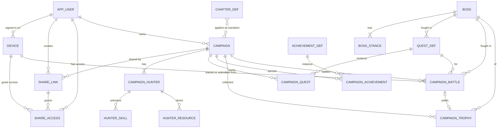

# Primal Web — модель данных

PostgreSQL 17+. Схема создаётся версионными миграциями Flyway (`V1__schema.sql` …), каталог заполняется
repeatable-миграцией из YAML (см. §4). Общий обзор — [`architecture.md`](architecture.md), API — [`api.md`](api.md).

---

## 1. Глоссарий: правила → `app` → веб

| Термин правил | Поле в `app` | Поле в вебе |
|---------------|--------------|-------------|
| Уровень враждебности (0–3) | `difficulty` | `difficulty` |
| Стойка I, II, III… | `currentPhase` | `stance` (1–9) |
| Значение прочности (на карте стойки, «за охотника») | `damageForWound` (dfw) | `toughnessPerHunter` в каталоге; `toughness` в бою (итог = за охотника × охотники) |
| Требование к повышению уровня стойки | `healthForStanceChange` (hsc; 0 — последняя, NULL — по запросу) | `stanceChange = {mode: HEALTH \| ON_DEMAND \| FINAL, atHealth}` |
| Здоровье монстра (шкала 10) | `currentHealth` | `health` |
| Жетоны урона на карте стойки | `accumulatedDamage` | `accumulatedDamage` |
| Жетоны ярости | `rage` | `rage` |
| Выплеск ярости (3 за охотника) | `showRageSurgeDialog` | `rageSurgePending` |
| Затвердевший | `isHardened` | `hardened` |
| Устойчивость (ключевое слово стойки) | `isResilient` | `resilient` |
| Глава кампании (книга) | `currentChapter − 1` (R-1) | `chapter` (0 — пролог, 1–11) |
| Задание | `QuestEntity` (`isAvailable` + `isCompleted`) | `campaign_quest.status` (OPEN / COMPLETED / EXPIRED) |
| Каталог заданий / глав | `task_info`, `chapter_info` (текстовые форматы) | `quest_def`, `chapter_def` (эффекты в `jsonb`) |

Поля боя (стойка, здоровье, прочность, ярость, статусы) — это TypeScript-типы браузера
([`battle.md`](battle.md) §2). В БД бой не хранится, туда попадает только итоговый результат боя
кампании (`campaign_battle`, §3.4).

---

## 2. Перечисления

Фиксированные игровые множества — Java enum; в БД — `varchar` + `CHECK`. Названия на русском и порядок
отдаются фронтенду через `GET /catalog/dictionaries` (как `displayName` в `app`). Новое значение (например,
стихия дополнения) требует изменения кода и миграции `CHECK`.

| Enum | Значения |
|------|----------|
| `Element` (9) | `FIRE` Огонь, `HORN` Рог, `CORAL` Коралл, `CRYSTAL` Кристалл, `LIGHTNING` Молния, `METAL` Металл, `FEATHER` Перо*, `POISON` Яд*, `ICE` Лёд* (* — дополнения) |
| `Material` (6) | `SCALES` Чешуя, `BONES` Кости, `BLOOD` Кровь, `ZIMIA` Зимия, `IRIDIA` Иридия, `ZLATIA` Златия |
| `Plant` (6) | `NILLEA` Ниллея, `TARMARET` Тармарет, `ALBALACEA` Альбалацея, `MELLIS` Меллис, `ANTHEMON` Антемон, `SELICORNIA` Селикорния |
| `ResourceCode` | объединение `Material` ∪ `Plant` ∪ `Element` (21 код, коды не пересекаются) |
| `HunterClass` (8) | `DAREON` Дареон, `MIRA` Мира, `TOREG` Торег, `LIONAR` Льонар, `KARA` Кара, `HELEREN` Хелерен, `DRUSK` Друск, `ZARAIA` Зарайа |
| `SkillBranch` (5) | `A` А, `B` Б, `V` В, `G` Г, `D` Д |
| `StanceChangeMode` | `HEALTH`, `ON_DEMAND`, `FINAL` |
| `Expansion` | `FEATHER`, `POISON`, `ICE` |

Статусы кампании, результатов боёв и заданий описаны рядом с таблицами.

---

## 3. Схема



### 3.1 Пользователи и устройства

Вход — по номеру телефона и паролю: номер — логин (миграции `V3__password_login.sql`, `V4__phone_login.sql`,
задачи 8.1–8.2). Пароль хранится только хешем bcrypt с префиксом алгоритма (`{bcrypt}$2a$10$…`).
HTTP-сессий нет: браузер предъявляет токен устройства.

```sql
create table app_user (
    id             bigint generated always as identity primary key,
    phone          varchar(16),                         -- логин: +79123456789; null — аккаунт по почте без номера
    password_hash  varchar(100),                        -- {bcrypt}…; null — пароль не задан (аккаунт по почте)
    email          varchar(254),                        -- только у аккаунтов, созданных входом по почте; не используется
    display_name   varchar(60),                         -- обязательно при регистрации; null (аккаунт по почте) — «Игрок»
    created_at     timestamptz  not null default now()
);
create unique index ux_app_user_phone on app_user (phone);
create unique index ux_app_user_email on app_user (email);
```

Аккаунты, созданные входом по коду из письма, остались без номера и пароля: они работают на запомненных
устройствах и задают номер и пароль в настройках. V4 при введении уникальности оставила повторяющийся номер
только у самого раннего аккаунта. Таблица кодов `login_challenge` удалена (V3).

```sql
create table device (                                    -- запомненный браузер
    id            uuid         primary key,
    user_id       bigint       references app_user(id) on delete cascade,   -- null: гость по ссылке
    token_hash    bytea        not null unique,          -- SHA-256 токена из cookie PRIMAL_DEVICE
    display_name  varchar(60),                           -- имя гостя; для пользователя — не используется
    user_agent    varchar(300),                          -- для списка устройств: «Chrome, Android»
    created_at    timestamptz  not null default now(),
    last_seen_at  timestamptz  not null default now(),   -- обновляется не чаще раза в час
    revoked_at    timestamptz,                           -- «Выйти» / отзыв из списка устройств
    cookie_renewed_at timestamptz not null default now() -- V2: когда cookie выдана или продлена (раз в 30 дней)
);
create index ix_device_user on device (user_id) where revoked_at is null;
```

Когда гость вводит код, его устройство привязывается к пользователю (`user_id` заполняется), а доступы
по ссылкам переходят на аккаунт (§3.5).

### 3.2 Каталог (read-only, заполняется из YAML)

```sql
create table boss (
    code        varchar(32) primary key,                 -- 'VIRAXEN' (транслитерация)
    name        varchar(60) not null unique,             -- 'Вираксен'
    element     varchar(16) check (element in
                  ('FIRE','HORN','CORAL','CRYSTAL','LIGHTNING','METAL','FEATHER','POISON','ICE')),
                                                         -- null: без стихии (Пробуждённый)
    expansion   varchar(16) check (expansion in ('FEATHER','POISON','ICE')),
    sort_order  smallint    not null                     -- порядок в списке выбора
);

create table boss_stance (
    boss_code             varchar(32) not null references boss(code),
    difficulty            smallint    not null check (difficulty between 0 and 3),
    stance_no             smallint    not null check (stance_no between 1 and 9),
    toughness_per_hunter  smallint    check (toughness_per_hunter > 0),   -- null: нет порога раны (Коровон II)
    change_mode           varchar(12) not null check (change_mode in ('HEALTH','ON_DEMAND','FINAL')),
    change_at_health      smallint    check (change_at_health between 1 and 9),
    primary key (boss_code, difficulty, stance_no),
    check ((change_mode = 'HEALTH') = (change_at_health is not null))
);
-- Доступные сложности босса = distinct difficulty (у Пробуждённого — только 3).

create table achievement_def (
    code  varchar(48)  primary key,          -- 'GOLOS_VOLTYARA'
    name  varchar(100) not null unique       -- 'Голос Волтьяра' (каноническое написание, 42.1)
);

create table quest_def (
    number           smallint     primary key check (number > 0),
    name             varchar(100) not null,               -- 'Память пустыни'
    boss_code        varchar(32)  not null references boss(code),   -- стихия задания = стихия босса
    expansion        varchar(16)  check (expansion in ('FEATHER','POISON','ICE')),
    victory_effects  jsonb        not null default '[]',  -- язык эффектов, §4
    defeat_effects   jsonb        not null default '[]'
);

create table chapter_def (
    chapter    smallint primary key check (chapter between 1 and 11),
    effects    jsonb    not null default '[]',   -- инструкции этапа сюжета главы
    decisions  jsonb    not null default '[]'    -- решения главы: вопрос, варианты → эффекты
);

create table catalog_version (                  -- одна строка: хеш YAML, отдаётся как ETag каталога
    id        boolean primary key default true check (id),
    checksum  varchar(64) not null,
    loaded_at timestamptz not null default now()
);
```

### 3.3 Кампания

```sql
create table campaign (
    id               bigint generated always as identity primary key,
    owner_id         bigint       not null references app_user(id) on delete cascade,
    name             varchar(100) not null,
    chapter          smallint     not null default 0 check (chapter between 0 and 11),  -- 0 = «Пролог»
    status           varchar(20)  not null default 'ACTIVE'
                       check (status in ('ACTIVE','CHAPTER_TRANSITION','COMPLETED')),
    forge_level      smallint     not null default 1 check (forge_level between 1 and 3),
    lab_level        smallint     not null default 1 check (lab_level between 1 and 3),
    final_boss_code  varchar(32)  references boss(code),  -- задан: следующий бой только с этим боссом (гл. 11)
    progress_seq     integer      not null default 0,     -- растёт при принятой победе и смене главы (§3.4)
    notes            text         not null default '',
    version          integer      not null default 0,
    created_at       timestamptz  not null default now(),
    updated_at       timestamptz  not null default now()
);
create index ix_campaign_owner on campaign (owner_id);
-- Не более 10 кампаний на пользователя — проверка в сервисе (primal.campaign.max-per-user = 10).

create table campaign_hunter (
    id            bigint generated always as identity primary key,
    campaign_id   bigint      not null references campaign(id) on delete cascade,
    hunter_class  varchar(16) not null check (hunter_class in
                    ('DAREON','MIRA','TOREG','LIONAR','KARA','HELEREN','DRUSK','ZARAIA')),
    player_name   varchar(60) not null,
    position      smallint    not null check (position between 1 and 5),   -- порядок в отряде
    unique (campaign_id, hunter_class),
    unique (campaign_id, position)
);
-- В отряде 2–5 охотников: максимум ограничивают CHECK и UNIQUE по position, минимум проверяет сервис
-- (primal.campaign.hunters.min = 2, max = 5; пятый игрок появляется в одном из дополнений).

create table hunter_skill (                             -- строка = ступень открыта
    hunter_id    bigint      not null references campaign_hunter(id) on delete cascade,
    branch       char(1)     not null check (branch in ('A','B','V','G','D')),
    tier         smallint    not null check (tier in (1, 2)),
    unlocked_at  timestamptz not null default now(),
    primary key (hunter_id, branch, tier)
);
-- Ступень 2 требует ступень 1 — проверка в сервисе (SkillValidator из app).

create table hunter_resource (
    hunter_id  bigint      not null references campaign_hunter(id) on delete cascade,
    resource   varchar(16) not null check (resource in (
                 'SCALES','BONES','BLOOD','ZIMIA','IRIDIA','ZLATIA',
                 'NILLEA','TARMARET','ALBALACEA','MELLIS','ANTHEMON','SELICORNIA',
                 'FIRE','HORN','CORAL','CRYSTAL','LIGHTNING','METAL','FEATHER','POISON','ICE')),
    quantity   integer     not null default 0 check (quantity >= 0),
    primary key (hunter_id, resource)
);
-- Начисление атомарно:
--   insert … on conflict (hunter_id, resource) do update set quantity = hunter_resource.quantity + excluded.quantity
-- Списание — update … set quantity = quantity - :amount (upsert с отрицательным количеством не годится:
-- CHECK проверяется у вставляемой строки ещё до on conflict). Уход в минус ловит CHECK → 422 NOT_ENOUGH_RESOURCES.

create table campaign_quest (
    campaign_id        bigint      not null references campaign(id) on delete cascade,
    quest_number       smallint    not null references quest_def(number),
    status             varchar(12) not null check (status in ('OPEN','COMPLETED','EXPIRED')),
    opened_in_chapter  smallint    not null,
    closed_in_chapter  smallint,                          -- когда выполнено или истекло
    updated_at         timestamptz not null default now(),
    primary key (campaign_id, quest_number)               -- задание в кампании один раз (как индекс 8→9 в app)
);

create table campaign_achievement (
    id                  bigint generated always as identity primary key,
    campaign_id         bigint       not null references campaign(id) on delete cascade,
    achievement_code    varchar(48)  references achievement_def(code),   -- null: пользовательское
    name                varchar(100) not null,           -- отображаемое название
    normalized_name     varchar(100) not null,           -- lower, ё→е, схлопнутые пробелы (42.1)
    source              varchar(12)  not null check (source in ('QUEST','CHAPTER','DECISION','MANUAL')),
    granted_in_chapter  smallint     not null,
    granted_at          timestamptz  not null default now(),
    unique (campaign_id, normalized_name)                 -- одно достижение на кампанию (D-9)
);
create unique index ux_campaign_achievement_code
    on campaign_achievement (campaign_id, achievement_code) where achievement_code is not null;
```

### 3.4 Бои кампании

Бой идёт в браузере ([`battle.md`](battle.md)). О бое кампании сервер узнаёт дважды: при старте
(отметка для предупреждения других участников) и в конце (результат). Экспедиции на сервер не попадают.

```sql
create table campaign_battle (
    id                      uuid        primary key,    -- создаёт браузер при старте; повтор запросов не дублирует бой
    campaign_id             bigint      not null references campaign(id) on delete cascade,
    purpose                 varchar(12) not null check (purpose in ('PROLOGUE','QUEST','FREE','FINAL')),
    quest_number            smallint    references quest_def(number),
    boss_code               varchar(32) references boss(code),     -- null: параметры введены вручную
    difficulty              smallint    not null check (difficulty between 0 and 3),
    chapter                 smallint    not null check (chapter between 0 and 11),   -- глава на момент старта
    progress_seq            integer     not null,       -- campaign.progress_seq на момент старта
    status                  varchar(12) not null default 'IN_PROGRESS'
                              check (status in ('IN_PROGRESS','APPLIED','DISMISSED','ABANDONED')),
    result                  varchar(8)  check (result in ('VICTORY','DEFEAT')),
    defeat_reason           varchar(12) check (defeat_reason in ('ROUNDS','SURRENDER')),
    rounds_played           smallint    check (rounds_played between 1 and 10),
    overrides               jsonb,                       -- награды, исправленные через «Редактировать»
    started_by_device_id    uuid        references device(id) on delete set null,   -- кто начал
    submitted_by_device_id  uuid        references device(id) on delete set null,   -- кто отправил результат
    started_at              timestamptz not null,
    finished_at             timestamptz,
    submitted_at            timestamptz,
    check ((purpose = 'QUEST') = (quest_number is not null)),
    check ((status in ('APPLIED','DISMISSED')) = (result is not null)),
    check (defeat_reason is null or result = 'DEFEAT'),
    check (result is distinct from 'DEFEAT' or defeat_reason is not null)
);
create index ix_campaign_battle_campaign on campaign_battle (campaign_id, started_at desc);
create index ix_campaign_battle_active on campaign_battle (campaign_id) where status = 'IN_PROGRESS';

create table campaign_trophy (                          -- создаётся при принятии победы
    id                  bigint generated always as identity primary key,
    campaign_id         bigint      not null references campaign(id) on delete cascade,
    boss_code           varchar(32) not null references boss(code),
    chapter             smallint    not null,
    campaign_battle_id  uuid        unique references campaign_battle(id) on delete set null,
    acquired_at         timestamptz not null default now()
);
```

Жизненный цикл записи:

| Событие | Статус | Кто |
|---------|--------|-----|
| Старт боя (`POST …/battles`) | `IN_PROGRESS` | любой участник; если запись не удалась, бой всё равно идёт |
| «Принять» результат | `APPLIED` | любой участник; если отметки о старте нет, запись создаётся сейчас |
| «Отклонить» результат | `DISMISSED` | любой участник |
| «Бросить бой», замена боя в браузере новым, снятие отметки участником | `ABANDONED` | любой участник; результат такого боя всё равно можно отправить |

**Предупреждение, а не блокировка.** Идущими считаются записи `IN_PROGRESS`, начатые меньше 24 часов назад
(`primal.campaign.battle-warning-hours`) при текущем `progress_seq`. Они показываются на листе кампании и
в окне подготовки боя, но не мешают начать ещё один бой.

**Первая принятая победа закрывает главу.** `campaign.progress_seq` увеличивается, когда принята победа,
а также при переходе главы и ручной смене главы. Результат боя принимается, только если его
`progress_seq` равен текущему. Поэтому после первой принятой победы результаты всех боёв, начатых до неё,
отклоняются — и победы, и поражения (`409 CAMPAIGN_CHANGED`). Принятое поражение и отклонённая игроком
победа главу не закрывают и счётчик не меняют.

`purpose` определяет сервер по состоянию кампании: глава 0 → `PROLOGUE`; задан `final_boss_code` →
`FINAL`; передано задание → `QUEST`; иначе → `FREE` («Продолжить без задания», 42.4). Кроме
`progress_seq`, при приёме проверяется, что переход главы не ожидается и задание всё ещё открыто
(`api.md` §7.3).

### 3.5 Доступ по ссылке

```sql
create table share_link (
    id           uuid        primary key,       -- токен = base64url(id ‖ HMAC(key, id)); сам токен не хранится
    campaign_id  bigint      not null references campaign(id) on delete cascade,
    created_by   bigint      not null references app_user(id) on delete cascade,
    permission   varchar(8)  not null default 'EDIT' check (permission in ('EDIT')),   -- задел на VIEW
    created_at   timestamptz not null default now(),
    revoked_at   timestamptz
);
create unique index ux_share_link_campaign on share_link (campaign_id)
    where revoked_at is null;                                          -- одна действующая ссылка

create table share_access (                      -- кто открыл ссылку
    id             bigint      generated always as identity primary key,
    share_link_id  uuid        not null references share_link(id) on delete cascade,
    user_id        bigint      references app_user(id) on delete cascade,  -- вошедший: доступ на всех его устройствах
    device_id      uuid        references device(id) on delete cascade,    -- гость: доступ только на этом устройстве
    joined_at      timestamptz not null default now(),
    check ((user_id is null) <> (device_id is null))
);
create unique index ux_share_access_user on share_access (share_link_id, user_id) where user_id is not null;
create unique index ux_share_access_device on share_access (share_link_id, device_id) where device_id is not null;
```

Правило доступа (`AccessService`):

| Ресурс | Владелец | По ссылке |
|--------|----------|-----------|
| Кампания C: лист, правки, подготовка боя, отправка результата, переход главы | `C.owner_id = user` | есть `share_access` пользователя или устройства по ссылке на C, `revoked_at is null` |
| Только владельцу | удаление кампании; создание, перевыпуск и отзыв ссылки | — |
| Каталог, экспедиция | без входа | без входа |

Перевыпуск ссылки = отзыв старой (`revoked_at`) + новая строка. Доступы по старой ссылке перестают
действовать сразу, потому что проверка идёт через `share_link.revoked_at`. Когда гость входит по коду,
`share_access` его устройства переписываются на пользователя (дубликаты удаляются).

### 3.6 Инварианты и где они проверяются

| Инвариант | Где |
|-----------|-----|
| Главы 0–11, кузня и лаборатория 1–3, ресурсы ≥ 0 | CHECK |
| Класс охотника уникален в кампании | UNIQUE |
| В отряде кампании 2–5 охотников | максимум — CHECK `position` 1–5 + UNIQUE; минимум — сервис |
| Одна действующая ссылка на кампанию | частичный UNIQUE `ux_share_link_campaign` |
| Номер телефона (логин) уникален в любом написании | UNIQUE `ux_app_user_phone` + хранение в формате `+79123456789` |
| Не больше 10 попыток входа по номеру за 15 минут | сервис (`RateLimiter`, в памяти) |
| Задание в кампании один раз | PK `campaign_quest` |
| Достижение в кампании один раз (с учётом написания) | UNIQUE `normalized_name` + частичный UNIQUE по коду |
| Результат боя применяется один раз | PK `campaign_battle.id` (UUID из браузера) |
| Трофей за бой один раз | UNIQUE `campaign_trophy.campaign_battle_id` |
| Первая принятая победа закрывает главу: результаты боёв, начатых до неё, не принимаются | `campaign.progress_seq` + сервис → `409 CAMPAIGN_CHANGED` |
| Параллельный бой не блокируется — только предупреждение | сервис: список идущих боёв без проверок на старте |
| Ступень 2 навыка — только после ступени 1 | сервис |
| Не более 10 кампаний на пользователя | сервис |
| Выполненное задание не истекает и не снимается редактором (D-5) | сервис: истекают только `OPEN` |
| Правила боя (здоровье 0–10, стойки 1–9, прочность, ярость) | движок в браузере (`battle.md`) |

---

## 4. Каталог и язык эффектов

### 4.1 Файлы

```
backend/src/main/resources/catalog/
├── bosses.yaml          боссы и стойки по сложностям (перенос из PrimalDatabase.kt: seedBosses)
├── achievements.yaml    коды и канонические названия
├── quests.yaml          49 заданий (перенос из doc/taskInfo.md и TaskInfoSeed.kt)
└── chapters.yaml        11 глав (перенос из doc/compainInfo.md и ChapterInfoSeed.kt)
```

Загрузчик — Java-миграция Flyway `R__Catalog` (repeatable, контрольная сумма = хеш файлов). Она разбирает
YAML в типы `rules` (ошибка формата останавливает запуск), делает upsert в таблицы §3.2 и обновляет
`catalog_version`. Удалять записи каталога, на которые ссылаются кампании, запрещено — это ловят FK.

### 4.2 Боссы

Запись стойки: `{ t: <прочность за охотника | ~>, change: <здоровье | FINAL | ON_DEMAND> }`.

```yaml
- code: VIRAXEN
  name: Вираксен
  element: FIRE
  stances:                     # по уровням враждебности
    0: [ {t: 2,  change: 7}, {t: 3,  change: 3}, {t: 4,  change: FINAL} ]
    1: [ {t: 5,  change: 7}, {t: 7,  change: 3}, {t: 10, change: FINAL} ]
    2: [ {t: 10, change: 7}, {t: 15, change: 3}, {t: 20, change: FINAL} ]
    3: [ {t: 18, change: 7}, {t: 24, change: 3}, {t: 30, change: FINAL} ]
- code: IEKOROS
  name: Иекорос
  element: LIGHTNING           # все стойки — смена по запросу
  stances:
    0: [ {t: 2, change: ON_DEMAND}, {t: 4, change: ON_DEMAND}, {t: 5, change: ON_DEMAND} ]
    # …
# Коровон, стойка II: {t: ~, change: ON_DEMAND} — урон только копится, смена по запросу (qa 36)
```

Перенос из `app`: `hsc > 0` → число, `hsc = 0` → `FINAL`, `hsc = NULL` → `ON_DEMAND`; `dfw = NULL` → `~`;
стойки 4–5 с `dfw = 0` — отсутствуют.

### 4.3 Грамматика эффектов

```
Effect :=
    { resources: { <ResourceCode>: qty, … } }      каждый охотник получает материи/растения
  | { openQuest: n }                                добавить задание
  | { expireQuests: [n, …] }                        истекло время заданий (только открытых)
  | { expireAllQuests: true }                       истекло время всех заданий (гл. 11)
  | { grantAchievement: CODE }
  | { forgeLevelUp: true } | { labLevelUp: true }
  | { hunterKitUpgrade: true }                      «Каждый охотник улучшает свой набор»
  | { rewardCards: ["10", "11"] }                   карты наград (выдаются вручную из коробки)
  | { message: "текст" }                            инструкция для игроков
  | { finalBattle: BOSS_CODE }                      следующий бой — только этот босс
  | { if: Condition, then: [Effect…], else: [Effect…] }

  У любого эффекта может быть поле  expansion: FEATHER|POISON|ICE  — пометка, из какого дополнения
  инструкция. В первой версии все дополнения подключены, и на расчёт пометка не влияет; это задел
  для будущего выбора дополнений при создании кампании.

Condition :=
    { achievement: CODE }            у отряда есть достижение
  | { chapterIn: [n, …] }            текущая глава (книги)
  | { questAvailable: n }            задание добавлено (OPEN или COMPLETED)
  | { not: Condition } | { all: [Condition…] } | { any: [Condition…] }
```

Семантика планировщика (`EffectPlanner.plan`):

1. Условия вычисляются по **снимку** кампании до применения набора эффектов. Достижения, которые выдаёт
   этот же набор, на его условия не влияют — как в `app`: «по достижениям до выдачи наград задания».
2. Результат — план конкретных действий и **пояснения** для интерфейса: для каждого `if` — формулировка
   правила и результат («Добавлено задание 4.», «Достижения нет.»). Формулировки строит сервер, фронтенд
   только выводит их.
3. Превью и применение вызывают одну и ту же функцию; применение выполняет план в одной транзакции.
4. Повторы безопасны: открыть уже открытое задание или выдать уже полученное достижение — no-op.

Общие правила, которые не записываются в YAML (код `progression`):

| Событие | Действия |
|---------|----------|
| Победа в бою кампании | трофей босса; каждому охотнику **2** стихии босса, если у босса есть стихия |
| Победа по заданию | задание → `COMPLETED`; `victory_effects` задания |
| Победа (любая, кроме финала) | кампания → `CHAPTER_TRANSITION`; `progress_seq + 1` — остальные бои этой главы больше не принимаются |
| Победа в финальном бою | кампания → `COMPLETED` («Кампания пройдена! Пробуждённый повержен.») |
| Поражение по заданию | `defeat_effects` задания; глава не меняется |
| Переход в главу N | эффекты вариантов решений → `chapter_def(N).effects`; `chapter = N`; `status = ACTIVE` |

### 4.4 Примеры: задания

```yaml
- number: 1
  name: Память пустыни
  boss: TORAMAT
  victory:
    - resources: { BONES: 2, ZLATIA: 2, NILLEA: 2, TARMARET: 1, ALBALACEA: 1, SELICORNIA: 1 }
    - if: { chapterIn: [1, 2] }
      then: [ { openQuest: 4 } ]
      else: [ { openQuest: 6 } ]
  defeat:
    - openQuest: 6

- number: 25                      # «Горящее солнце»: в гл. 8 вместо 27 добавляется 34
  name: Горящее солнце
  boss: KHARJA
  victory:
    - resources: { BONES: 1, BLOOD: 2, IRIDIA: 1, NILLEA: 2, ALBALACEA: 1, MELLIS: 2 }
    - rewardCards: ["17"]
    - if: { achievement: GORYASHCHIY_UGOLEK }
      then:
        - if: { chapterIn: [8] }
          then: [ { openQuest: 34 } ]
          else: [ { openQuest: 27 } ]

- number: 42                      # «45, если задание 18 ещё не доступно»
  name: Тёмная трясина
  boss: REIKAL
  expansion: POISON
  victory:
    - resources: { SCALES: 1, BLOOD: 2, IRIDIA: 1, TARMARET: 1, MELLIS: 1, ANTHEMON: 2, SELICORNIA: 1 }
    - rewardCards: ["30", "31"]
    - if: { not: { questAvailable: 18 } }
      then: [ { openQuest: 45 } ]
```

Условное достижение (задания 29 и 40): `- if: { achievement: GOLOS_VOLTYARA } then: [ { grantAchievement: UROBBOROS } ]`.

### 4.5 Примеры: главы

```yaml
- chapter: 1                      # применяется после победы в «Прологе»
  effects:
    - resources: { BONES: 1, SCALES: 1, BLOOD: 2, ALBALACEA: 1, ANTHEMON: 1, MELLIS: 1, NILLEA: 2 }
    - openQuest: 1
    - openQuest: 2
    - { openQuest: 36, expansion: FEATHER }

- chapter: 4
  effects:
    - forgeLevelUp: true
    - labLevelUp: true
    - openQuest: 11
    - if: { achievement: NAROD_ZOLOTYKH_GOR }
      then: [ { openQuest: 7 } ]
      else: [ { openQuest: 8 } ]
    - if: { achievement: ZATISHE }
      then: [ { openQuest: 9 } ]
    - if: { achievement: YAD_PAZISA }
      then: [ { message: "Получите награду 25" } ]
    - expireQuests: [1, 3, 4, 5, 31, 41, 46]

- chapter: 7
  decisions:                      # решение до наград главы; вариант выдаёт достижение без отзыва (D-10)
    - code: TRAIN_WITH_VOLTYAR
      question: Хотите ли вы тренироваться в лагере у Волтьяра?
      options:
        - { code: YES, label: Да, effects: [ { grantAchievement: GOLOS_VOLTYARA } ] }
        - { code: NO,  label: Нет }
  effects:
    - hunterKitUpgrade: true
    - if: { achievement: GERBARIY }
      then: [ { openQuest: 24 } ]
    - if: { achievement: FOLIANT_O_CHUDOVISHCHAKH }
      then: [ { openQuest: 33 } ]
    - expireQuests: [7, 9, 11]

- chapter: 10
  effects:
    - if: { achievement: GOLOS_VOLTYARA }        # C-9
      then: [ { hunterKitUpgrade: true } ]
    - if: { not: { all: [ { achievement: TRI_KOPYA }, { achievement: EKHO_VODOPADA } ] } }   # C-8
      then: [ { openQuest: 30 } ]
    # …

- chapter: 11
  effects:
    - expireAllQuests: true
    - finalBattle: AWAKENED
```

---

## 5. Перенос из `app` (Room → PostgreSQL)

| `app` (Room) | Веб | Изменение |
|--------------|-----|-----------|
| `CampaignEntity` | `campaign` | `chapter` = `currentChapter − 1`; добавлены `status`, `final_boss_code`, `version`, `owner_id` |
| `HunterEntity` | `campaign_hunter` | + `position`; класс уникален в кампании |
| `SkillEntity` (10 строк с флагом `unlocked`) | `hunter_skill` | хранятся только открытые ступени |
| `ResourceEntity` (`type` + `name`) | `hunter_resource` | единый код ресурса; `CHECK ≥ 0` вместо ограничения в UI |
| `AchievementEntity` (свободный текст) | `campaign_achievement` | + код каталога, `normalized_name`, источник, глава |
| `TrophyEntity` (`bossName` + `element`) | `campaign_trophy` | FK на `boss`; стихия берётся из каталога; связь с боем |
| `QuestEntity` (`isAvailable` + `isCompleted`, `quest_id` текстом) | `campaign_quest` | один `status`; FK на `quest_def` |
| `BossEntity` (5 пар колонок, кодирование 0/NULL) | `boss` + `boss_stance` | строка на стойку; явный `change_mode` |
| `TaskInfoEntity` (текстовые форматы `NAME:qty;…`, `kind\|…`) | `quest_def` | эффекты в `jsonb` |
| `ChapterInfoEntity` (текстовые форматы) | `chapter_def` | эффекты и решения в `jsonb`; нумерация — глава книги |
| `BattleScreenState` (в памяти) + автосохранение | состояние в `localStorage` браузера (`battle.md` §7) + `campaign_battle` | бой в браузере; на сервер — отметка о старте и итог боя кампании |
