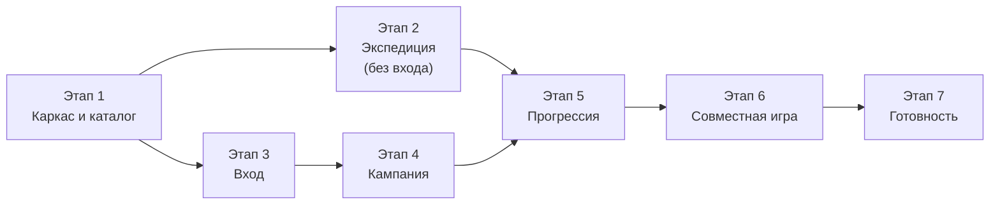

# План реализации Primal Web

Веб-версия помощника «Primal. Пробуждение»: Java + Spring Boot, PostgreSQL, React. Бой проводится в
браузере, сервер хранит кампании. Задачи выполняются по порядку, одна задача — одна рабочая сессия.

**Источники требований** (при расхождениях — вопрос пользователю, ответ — в `web/doc/qa.md`):
- правила игры — `app/Primal. Пробуждение.md`;
- архитектура, бой, модель данных, API — `web/doc/architecture.md`, `web/doc/battle.md`,
  `web/doc/data-model.md`, `web/doc/api.md`;
- эталон поведения — мобильное приложение: `app/doc/*.md` и код `app/shared/src/commonMain` (коды решений R-x, D-x, C-x, qa N).

**Порядок работы над задачей.** Разработка и тесты — одна задача и одна команда агента
(`web/.kilo/commands/implementTask.md`):
1. Взять первую невыполненную задачу, сверить её с правилами и документацией, задать вопросы.
2. Согласовать список файлов — кода и тестов — и архитектуру доработки.
3. Реализовать код и тесты из раздела «Тесты»; запустить сборку и все тесты.
4. Описать изменения в `web/doc` (поведение, API, модель данных), решения — в `web/doc/qa.md`.
5. Отметить задачу «✅ ВЫПОЛНЕНО (дата)» — только когда тесты написаны и проходят.

**Тесты.** У каждого теста описание на русском, блоки «подготовка / вызов / проверка», тесты сгруппированы
по смыслу (как было принято в `app`).

| Слой | Инструменты | Папка |
|------|-------------|-------|
| Движок боя и интерфейс | Vitest, Testing Library, MSW (подмена API) | `web/frontend/src/**/*.test.ts(x)` |
| Бэкенд: unit | JUnit 5, AssertJ | `web/backend/src/test/java/com/primal/**` |
| Бэкенд: интеграция | Testcontainers (PostgreSQL 17), MockMvc | `web/backend/src/test/java/com/primal/**/*IT.java` |
| E2E | Python, pytest, Playwright, Allure, Page Object (как в `test/`) | `web/e2e/` |

Объём задачи (вместе с тестами): **S** — до половины дня, **M** — день, **L** — два-три дня.

Этапы 2 и 3 не зависят друг от друга и могут идти параллельно.

---

# Этап 1. Каркас и каталог

## Задача 1.1: Репозиторий, соглашения и правила агента ✅ ВЫПОЛНЕНО (27.09.2026)

**Объём:** S · **Зависит от:** —

**Файлы:**
- `web/.gitattributes`, `web/.editorconfig`, `web/.gitignore`, `web/README.md`
- `web/.kilorules`, `web/.kilo/commands/implementTask.md`

**Описание:**
Подготовить папку `web/` как самостоятельный проект с правилами для агента, адаптированными под Java/Spring
и React.

**Детали:**
- `.gitattributes`: `* text=auto eol=lf`, `*.bat eol=crlf`, `*.png binary`. Иначе `gradlew` и `*.sh`,
  выгруженные на Windows с CRLF, ломают сборку Docker-образов (`/bin/sh^M`).
- `.gitignore`: `.env`, `node_modules/`, `dist/`, `build/`, `.gradle/`, `allure-results/`, `.venv/`.
- `.kilorules`: роль — Senior Java/Spring + React разработчик; стек из `architecture.md` §2; правила:
  правила боя — только в `web/frontend/src/domain/battle` (чистый TypeScript, без React и сети); награды
  и условия — только в модуле `rules` бэкенда; контроллеры тонкие; тесты пишутся в той же задаче, что и
  код (оформление — раздел «Тесты» этого плана); всё о работе приложения описывается в `web/doc`.
- Одна команда агента `implementTask` вместо пары «разработка / тестирование» из `app/.kilo/commands`:
  порядок работы из начала этого плана; пути `web/doc`, `web/implementationTasks.md`, `web/doc/qa.md`.

**Тесты:** нет — задача без кода.

**Критерии приёмки:**
- После `git clone` на Windows файлы `gradlew` и `*.sh` имеют окончания строк LF.
- `.env` не попадает в git.
- Команда агента ссылается только на файлы `web/` и на правила игры.

---

## Задача 1.2: Инфраструктура для разработки ✅ ВЫПОЛНЕНО (27.09.2026)

**Объём:** S · **Зависит от:** 1.1

**Файлы:**
- `web/docker-compose.dev.yml`

**Описание:**
Поднять PostgreSQL и Mailpit для локальной разработки: бэкенд запускается из IDE и подключается к ним.

**Детали:**
- `postgres:17-alpine`: БД, пользователь и пароль `primal`, порт `127.0.0.1:5432`, том `primal-dev-db`.
- `axllent/mailpit`: SMTP `127.0.0.1:1025`, веб-интерфейс `127.0.0.1:8025`.

**Тесты:** нет — проверка по критериям приёмки.

**Критерии приёмки:**
- `docker compose -f docker-compose.dev.yml up -d` поднимает оба сервиса; к БД можно подключиться из
  IntelliJ; интерфейс Mailpit открывается на http://localhost:8025.

---

## Задача 1.3: Каркас бэкенда ✅ ВЫПОЛНЕНО (27.09.2026)

**Объём:** M · **Зависит от:** 1.2

**Файлы:**
- `web/backend/settings.gradle.kts`, `build.gradle.kts`, `gradle/libs.versions.toml`, `gradlew`, `gradlew.bat`
- `web/backend/src/main/java/com/primal/PrimalApplication.java`
- `web/backend/src/main/java/com/primal/{common,identity,access,mail,realtime,catalog,rules,campaign,progression}/package-info.java`
- `web/backend/src/main/java/com/primal/common/config/PrimalProperties.java`, `StartupSecretsCheck.java`
- `web/backend/src/main/java/com/primal/common/error/{ErrorCode,ApiException,GlobalExceptionHandler}.java`
- `web/backend/src/main/resources/application.yml`, `application-dev.yml`
- `web/backend/Dockerfile`
- Тесты: `web/backend/src/test/java/com/primal/{ArchitectureTest,common/StartupSecretsCheckTest,common/GlobalExceptionHandlerTest}.java`

**Описание:**
Пустое, но запускаемое Spring Boot-приложение с модульной структурой из `architecture.md` §3, единым
форматом ошибок и проверкой секретов.

**Детали:**
- Java 25 (toolchain), Spring Boot 4.x. Зависимости: web, data-jpa, validation, security, mail, actuator,
  flyway (+ `flyway-database-postgresql`), драйвер PostgreSQL, springdoc-openapi (включается в `dev`),
  bucket4j, caffeine, jackson-dataformat-yaml. Тестовые: spring-boot-starter-test, testcontainers
  (postgresql), archunit.
- Порт 8080; REST под `/api/v1`; Actuator: `management.endpoints.web.base-path=/api/actuator`, наружу
  открыт только `health`.
- `PrimalProperties` (`primal.*`) — из переменных окружения `.env` (см. `web/doc/setup.md`, раздел
  «Переменные окружения»): `public-url`, `otp.pepper`, `share-link.key`,
  `campaign.max-per-user = 10`, `campaign.hunters.min = 2`, `campaign.hunters.max = 5`,
  `campaign.battle-warning-hours = 24`.
- `StartupSecretsCheck`: если `PUBLIC_URL` начинается с `https://`, а секреты короче 32 символов или
  содержат `change-me` (значения из `.env.example`), приложение не запускается и пишет в лог, что
  нужно заменить. Локально по HTTP примерные значения разрешены.
- `GlobalExceptionHandler`: RFC 9457 `application/problem+json` с полем `code` и `errors[]` для
  валидации (`api.md` §1.1); неизвестный путь — `404 NOT_FOUND`.
- `Dockerfile`: многоступенчатый (сборка Gradle → `eclipse-temurin:25-jre`), процесс не от root,
  `-XX:MaxRAMPercentage=75`.

**Тесты:**
- ArchUnit: `rules` не зависит от Spring и JPA; контроллеры не обращаются к репозиториям; модули не
  используют чужие репозитории (`architecture.md` §3).
- `StartupSecretsCheck`: https + примерные или короткие секреты → отказ; http + примерные → запуск.
- `GlobalExceptionHandler`: неизвестный путь → 404 problem+json с `code`; ошибка валидации → `errors[]`.

**Критерии приёмки:**
- `gradlew build` проходит.
- `gradlew bootRun --args="--spring.profiles.active=dev"` стартует с БД из 1.2;
  `GET /api/actuator/health` → `{"status":"UP"}`; Swagger UI открывается в `dev` и отключён без него.

---

## Задача 1.4: Каркас фронтенда ✅ ВЫПОЛНЕНО (27.09.2026)

**Объём:** M · **Зависит от:** 1.1

**Файлы:**
- `web/frontend/package.json`, `vite.config.ts`, `tsconfig.json`, `eslint.config.js`, `orval.config.ts`
- `web/frontend/src/main.tsx`, `src/app/{App,routes,Layout}.tsx`
- `web/frontend/src/api/{http.ts,errors.ts}`, `src/api/generated/` (пусто до появления API)
- `web/frontend/src/domain/battle/` (пусто до задачи 2.1)
- `web/frontend/src/shared/i18n/ru.ts`, `src/shared/ui/`
- `web/frontend/src/test/setup.ts` (Vitest, Testing Library, MSW)
- `web/frontend/Dockerfile`, `web/frontend/Caddyfile`
- Тесты: `web/frontend/src/api/http.test.ts`

**Описание:**
SPA на React + TypeScript с маршрутами-заглушками из `architecture.md` §5.1 и HTTP-клиентом, который
понимает CSRF, 401 и problem+json.

**Детали:**
- Vite, React 19, TypeScript strict, Mantine, TanStack Query, React Router, ESLint + Prettier, Vitest, MSW.
- Границы модулей в ESLint (`no-restricted-imports` и `no-restricted-globals` для `src/domain/**`, qa 8):
  `src/domain/**` не импортирует React, `src/api`, `src/features` и не обращается к `window`.
- `vite.config.ts`: прокси `/api` → `http://localhost:8080` (без буферизации — для SSE).
- `http.ts`: `credentials: 'same-origin'`; заголовок `X-XSRF-TOKEN` из cookie `XSRF-TOKEN`; ответ 401 на
  защищённом маршруте → `/login?next=…` (меню, экспедиция и бой открываются без входа);
  problem+json → `ApiError { status, code, detail, … }`.
- `orval.config.ts`: источник — `http://localhost:8080/v3/api-docs`, результат — `src/api/generated`
  (хуки TanStack Query). Скрипт `npm run api:generate`; сгенерированный код хранится в git.
- Все тексты интерфейса — в `ru.ts`; у интерактивных элементов `data-testid` (правило записать в
  `web/doc/qa.md`).
- `Dockerfile`: сборка на `node:24-alpine` → `caddy:2-alpine` со статикой в `/srv`.
- `Caddyfile`: адрес сайта из `{$SITE_ADDRESS}`; `handle /api/*` → `reverse_proxy backend:8080`;
  остальное — `root /srv`, `try_files {path} /index.html`, `file_server`; `encode zstd gzip`;
  заголовки `Referrer-Policy: no-referrer`, `X-Content-Type-Options: nosniff`,
  `Content-Security-Policy: frame-ancestors 'none'`; для `/assets/*` — долгий `Cache-Control`.

**Тесты:**
- `http.ts`: заголовок CSRF в изменяющих запросах; 401 на защищённом маршруте → переход на вход, на
  публичном — нет; problem+json превращается в `ApiError` с `code`.
- Линтер падает, если `src/domain` импортирует React (проверочный файл-нарушитель в тесте конфигурации).

**Критерии приёмки:**
- `npm run dev` открывает главное меню на http://localhost:5173; `npm run build`, `npm run lint`,
  `npm run typecheck`, `npm test` проходят.
- Маршруты из `architecture.md` §5.1 открываются (пока заглушками).

---

## Задача 1.5: Полный стек в Docker и каркас E2E ✅ ВЫПОЛНЕНО (27.09.2026)

**Объём:** M · **Зависит от:** 1.3, 1.4

**Файлы:**
- `web/docker-compose.yml`, `web/.env.example`
- `web/e2e/{pyproject.toml,conftest.py,config.json,pages/base_page.py,pages/main_page.py,tests/test_smoke.py}`

**Описание:**
Один Compose-файл для локального запуска «всё в Docker» и для сервера; различия задаёт `.env`
(`web/doc/setup.md`). Проект E2E-тестов по образцу `test/`, в который следующие задачи добавляют свои
сценарии.

**Детали:**
- `postgres:17-alpine` — порт наружу не открыт, том `primal-db`, healthcheck `pg_isready`.
- `backend` — сборка `./backend`, переменные из `.env`, healthcheck по `/api/actuator/health`, запуск
  после готовой БД.
- `web` — сборка `./frontend`; порты `${HTTP_PORT:-8088}:80`, `${HTTPS_PORT:-8443}:443`; тома
  `caddy-data` и `caddy-config` (сертификаты); запуск после готового бэкенда.
- `mailpit` — только в профиле `local`, интерфейс на `127.0.0.1:8025`.
- Всем сервисам: `restart: unless-stopped`, ротация логов (`max-size: 10m`, `max-file: 5`).
- `.env.example` — ровно переменные из `setup.md` с комментариями; значения подходят для локального запуска.
- `web/e2e`: pytest, Playwright for Python, Allure, Page Object, локаторы по `data-testid`; адрес сайта
  и Mailpit — из `config.json` (по умолчанию `http://localhost:8088` и `http://localhost:8025`); помощник
  чтения кода входа из HTTP API Mailpit (`/api/v1/messages`).

**Тесты:**
- E2E-смоук: главная страница открывается; `GET /api/actuator/health` через Caddy → `UP`.

**Критерии приёмки:**
- По разделу 2 `setup.md` на чистой машине сайт открывается на http://localhost:8088.
- `docker compose --profile local down` и повторный `up` сохраняют данные БД.
- `poetry run pytest` в `web/e2e` проходит против запущенного стека.

---

## Задача 1.6: Схема БД ✅ ВЫПОЛНЕНО (27.09.2026)

**Объём:** S · **Зависит от:** 1.3

**Файлы:**
- `web/backend/src/main/resources/db/migration/V1__schema.sql`
- `web/backend/src/main/resources/application.yml` (Flyway, `ddl-auto: validate`)
- Тесты: `web/backend/src/test/java/com/primal/support/IntegrationTest.java`, `SchemaIT.java`

**Описание:**
Первая миграция создаёт всю схему из `data-model.md` §3. JPA-сущности появляются в задачах своих модулей.

**Детали:**
- DDL переносится из `data-model.md` без изменений (он проверен на PostgreSQL 17).
- Hibernate — `ddl-auto: validate`; изменения схемы — только новыми миграциями `V2__…`.
- `IntegrationTest` — базовый класс интеграционных тестов: один контейнер PostgreSQL 17 на весь прогон,
  Flyway применяет миграции, MockMvc.

**Тесты:**
- Миграция на пустой БД создаёт 19 таблиц; ключевые ограничения срабатывают: шестой охотник, второй
  трофей за бой, вторая действующая ссылка, ресурс в минус, результат `APPLIED` без исхода.

**Критерии приёмки:**
- Бэкенд на пустой БД применяет `V1` и стартует; повторный старт ничего не меняет.

---

## Задача 1.7: Каталог: загрузка, боссы, достижения ✅ ВЫПОЛНЕНО (27.09.2026)

**Объём:** M · **Зависит от:** 1.6

**Файлы:**
- `web/backend/src/main/resources/catalog/{bosses,achievements}.yaml`
- `web/backend/src/main/java/db/migration/R__Catalog.java`
- `web/backend/src/main/java/com/primal/catalog/{CatalogService,CatalogController,Dictionaries}.java` (+ сущности)
- `web/backend/src/main/java/com/primal/rules/model/{Element,Material,Plant,ResourceCode,HunterClass,SkillBranch,StanceChangeMode}.java`
- Тесты: `web/backend/src/test/java/com/primal/catalog/{BossCatalogTest,CatalogApiIT}.java`

**Описание:**
Каталог хранится в YAML и попадает в БД через repeatable-миграцию (`data-model.md` §4.1). Здесь —
боссы, достижения и словари. Боссы со стойками — единственное, что нужно экспедиции от сервера.

**Детали:**
- `R__Catalog`: Java-миграция Flyway; контрольная сумма — хеш файлов `catalog/*.yaml`; upsert в
  `boss`, `boss_stance` (стойки босса перезаписываются целиком), `achievement_def`, `catalog_version`.
  Ошибка разбора YAML останавливает запуск.
- `bosses.yaml` — все 23 босса из последней функции сидирования в `app/shared/src/commonMain/kotlin/com/primalapp/database/PrimalDatabase.kt`.
  Перенос: `hsc > 0` → число, `hsc = 0` → `FINAL`, `hsc = NULL` → `ON_DEMAND`; `dfw = NULL` → `~`;
  стойки 4–5 — только при `dfw > 0`. Коды — транслитерация (`VIRAXEN`, `AWAKENED` …), `sort_order` —
  порядок `app`: по русскому названию стихии, затем по имени, Пробуждённый последним.
- `achievements.yaml` — все достижения из `app/doc/taskInfo.md`, `app/doc/compainInfo.md` и seed-файлов
  в каноническом написании (42.1; «Звезда дракона» — qa 93).
- `CatalogService` держит каталог в памяти; `GET /catalog/dictionaries`, `/catalog/bosses`,
  `/catalog/achievements` (`api.md` §4) — без входа; `ETag` — контрольная сумма, `Cache-Control: max-age=3600`.

**Тесты:**
- 23 босса; стойки Вираксена (сложности 0–3), Иекороса (все `ON_DEMAND`), Коровона (стойка II без
  прочности), Кситероса (стойка II `ON_DEMAND`), Пробуждённого (только сложность 3, 5 стоек) — значения из
  seed и `app/shared/src/commonTest/.../BossTest.kt`.
- У каждого босса стойки I–III на каждой доступной сложности.
- API без входа: форматы `api.md` §4; повтор с `If-None-Match` → 304.

**Критерии приёмки:**
- Правка YAML и перезапуск обновляют БД без новой миграции.

---

## Задача 1.8: Каталог: задания, главы и язык эффектов ✅ ВЫПОЛНЕНО (27.09.2026)

**Объём:** L · **Зависит от:** 1.7

**Файлы:**
- `web/backend/src/main/resources/catalog/{quests,chapters}.yaml`
- `web/backend/src/main/java/com/primal/rules/effects/{Effect,Condition,Decision,EffectDescriber}.java`
- `web/backend/src/main/java/com/primal/catalog/{QuestCatalogController,ChapterCatalogController}.java`
- Тесты: `web/backend/src/test/java/com/primal/catalog/{CatalogIntegrityTest,QuestCatalogTest,ChapterCatalogTest}.java`, `rules/effects/EffectDescriberTest.java`

**Описание:**
Перенести 49 заданий и 11 глав в язык эффектов (`data-model.md` §4.3–4.5) и отдать их в API с готовыми
формулировками правил.

**Детали:**
- Типы `Effect` и `Condition` — sealed-интерфейсы и records без аннотаций (модуль `rules` — чистая Java);
  разбор YAML по имени ключа — `catalog/EffectParser` (qa 20).
- `quests.yaml` — из `app/doc/taskInfo.md` с исправлениями C-5…C-7 и C-10 (qa 110) и условиями из
  `TaskInfoSeed.kt`: задание 25 — вложенное условие, 29 и 40 — условное достижение, 42 — `questAvailable`.
- `chapters.yaml` — из `app/doc/compainInfo.md` и `ChapterInfoSeed.kt`: нумерация по книге
  (`chapter: 1` — после пролога); C-8, C-9; глава 7 — решение `TRAIN_WITH_VOLTYAR`; глава 11 —
  `expireAllQuests` и `finalBattle: AWAKENED`.
- `EffectDescriber` — перенос формулировок `describeTaskCondition` и `describeChapterCondition` из
  `app/shared/.../domain/ConditionOutcomes.kt`.
- `GET /catalog/quests`, `/catalog/quests/{n}`, `/catalog/chapters` — формат `api.md` §4.

**Тесты:**
- Целостность: каждое задание, достижение и босс, на которые ссылаются эффекты и условия, существуют.
- 49 заданий и 11 глав; безусловные награды каждого задания совпадают с `TaskInfoSeed.kt`
  (`app/shared/src/commonTest/.../TaskInfoTest.kt`, `ChapterInfoTest.kt`).
- Формулировки правил заданий 1, 2, 11, 25, 29, 40, 42 и глав 4, 5, 10 совпадают с текстами окон наград `app`.

**Критерии приёмки:**
- `GET /catalog/quests/1` отдаёт пример из `api.md` §4.

---

# Этап 2. Экспедиция в браузере (без входа)

## Задача 2.1: Движок боя на TypeScript ✅ ВЫПОЛНЕНО (27.09.2026)

**Объём:** L · **Зависит от:** 1.4

**Файлы:**
- `web/frontend/src/domain/battle/{types,engine,messages,index}.ts`
- Тесты: `web/frontend/src/domain/battle/engine.test.ts`, `web/frontend/src/domain/domain-imports.test.ts`

**Описание:**
Чистая функция `applyCommand(state, command, stances)` — перенос `MonsterExt.kt` и `BattleViewModel.kt`
без интерфейсных частей (таймер, режимы ввода, подсветка, вибрация). Спецификация — `battle.md` §2–5.

**Детали:**
- Типы `BattleState`, `MonsterState`, `StanceChange`, `StanceDef`, `PendingStance`, `BattleCommand`,
  `BattleEvent` — как в `battle.md` §2–3; `createBattle(params)` — начальное состояние (здоровье 10,
  ярость = число охотников, прочность = за охотника × охотники).
- Алгоритмы урона, подтверждения стойки и конца раунда — `battle.md` §4; правило «нет ожиданий» —
  недопустимая команда возвращает ошибку, состояние не меняется.
- Выплеск ярости — только при росте ярости и `rage ≥ 3 × охотники`; подтверждение → `rage = hunterCount`.
- Префилл новой стойки — из переданного `stances` (снимок каталога), иначе `prefill = null`.
- Сообщения — `messages.ts`, тексты `app` (`battle.md` §5).
- Никаких импортов React, API, `window`: код работает в Node (Vitest) без браузера.

**Тесты** — паритет с приложением:
- Перенести сценарии `app/shared/src/commonTest/kotlin/com/primalapp/model/MonsterTest.kt` и игровые
  сценарии `viewmodel/BattleViewModelTest.kt`: урон, раны, смена стойки с переносом, «Затвердевший»,
  «Устойчивость», заживление, отрицательный урон, ярость и выплеск, конец раунда, поражение по раундам,
  «Сдаться», смена стойки по запросу, стойка без прочности, тексты сообщений. Сценарии таймера, режимов
  ввода, подсветки и вибрации — в задаче 2.4.
- Пример книги: Вираксен, прочность 4, порог 7, здоровье 9, урон 13 → 2 раны, стойка II ждёт
  подтверждения, перенесено 5; после подтверждения прочности 6 третьей раны нет.
- Коровон: на стойке без прочности урон копится; после подтверждения стойки с прочностью раны наносятся сразу.
- Недопустимые команды при `pendingStance`, `rageSurgePending`, после победы не меняют состояние.
- Префилл новой стойки из снимка стоек и `prefill = null` для ручного боя.

**Критерии приёмки:**
- Все тесты движка проходят; `src/domain/battle` не импортирует ничего, кроме себя.

---

## Задача 2.2: Отмена и хранение боя в браузере ✅ ВЫПОЛНЕНО (27.09.2026)

**Объём:** M · **Зависит от:** 2.1

**Файлы:**
- `web/frontend/src/domain/battle/{history,storage,localBattle}.ts`
- `web/frontend/src/features/battle/useActiveBattle.ts`
- Тесты: `web/frontend/src/domain/battle/{history,storage}.test.ts`,
  `web/frontend/src/features/battle/useActiveBattle.test.tsx`

**Описание:**
Стек отмены и сохранение текущего боя в `localStorage` (`battle.md` §6–7).

**Детали:**
- `history.ts`: перед командой — снимок `{ state, description }`; хранится 10 последних; отмена
  восстанавливает снимок целиком, включая раунд (D-4). После победы или поражения отмена доступна, пока
  результат не отправлен.
- `storage.ts`: запись `LocalBattle` под ключом `primal.battle` после каждой команды; `schemaVersion`
  и перевод старых записей; при недоступном `localStorage` — работа в памяти и флаг для предупреждения.
- `useActiveBattle`: загрузка при старте приложения, выполнение команд через движок, отмена, «Новый бой»
  (очистка), подтверждение замены незаконченного боя.

**Тесты:**
- Отмена: глубина 10 (11 команд → 10 отмен); возврат раунда (D-4); отмена после победы.
- Хранение: запись после каждой команды; восстановление вместе с историей отмены; перевод записи старой
  `schemaVersion`; работа при `localStorage`, бросающем исключения.

**Критерии приёмки:**
- Перезагрузка страницы посреди боя возвращает тот же бой с той же историей отмены.
- В режиме, где `localStorage` недоступен, бой идёт, а экран предупреждает, что бой не сохранится.

---

## Задача 2.3: Фронтенд: подготовка экспедиции ✅ ВЫПОЛНЕНО (27.09.2026)

**Объём:** M · **Зависит от:** 2.2, 1.7

**Файлы:**
- `web/frontend/src/features/expedition/{ExpeditionSetupPage,BossSelect,ReactionDeckHint}.tsx`
- `web/frontend/src/features/battle/{StanceFields.tsx,stanceForm.ts,bossCatalog.ts}` — общие с окном смены
  стойки (2.4) и подготовкой боя кампании (5.4)
- `web/frontend/src/shared/assets/` — иконки из `app/androidApp/src/main/res/drawable/*.png` и колоды
  `drawable-nodpi/reaction_deck_level_*.png`
- `web/frontend/src/api/generated/` — клиент orval; `web/backend/.../common/api/{ApiNullable,OpenApiConfig}.java`
- Тесты: `web/frontend/src/features/expedition/ExpeditionSetupPage.test.tsx`,
  `web/backend/src/test/java/com/primal/common/api/OpenApiContractIT.java`

**Описание:**
Экран «Подготовка к бою» — как `QuickBattleHost` в `app` (`app/doc/behavior.md` §1). Доступен без входа.

**Детали:**
- Боссы и стойки — из `GET /catalog/bosses`. Список: «Ввести данные вручную» первым, затем боссы в
  порядке каталога, Пробуждённый последним.
- Сложность 0–3; если у босса нет выбранной сложности, берётся единственная доступная (Пробуждённый — 3).
- Число охотников — текстовое поле, по умолчанию 4, любое целое больше 0 (D-12).
- Прочность и смена стойки предзаполняются стойкой I и редактируются (D-2): пустая прочность — стойка
  без порога раны; режим смены — «по здоровью» с порогом, «по запросу» или «последняя».
- Под сложностью — «Подготовьте колоду карт реакций:» и картинка колоды уровня.
- «Начать бой» создаёт `LocalBattle` (`mode = EXPEDITION`, снимок стоек босса выбранной сложности) и
  открывает `/battle`; если есть незаконченный бой — сначала подтверждение.

**Тесты:**
- Порядок списка боссов; префилл стойки I при выборе босса и сложности; единственная сложность
  Пробуждённого; число охотников: 4 по умолчанию, 0 и текст не дают начать, 12 — можно.
- Созданный бой содержит снимок стоек и параметры из полей (включая исправленные вручную).

**Критерии приёмки:**
- Экспедиция начинается без входа в аккаунт.

---

## Задача 2.4: Фронтенд: экран боя ✅ ВЫПОЛНЕНО (27.09.2026)

**Объём:** L · **Зависит от:** 2.3

**Файлы:**
- `web/frontend/src/features/battle/{BattlePage,InfoPanel,DamageInput,RageControls,StatusToggles,StanceDialog,RageSurgeDialog,ResultScreen}.tsx`
- `web/frontend/src/features/battle/{useDamageInput,useHighlights,useVibration,useWakeLock}.ts`
- `web/frontend/src/features/menu/MainMenuPage.tsx` («Вернуться к бою»)
- Тесты: `web/frontend/src/features/battle/{useDamageInput,useHighlights,BattlePage}.test.ts(x)`,
  `web/e2e/{pages/expedition_page.py,pages/battle_page.py,pages/main_page.py,tests/test_expedition.py}`

**Описание:**
Экран боя с поведением `app/doc/behavior.md` §2–6; команды выполняет движок из 2.1 через `useActiveBattle`.

**Детали:**
- `useDamageInput` — автомат ввода из `battle.md` §8: кнопки +1/+5/+10/+50 с таймером 2 с, ручной ввод,
  «Применить сейчас (N)», «Отмена», подсказка про отрицательный урон. «Закончить раунд» передаёт
  накопленный ввод в `END_ROUND.damage`.
- Ярость: −1, +1, +охотники, +(охотники − 1). Статусы «Затвердевший» и «Устойчивость стойки» с кнопкой
  «i» и описанием. «Заживить рану», «Сменить стойку» (только при `ON_DEMAND`), «Сдаться» с
  подтверждением, «Отменить действие» с описанием отменяемого.
- Окно «Смена стойки!» по `pendingStance`: номер стойки, перенесённый урон или его сброс, поля с
  префиллом и пометкой источника; «Отмена» = отмена действия. Окно «Выплеск ярости» по `rageSurgePending`.
- Подсветка изменённых параметров на 1 с; вибрация: двойная при `WOUNDS_INFLICTED`, иначе короткая;
  Screen Wake Lock во время боя.
- Экраны победы и поражения (причина — раунды или «Сдаться», D-14); для экспедиции — «Новый бой» и
  «В меню». Главное меню показывает «Вернуться к бою», если в хранилище есть незаконченный бой.

**Тесты:**
- `useDamageInput` (как в `app/doc/architecture.md` §4.1–4.4): кнопки копят урон и запускают таймер 2 с;
  новое нажатие сбрасывает таймер; через 2 с без нажатий выполняется урон; ввод в поле → `MANUAL` без
  таймера; фокус поля останавливает таймер, сохраняя значение; `MANUAL` + кнопка → сумма без таймера;
  «Отмена» очищает ввод.
- `useHighlights`: изменённые параметры подсвечены 1 с; повторное изменение продлевает подсветку.
- Вибрация: двойная при `WOUNDS_INFLICTED`, иначе короткая. «Вернуться к бою» — только при незаконченном бое.
- E2E: экспедиция без входа до победы с отменой действия; перезагрузка страницы посреди боя возвращает бой.

**Критерии приёмки:**
- Сценарии UI-тестов `test/battle_tests` мобильного приложения проходят в браузере телефона без входа.

---

# Этап 3. Вход

## Задача 3.1: Вход по коду из письма ✅ ВЫПОЛНЕНО (27.09.2026)

**Объём:** L · **Зависит от:** 1.5, 1.6

**Файлы:**
- `web/backend/src/main/java/com/primal/identity/{AppUser,LoginChallenge,Device}.java` (+ репозитории)
- `web/backend/src/main/java/com/primal/identity/{LoginCodeService,DeviceService,AuthController}.java`,
  `identity/{DeviceCookies,Tokens,UserAgents,LoginCodeRequested,LoginCodeMailSender}.java`
- `web/backend/src/main/java/com/primal/mail/{MailService,LoginCodeMail,MailConfig}.java`, `src/main/resources/mail/login-code.{txt,html}`
- `web/backend/src/main/java/com/primal/common/ratelimit/RateLimiter.java`, `common/config/TimeConfig.java`
- Тесты: `web/backend/src/test/java/com/primal/support/{AuthHelper,MailCapture,MutableClock,TestProperties}.java`,
  `identity/{LoginCodeIT,DeviceCookiesTest}.java`

**Описание:**
`POST /auth/code` и `POST /auth/code/verify` по `api.md` §3: без паролей; регистрация и вход — один сценарий.

**Детали:**
- Код — 6 цифр из `SecureRandom`; в БД `HMAC-SHA256(pepper, challengeId ‖ code)`; срок 10 минут;
  5 попыток; новый запрос отменяет прежний (`consumed_at`).
- Почта нормализуется (`trim`, `lower`); ответ на `/auth/code` одинаков для известных и новых адресов.
- Ограничения (Bucket4j, в памяти): на адрес — 1 письмо в минуту и 5 в час; на IP — 20 в час;
  проверка кода — 60 в час на IP. Превышение → `429 RATE_LIMITED` с `Retry-After`.
- Письмо уходит после коммита транзакции (`@TransactionalEventListener(AFTER_COMMIT)` + `@Async`);
  ошибка SMTP пишется в лог, пользователь может запросить код повторно. Текст письма — из `api.md` §3.
- Настройки почты — из `SMTP_HOST`, `SMTP_PORT`, `SMTP_USERNAME`, `SMTP_PASSWORD`, `MAIL_FROM`;
  `SMTP_TLS`: `none` — без шифрования (Mailpit), `starttls` — порт 587, `ssl` — порт 465.
- Верный код: пользователь создаётся при первом входе; `DeviceService.issue()` создаёт устройство
  (32 случайных байта, в БД — SHA-256) и выставляет cookie `PRIMAL_DEVICE` (HttpOnly, SameSite=Lax,
  `Max-Age` 400 дней; `Secure`, если `PUBLIC_URL` на https).
- Фоновая задача раз в сутки удаляет `login_challenge` старше суток.

**Тесты:**
- Письмо отправлено; ответ одинаков для нового и известного адреса; частые запросы → 429 с `Retry-After`.
- Верный код создаёт пользователя и cookie; второй вход тем же адресом не создаёт пользователя; неверный
  код уменьшает `attemptsLeft`; 6-я попытка и код старше 10 минут → `CODE_EXPIRED`; новый запрос отменяет
  прежний код.
- В БД нет открытых кодов и токенов (только HMAC и SHA-256); cookie `Secure` только при `https`-адресе.

**Критерии приёмки:**
- Письмо с кодом видно в Mailpit; вход проходит.

---

## Задача 3.2: Устройства и аутентификация запросов ✅ ВЫПОЛНЕНО (27.09.2026)

**Объём:** M · **Зависит от:** 3.1

**Файлы:**
- `web/backend/src/main/java/com/primal/identity/{DeviceTokenAuthenticationFilter,PrimalPrincipal,SecurityConfig,DevicesController}.java`,
  `identity/AccountService.java`, `common/error/Problems.java`, `db/migration/V2__device_cookie_renewed_at.sql`
- `web/frontend/src/api/http.ts` (получение CSRF-токена), `src/api/generated/auth` (клиент orval)
- Тесты: `web/backend/src/test/java/com/primal/identity/DevicesIT.java`, `support/Xsrf.java`

**Описание:**
Каждый запрос аутентифицируется по cookie устройства, HTTP-сессий нет (`architecture.md` §6).

**Детали:**
- `PrimalPrincipal` — sealed: `UserPrincipal(userId, deviceId)` | `GuestPrincipal(deviceId)`.
- `SecurityFilterChain`: `STATELESS`; без входа — `/api/v1/auth/code/**`, `/api/v1/share/**`,
  `/api/v1/catalog/**`, `/api/actuator/health`; CSRF — `CookieCsrfTokenRepository.withHttpOnlyFalse()`.
- Поиск устройства по хешу токена с кэшем Caffeine на 60 с; отзыв сбрасывает кэш.
- `last_seen_at` обновляется не чаще раза в час; cookie продлевается, если прошло больше 30 дней;
  устройство без визитов 365 дней → 401.
- Эндпоинты `GET/PATCH /auth/me`, `POST /auth/logout`, `GET /auth/devices`, `DELETE /auth/devices/{id}`,
  `POST /auth/devices/revoke-others` (`api.md` §3). `userAgent` — короткая подпись «Chrome, Android».

**Тесты:**
- Каталог доступен без cookie; защищённый запрос без cookie → 401; после отзыва устройства → 401.
- «Выйти на всех других устройствах» оставляет рабочим только текущее; POST без `X-XSRF-TOKEN` → 403.
- Продление cookie через 30 дней и отключение после 365 дней простоя (подмена часов).

**Критерии приёмки:**
- Все эндпоинты `api.md` §3 работают через Swagger UI.

---

## Задача 3.3: Фронтенд: вход и настройки ✅ ВЫПОЛНЕНО (28.09.2026)

**Объём:** M · **Зависит от:** 1.5, 3.2

**Файлы:**
- `web/frontend/src/features/auth/{LoginPage,CodeInput,SettingsPage,DevicesList,RequireAuth}.tsx`, `useMe.ts`
- `web/frontend/src/app/{routes,Layout}.tsx` (защита маршрутов, сброс «кто я» при 401), `features/menu/MainMenuPage.tsx`
- `web/backend/.../common/ratelimit/RateLimiter.java` (лимиты по IP из настроек)
- Тесты: `web/frontend/src/features/auth/LoginPage.test.tsx` (вход и настройки), `src/app/routes.test.tsx`,
  `web/e2e/{pages/login_page.py,tests/test_login.py}`

**Описание:**
Экран входа в два шага и страница настроек.

**Детали:**
- Шаг 1 — почта; шаг 2 — 6 ячеек кода (`autocomplete="one-time-code"`, вставка целиком), таймер
  повторной отправки по `resendAfter`, сообщения по `code` ошибки. Новому пользователю после входа
  предлагается указать имя.
- Защищены только маршруты кампаний и настроек: `GET /auth/me` → 401 → `/login?next=…`. Главное меню
  без входа показывает «Экспедиция» и «Войти»; «Кампании» ведёт на вход.
- `/settings`: имя, список устройств с пометкой текущего, отзыв, «Выйти на всех других устройствах»,
  «Выйти».

**Тесты:**
- Шаги входа, вставка кода целиком, таймер повторной отправки, тексты ошибок по `code` (API — MSW).
- E2E: вход с кодом из Mailpit; после перезапуска браузера вход не требуется; экспедиция доступна без входа.

**Критерии приёмки:**
- После отзыва текущего устройства открывается экран входа; экспедиция по-прежнему доступна.

---

# Этап 4. Кампания

## Задача 4.1: Кампании: создание, список, удаление ✅ ВЫПОЛНЕНО (28.09.2026)

**Объём:** M · **Зависит от:** 3.3, 1.8

**Файлы:**
- `web/backend/src/main/java/com/primal/campaign/{Campaign,CampaignHunter,CampaignService,CampaignController}.java` (+ репозитории)
- `web/backend/src/main/java/com/primal/access/AccessService.java`, `common/api/ApiOptional.java`
- `web/frontend/src/features/campaign/{CampaignListPage,CampaignCreatePage}.tsx`
- Тесты: `web/backend/src/test/java/com/primal/campaign/CampaignIT.java`, `web/frontend/src/features/campaign/CampaignCreatePage.test.tsx`
  (и список), `web/e2e/{pages/campaigns_page.py,tests/test_campaigns.py}`

**Описание:**
`GET/POST /campaigns`, `DELETE /campaigns/{id}` (`api.md` §5.1, §5.3). Новая кампания — глава 0 «Пролог».

**Детали:**
- От 2 до 5 охотников с разными классами; пустое имя игрока → название класса; не больше 10 собственных
  кампаний (`422 CAMPAIGN_LIMIT_REACHED`); гость → `403 ACCOUNT_REQUIRED`.
- Удаление — только владельцу, с подтверждением в интерфейсе.
- Экран создания: название, выбор классов (8), имена игроков, сообщение «В отряде от 2 до 5 охотников».
  После создания — лист кампании; с задачи 5.4 — сразу подготовка пролога.

**Тесты:**
- 1 или 6 охотников → 400; повтор класса → 400; 11-я кампания → 422; гость → 403; удаление убирает все
  данные кампании; чужая кампания → 404.
- Экран создания не даёт выбрать меньше 2 и больше 5 классов.

**Критерии приёмки:**
- Созданная кампания видна в списке с главой «Пролог».

---

## Задача 4.2: Лист кампании: API ✅ ВЫПОЛНЕНО (28.09.2026)

**Объём:** M · **Зависит от:** 4.1

**Файлы:**
- `web/backend/src/main/java/com/primal/campaign/{CampaignSheetService,CampaignSheetDto}.java`
- `web/backend/src/main/java/com/primal/campaign/{CampaignQuest,CampaignAchievement,CampaignTrophy,HunterSkill,HunterResource}.java` (+ репозитории)
- `web/backend/src/main/java/com/primal/rules/model/SkillTree.java` (доступные ступени навыков)
- Тесты: `web/backend/src/test/java/com/primal/campaign/CampaignSheetIT.java`, `rules/model/SkillTreeTest.java`

**Описание:**
`GET /campaigns/{id}` отдаёт лист кампании одним ответом; `PATCH /campaigns/{id}` правит название,
заметки и главу (`api.md` §5.2–5.3).

**Детали:**
- Уровень враждебности по главе: 0 → 0, 1–3 → 1, 4–7 → 2, 8–11 → 3.
- Задания — с названием и боссом из каталога; трофеи сгруппированы по боссу; ресурсы — только ненулевые;
  `unlockableSkills`; `pendingTransition`; `activeBattles` и `recentBattles` — пустые списки до задач 5.1–5.2.
- Ручная правка главы 0–11 увеличивает `progress_seq`; при ожидающем переходе главы →
  `409 CHAPTER_TRANSITION_PENDING`.

**Тесты:**
- Структура ответа по `api.md` §5.2; уровень враждебности для глав 0/1/3/4/7/8/11.
- Устаревший `expectedVersion` → 409; ручная правка главы растит `progress_seq`.

**Критерии приёмки:**
- Лист кампании собирается одним запросом без запросов к каталогу со стороны клиента.

---

## Задача 4.3: Навыки и ресурсы охотников ✅ ВЫПОЛНЕНО (28.09.2026)

**Объём:** S · **Зависит от:** 4.2

**Файлы:**
- `web/backend/src/main/java/com/primal/campaign/{HunterService,HunterController}.java` (навыки, ресурсы, имя игрока)
- Тесты: `web/backend/src/test/java/com/primal/rules/model/SkillTreeTest.java`, `campaign/HunterIT.java`

**Описание:**
Древо навыков и учёт ресурсов (`api.md` §5.4).

**Детали:**
- Правила ступеней — перенос `SkillValidatorImpl`: ступень 2 только после 1; нельзя снять ступень 1 при
  открытой 2; иначе `422 SKILL_LOCKED`.
- Изменение ресурсов — атомарный upsert в одной транзакции «всё или ничего»; уход ниже 0 →
  `422 NOT_ENOUGH_RESOURCES`.
- `PATCH /campaigns/{id}/hunters/{hunterId}` — имя игрока.

**Тесты:**
- Сценарии `SkillValidatorImpl` из `app`; снятие ступени 1 при открытой 2 → 422.
- Изменение `{BONES: 1, FIRE: -5}` при 2 огня не меняет ничего и возвращает 422.

**Критерии приёмки:**
- Навыки и ресурсы меняются через API и видны в листе кампании.

---

## Задача 4.4: Планировщик эффектов ✅ ВЫПОЛНЕНО (28.09.2026)

**Объём:** L · **Зависит от:** 1.8

**Файлы:**
- `web/backend/src/main/java/com/primal/rules/effects/{EffectPlanner,CampaignFacts,Plan,RuleExplanation}.java`,
  `rules/model/AchievementNames.java`
- `web/backend/src/main/java/com/primal/campaign/PlanApplier.java`
- Тесты: `web/backend/src/test/java/com/primal/rules/effects/EffectPlannerTest.java`, `rules/model/AchievementNamesTest.java`,
  `campaign/PlanApplierIT.java`

**Описание:**
`EffectPlanner.plan(effects, facts)` — чистая функция: какие действия будут выполнены и почему
(`data-model.md` §4.3). `PlanApplier` выполняет план над кампанией.

**Детали:**
- Условия вычисляются по снимку кампании до применения набора; пометка `expansion` на расчёт не влияет.
- Пояснения — тексты `app` из `ConditionOutcomes.kt`: «Добавлено задание N.», «Достижения нет, задание
  не добавляется.», «Условие не выполнено, задание не добавляется.», «Достижения нет.», «Достижение есть,
  добавлено достижение «X».», «Достижение «X» уже получено.», «Достижение есть, улучшите набор
  охотника.», «Достижение есть: <сообщение>.».
- `PlanApplier`: ресурсы — каждому охотнику; открытие задания — нового или истёкшего (выполненное не
  меняется, D-5); истечение — только открытых; достижение — без дублей; кузня и лаборатория — не выше 3;
  `finalBattle` → `campaign.final_boss_code`.

**Тесты** — паритет с приложением:
- Перенести `app/shared/src/commonTest/kotlin/com/primalapp/domain/{ConditionOutcomesTest,AchievementNamesTest}.kt`.
- Задание 1 (главы 1–2 → 4, иначе 6), 25 (глава 8 → 34, иначе 27 при «Горящем угольке»), 29 и 40
  (условное достижение), 42 (`questAvailable` 18); главы 4, 5, 6, 9, 10 (C-8: задание 30, если нет хотя бы
  одного из «Три копья» и «Эхо водопада»; C-9).
- Снимок: достижения, выдаваемые тем же набором, не влияют на его условия.
- `PlanApplier`: выполненное задание не переоткрывается, истекают только открытые, кузня не выше 3.

**Критерии приёмки:**
- Все тесты паритета проходят.

---

## Задача 4.5: Задания и достижения кампании ✅ ВЫПОЛНЕНО (28.09.2026)

**Объём:** M · **Зависит от:** 4.2, 4.4

**Файлы:**
- `web/backend/src/main/java/com/primal/campaign/{QuestService,AchievementService,QuestController}.java`
  (нормализация названий — `rules/model/AchievementNames.java`, задача 4.4)
- Тесты: `web/backend/src/test/java/com/primal/campaign/{QuestIT,AchievementIT}.java`

**Описание:**
`api.md` §5.5–5.6: «Выполнено», «Отмена», редактор открытых заданий, добавление и удаление достижений.

**Детали:**
- «Выполнено»: задание → `COMPLETED`; из плана наград победы выполняются только действия открытия
  заданий, без ресурсов и достижений (qa 70).
- «Отмена»: `COMPLETED` → `OPEN`; открытые им задания не меняются (qa 119).
- `PUT /quests/open`: добавить недостающие как `OPEN`, удалить открытые вне списка; выполненные и истёкшие
  не трогать (D-5).
- Достижения: нормализация (регистр, ё/е, пробелы — `AchievementNames.kt`), сопоставление с каталогом;
  равнозначное в другом написании заменяется новым (42.1).

**Тесты:**
- «Выполнено» открывает только задания (qa 70); «Отмена» (qa 119); редактор не трогает выполненные (D-5).
- «голос  волтьяра» сохраняется как «Голос Волтьяра» с кодом `GOLOS_VOLTYARA`; второй раз не добавляется;
  другое написание заменяет прежнее.

**Критерии приёмки:**
- Задания и достижения управляются через API так же, как в листе кампании `app`.

---

## Задача 4.6: Фронтенд: лист кампании ✅ ВЫПОЛНЕНО (28.09.2026)

**Объём:** L · **Зависит от:** 4.3, 4.5

**Файлы:**
- `web/frontend/src/features/campaign/{CampaignSheetPage,HuntersTab,SkillTree,ResourcesGrid,QuestsTab,QuestEditor,AchievementsTab,TrophiesTab,NotesTab,ChapterControl,BossLabel}.tsx`,
  `web/frontend/src/features/campaign/{useCampaignSheet,useResourceChanges}.ts` (версия в кэше листа,
  ресурсы пачками); уведомления Mantine — `app/App.tsx`, `main.tsx`
- Тесты: `web/frontend/src/features/campaign/CampaignSheetPage.test.tsx` (данные —
  `src/test/fixtures/campaign.ts`), `web/e2e/{pages/campaign_sheet_page.py,tests/test_campaign_sheet.py}`

**Описание:**
Лист кампании — аналог `CampaignSheetScreen` (`app/doc/behavior.md` §7).

**Детали:**
- Охотники: переключатель охотника; древо навыков — кнопки с состоянием «Открыт»/«Закрыт» (`aria-pressed`,
  как 42.2); ресурсы — иконки и +/−, «−» недоступен при 0.
- Задания: открытые с «Выполнено» (название и босс со стихией); «Выполненные:» серым с «Отмена»; редактор
  с неактивными выполненными.
- Достижения: список и редактор с автодополнением из `/catalog/achievements`. Трофеи. Заметки с
  автосохранением. Глава с ручной правкой и подтверждением.
- Баннер ожидающего перехода главы; «Удалить кампанию» — только владельцу.
- Ответ 409 → уведомление «Состояние обновилось» и перезапрос листа.

**Тесты:**
- Состояние кнопок навыков; «−» недоступен при 0; выполненные задания недоступны в редакторе; 409 → уведомление.
- E2E: сценарии `test/campaign_tests/test_campaign_sheet.py` мобильного приложения, перенесённые на веб.

**Критерии приёмки:**
- Лист кампании показывает и меняет всё, что есть в листе кампании `app`.

---

# Этап 5. Прогрессия кампании

## Задача 5.1: Подготовка и отметки о начале боя: API ✅ ВЫПОЛНЕНО (28.09.2026)

**Объём:** M · **Зависит от:** 4.2, 1.7

**Файлы:**
- `web/backend/src/main/java/com/primal/progression/{CampaignBattle,CampaignBattleRepository,BattleSetupService,CampaignBattleService,CampaignBattleController}.java`,
  `progression/{CampaignBattleQueries,BattleDto}.java`; `campaign/{CampaignBattles,CampaignViews}.java`
  (бои в листе без зависимости от `progression`), `CampaignService.battleContext`, `AccountService.author`
- Тесты: `web/backend/src/test/java/com/primal/progression/{BattleSetupIT,CampaignBattleMarksIT}.java`

**Описание:**
`GET /campaigns/{id}/battle-setup`, `POST` и `GET /campaigns/{id}/battles`,
`DELETE /campaigns/{id}/battles/{battleId}` (`api.md` §6). Отметки предупреждают, но не блокируют.

**Детали:**
- `purpose`: глава 0 → `PROLOGUE` (Вираксен, сложность 0); `final_boss_code` → `FINAL` (только этот
  босс); `questNumber` → `QUEST` (только открытое задание, иначе `422 QUEST_NOT_OPEN`); без задания → `FREE`.
- Подготовка отдаёт: снимок главы и `progressSeq`, сложность по главе, число охотников кампании, открытые
  задания с боссами, стойки босса выбранной сложности (если сложности нет — единственная доступная, 42.4),
  `forcedBoss`, `activeBattles`.
- Отметка о начале: запись `campaign_battle` в `IN_PROGRESS` с автором (`started_by_device_id`); повтор с
  тем же `id` → `200`; идущие бои не проверяются. Ждёт переход главы → `409 CHAPTER_TRANSITION_PENDING`.
- Идущие бои для предупреждений — `IN_PROGRESS`, начатые меньше `battle-warning-hours` назад при текущем
  `progress_seq`; остальные в истории с `stale = true`. `activeBattles` появляется и в листе кампании.
- `DELETE` → `ABANDONED`; доступно любому участнику кампании.

**Тесты:**
- `purpose` для глав 0, 1–10 (с заданием и без), 11; стойки выбранной сложности; единственная сложность
  Пробуждённого; закрытое задание → 422; ожидающий переход → 409. Префилл для пролога, задания 1 (Торамат)
  и главы 11 совпадает с `app` (42.4).
- Два старта подряд в одной кампании проходят оба; второй получает первый в `otherActiveBattles`.
- Отметка старше 24 часов и отметка, начатая до принятой победы, в предупреждения не попадают.
- Повтор старта с тем же `id` не создаёт второй записи; `DELETE` переводит в `ABANDONED`.

**Критерии приёмки:**
- Лист кампании показывает идущие бои с автором и временем начала.

---

## Задача 5.2: Результат боя: превью и применение ✅ ВЫПОЛНЕНО (28.09.2026)

**Объём:** L · **Зависит от:** 5.1, 4.4

**Файлы:**
- `web/backend/src/main/java/com/primal/progression/{BattleResultService,BattleResultController,BattleResultDto,ConsequencesWriter}.java`,
  `progression/BattleReport.java`; `campaign/BattleOutcomes.java` (трофей, задание, закрытие главы, план),
  `CampaignService.lockForBattle`, `Campaign.closeChapter/finish`
- Тесты: `web/backend/src/test/java/com/primal/progression/BattleResultIT.java`

**Описание:**
`POST /campaigns/{id}/battles/{battleId}/result/preview` и `POST …/result` (`api.md` §7). Первая принятая
победа закрывает главу.

**Детали:**
- Общие правила (`data-model.md` §4.3): победа — трофей и 2 стихии босса каждому охотнику (у босса без
  стихии — без стихий); по заданию — задание `COMPLETED` и `victory_effects`; поражение — `defeat_effects`;
  `FREE` — трофей и стихии выбранного босса, без босса → `422 BOSS_REQUIRED`.
- Нет отметки о начале → запись создаётся из полей результата.
- Однократность: итог уже сохранён (`APPLIED` / `DISMISSED`) → `200` с сохранённым итогом, без
  повторного применения.
- Согласованность (при превью и `ACCEPT`): `progressSeq` равен текущему, нет ожидающего перехода,
  кампания не завершена, задание открыто, в главе 11 — финальный босс; иначе `409 CAMPAIGN_CHANGED` с
  `reasons` (кто и когда принял закрывшую главу победу — из записи того боя). `DISMISS` принимается всегда.
- `ACCEPT` в одной транзакции: трофей (`campaign_battle_id`), ресурсы, задания, достижения, статус
  кампании (`CHAPTER_TRANSITION` или `COMPLETED`), `progress_seq + 1` для победы, итог и
  `submitted_by_device_id`.
- `overrides` заменяют расчёт правил переданными значениями (`PostVictoryDialog`).
- `dismissConsequences` строит `ConsequencesWriter` из того же плана; `otherActiveBattles` — в превью.

**Тесты:**
- Задание 1, победа в главе 2: трофей Торамата, Рог 2 и ресурсы задания каждому охотнику, открыто
  задание 4, задание 1 выполнено, кампания ждёт перехода в главу 3; повторная отправка ничего не меняет.
- **Первая победа закрывает главу:** два боя начаты при одном `progressSeq`; победа первого принята →
  победа и поражение второго → `409 CAMPAIGN_CHANGED` с причиной про первый бой. Принятое поражение и
  отклонённая победа `progressSeq` не меняют — другой бой той же главы принимается.
- Результат без отметки о начале принимается; брошенный (`ABANDONED`) бой тоже.
- Перенести сценарии `app/shared/src/commonTest/kotlin/com/primalapp/viewmodel/CampaignViewModelTest.kt`
  о прологе (36.1), наградах задания и поражения (задание 47 — «Оледенение», R-7, D-15), бое без задания (42.4).
- Превью совпадает с применённым; `overrides`; `dismissConsequences` без пустых пунктов.

**Критерии приёмки:**
- История боёв кампании показывает, кто начал бой, кто отправил результат и чем он кончился.

---

## Задача 5.3: Переход главы ✅ ВЫПОЛНЕНО (28.09.2026)

**Объём:** L · **Зависит от:** 5.2

**Файлы:**
- `web/backend/src/main/java/com/primal/progression/{ChapterTransitionService,ChapterTransitionController,ChapterTransitionDto}.java`,
  `progression/RuleViews.java` (вид правила в пояснениях), `ConsequencesWriter.transition`;
  `campaign/ChapterChanges.java` (вход в главу, отказ от перехода), `Campaign.enterChapter/stayInChapter`
- Тесты: `web/backend/src/test/java/com/primal/progression/{ChapterTransitionIT,CampaignWalkthroughIT}.java`

**Описание:**
`GET` и `POST /campaigns/{id}/chapter-transition` (`api.md` §8).

**Детали:**
- Превью учитывает ответы на решения (`decision=<CODE>:<OPTION>`, qa 89); `decisionsComplete`.
- `ACCEPT`: эффекты вариантов решений → эффекты `chapter_def(N)` → `chapter = N`, `status = ACTIVE`,
  `progress_seq + 1`; без ответа на решение → `422 DECISION_REQUIRED`.
- `REJECT`: эффекты не применяются, глава прежняя, `status = ACTIVE` (как в `app`).
- `rejectConsequences`: пункты без содержания не выводятся; последний пункт — о ручной правке на листе.
- `expireQuests` в превью помечает, было ли задание открыто.

**Тесты:**
- Переход в главу 7 с ответом «Да» выдаёт «Голос Волтьяра» и улучшение набора; в главах 8 и 10 улучшение
  набора есть только при этом достижении (C-9); без ответа → 422; `REJECT` ничего не применяет (D-10).
- Переход в главу 11: все открытые задания истекли, следующий бой — только с Пробуждённым (R-6).
- Сквозной тест: создание → пролог → глава 1 → задание 1 → глава 2 → … → глава 11 → Пробуждённый →
  `COMPLETED` («Кампания пройдена! Пробуждённый повержен.»).

**Критерии приёмки:**
- Превью и применение перехода совпадают для всех 11 глав.

---

## Задача 5.4: Фронтенд: бой кампании, результат, переход главы ✅ ВЫПОЛНЕНО (28.09.2026)

**Объём:** L · **Зависит от:** 5.3, 4.6, 2.4

**Файлы:**
- `web/frontend/src/features/progression/{QuestSelectPage,CampaignBattleSetupPage,ActiveBattleWarning,OutcomePage,OutcomeEditForm,ResultSubmission,TransitionPage,DecisionDialog,ConfirmConsequencesDialog}.tsx`,
  `progression/{RewardsView,PendingResultBanner}.tsx`; общая форма подготовки — `expedition/BattleSetupForm.tsx`
- `web/frontend/src/features/progression/{useResultSubmission,useBattleMark,campaignBattle}.ts`
- Тесты: `web/frontend/src/features/progression/*.test.ts(x)` (данные — `src/test/fixtures/progression.ts`),
  `web/e2e/{pages/campaign_battle_page.py,pages/rewards_page.py,tests/test_campaign_progression.py}`;
  `OpenApiContractIT.uniqueSchemaNames` (qa 94)

**Описание:**
Бой кампании от выбора задания до перехода главы (`battle.md` §9, `api.md` §6–8).

**Детали:**
- Выбор задания: открытые задания и «Продолжить без задания»; в главе 11 выбора нет.
- Подготовка — экран из 2.3 с префиллом из `battle-setup`. Есть `activeBattles` → окно-предупреждение
  «Уже идёт бой: …» с [Отмена] [Начать бой] (`battle.md` §9) — старт не блокируется.
- «Начать бой»: `LocalBattle` с `mode = CAMPAIGN`, новым `id`, снимком главы, `progressSeq` и стоек;
  отметка о начале отправляется без ожидания ответа (`startMarked`). «Новый бой» и замена боя снимают
  отметку. Баннер «Идёт бой: …» на листе кампании.
- После победы или поражения — «К наградам»: превью с предупреждением об идущих боях, «Принять»,
  «Редактировать» (босс, стихия, задания, ресурсы), «Отклонить» → `ConfirmConsequencesDialog` со списком
  `dismissConsequences`.
- Отправка: `NOT_SENT` / `SENT`; обрыв сети → «Отправить снова» и баннер в меню и на листе кампании
  этого браузера; `409 CAMPAIGN_CHANGED` → причины и «Отклонить результат».
- Пролог: итог принимается без показа окна (36.1). После создания кампании — сразу подготовка пролога.
- Переход главы: сначала окно решения (закрывается только ответом), затем награды с правилами и
  сообщениями; «Принять»; «Отклонить» → `ConfirmConsequencesDialog` с `rejectConsequences`.
- Экран «Кампания пройдена! Пробуждённый повержен.».

**Тесты:**
- `useResultSubmission` (API — MSW): успех → `SENT` и очистка хранилища; ошибка сети → `NOT_SENT`, повтор;
  `409 CAMPAIGN_CHANGED` → причины на экране и доступна только «Отклонить».
- Предупреждение появляется при непустом `activeBattles` и не мешает начать бой; ошибка отметки о начале
  не мешает бою.
- Пролог принимается без окна наград.
- E2E: создание → пролог → глава 1 → задание → награды с «Отклонить» и подтверждением → переход главы.

**Критерии приёмки:**
- Сквозной проход вручную: создание → пролог → глава 1 → задание 1 → глава 2 без исправлений на листе.
- Отключение сети перед «Принять» не теряет результат: после восстановления сети он отправляется.

---

# Этап 6. Совместная игра

## Задача 6.1: Ссылки-приглашения на кампании ✅ ВЫПОЛНЕНО (28.09.2026)

**Объём:** M · **Зависит от:** 5.2, 3.2

**Файлы:**
- `web/backend/src/main/java/com/primal/access/{ShareLink,ShareAccess,ShareTokenCodec,ShareLinkService,ShareController}.java`,
  `access/{ShareLinkRepository,ShareAccessRepository}.java`
- `web/backend/src/main/java/com/primal/access/AccessService.java`
- Перенос доступов гостя — событие `identity/GuestDeviceAttached` из `DeviceService.signIn` (qa 100), гостевое
  устройство — `DeviceService.createGuest`; лимит `JOIN_PER_IP` (`PRIMAL_JOINS_PER_IP_HOUR`)
- Тесты: `web/backend/src/test/java/com/primal/access/{ShareTokenCodecTest,AccessMatrixIT,ShareLinkIT}.java`

**Описание:**
Ссылки на кампании с правом редактирования (`api.md` §9.1–9.2, `data-model.md` §3.5).

**Детали:**
- Токен = `base64url(linkId ‖ HMAC-SHA256(PRIMAL_SHARE_LINK_KEY, linkId)[0..16])`; сравнение подписи
  за постоянное время.
- `POST` создаёт ссылку или перевыпускает её (старая отзывается), `GET` показывает, `DELETE` отзывает —
  только владельцу.
- `POST /share/{token}/join`: без cookie — создать гостевое устройство; гость — доступ на устройство;
  пользователь — на аккаунт; владелец — ничего.
- При входе по коду с гостевого устройства доступы переходят на пользователя.
- `AccessService`: владелец или действующая ссылка — ко всем операциям кампании, включая подготовку и
  отметки боя, результаты и переход главы; `403 OWNER_ONLY` для удаления и ссылки; список `/campaigns`
  включает кампании с доступом `LINK`.
- Ограничение: 30 вызовов `join` в час на IP.

**Тесты:**
- Матрица доступа (`data-model.md` §3.5): владелец, гость по ссылке, пользователь по ссылке, чужой; гость
  проходит полный цикл (подготовка, отметка, результат, переход главы); операции только для владельца → 403.
- Перевыпуск и отзыв ссылки сразу закрывают доступ; подделанный токен → 404.
- Вход гостя по коду переносит доступы на аккаунт; кампания видна на другом устройстве пользователя.

**Критерии приёмки:**
- Гость по ссылке играет в кампанию без регистрации.

---

## Задача 6.2: Обновления кампании в реальном времени (SSE) ✅ ВЫПОЛНЕНО (28.09.2026)

**Объём:** M · **Зависит от:** 6.1

**Файлы:**
- `web/backend/src/main/java/com/primal/realtime/{EventHub,EventsController,ChangeEvents}.java`; события
  `access/ShareLinkChanged`, `identity/DevicesRevoked` (qa 105)
- Тесты: `web/backend/src/test/java/com/primal/realtime/CampaignEventsIT.java`

**Описание:**
Поток `GET /campaigns/{id}/events` (`api.md` §9.3).

**Детали:**
- `SseEmitter` без таймаута; реестр подписчиков в памяти; публикация после коммита
  (`@TransactionalEventListener(AFTER_COMMIT)`) из правок листа, отметок о начале и брошенных боёв,
  результатов и переходов главы; в событии — новая версия и автор изменения.
- Права проверяются при подписке; при отзыве ссылки или устройства → `access.revoked` и закрытие потока.
- Пульс каждые 25 с.

**Тесты:**
- Событие приходит после коммита (и не приходит при откате) — для правки листа, отметки о начале и
  принятого результата.
- `access.revoked` при отзыве ссылки; подписка без прав → 404.

**Критерии приёмки:**
- Изменение листа на одном устройстве за секунду отражается на другом через Caddy (полный стек из 1.5).

---

## Задача 6.3: Фронтенд совместной игры ✅ ВЫПОЛНЕНО (28.09.2026)

**Объём:** M · **Зависит от:** 6.2, 5.4

**Файлы:**
- `web/frontend/src/features/sharing/{ShareDialog,JoinPage}.tsx`
- `web/frontend/src/api/useLiveUpdates.ts`, `src/features/campaign/BattleHistory.tsx`; признак `battles` в
  событии — `realtime/ChangeEvents.battlesChanged` (qa 107)
- Тесты: `web/frontend/src/features/sharing/*.test.tsx`, `src/api/useLiveUpdates.test.tsx`,
  `web/e2e/{pages/share_dialog.py,tests/test_shared_campaign.py}`

**Описание:**
Окно «Поделиться», вход по ссылке, живые обновления листа, история боёв с авторами.

**Детали:**
- «Поделиться» на листе кампании: ссылка, «Копировать», QR-код (библиотека `qrcode`), «Перевыпустить» и
  «Отозвать» с подтверждением, список присоединившихся.
- `/s/:token`: «Вас пригласили в кампанию «…»» → имя для гостя → `join` → `history.replaceState` →
  лист кампании.
- Пометка «по ссылке» в списке кампаний; кнопки только для владельца скрыты.
- `useLiveUpdates`: `EventSource` → при новой версии инвалидировать запросы кампании (в том числе баннер
  идущих боёв); `access.revoked` → сообщение и возврат в меню.
- История боёв на листе: результат, задание, глава, кто начал, кто отправил, принят / отклонён / брошен.

**Тесты:**
- `useLiveUpdates` инвалидирует запросы при новой версии и уводит в меню при `access.revoked`.
- `/s/:token` убирает токен из адресной строки.
- E2E: владелец и гость в двух контекстах браузера; гость начинает бой — у владельца появляется баннер;
  владелец начинает второй бой — видит предупреждение и всё равно начинает; гость принимает победу —
  результат владельца отклоняется с объяснением; отзыв ссылки закрывает гостю доступ.

**Критерии приёмки:**
- Совместная игра по ссылке работает на двух реальных телефонах.

---

# Этап 7. Готовность к эксплуатации

## Задача 7.1: PWA и экспедиция без сети ✅ ВЫПОЛНЕНО (28.09.2026)

**Объём:** M · **Зависит от:** 2.4

**Файлы:**
- `web/frontend/vite.config.ts` (vite-plugin-pwa), `web/frontend/public/icons/`
- `web/frontend/src/shared/ui/OfflineBanner.tsx`; автоповтор отправки итога при появлении сети —
  `progression/OutcomePage.tsx`
- Тесты: `web/e2e/tests/test_offline.py`, `shared/ui/OfflineBanner.test.tsx`
- Установку на Android проверить на телефоне после развёртывания по HTTPS (7.4)

**Описание:**
Сайт устанавливается на телефон как приложение, а экспедиция работает без интернета после первого
открытия.

**Детали:**
- Манифест: название, иконки из `app/androidApp/src/main/res/mipmap-*/ic_launcher.png`, `display: standalone`.
- Service worker: статика — заранее; `GET /api/v1/catalog/dictionaries` и `/catalog/bosses` —
  «stale-while-revalidate»; остальные запросы `/api` не кэшируются.
- Без сети: баннер «Нет подключения»; экспедиция и начатый бой работают; неотправленный результат
  кампании отправляется, когда сеть появится.

**Тесты:**
- E2E: после одного открытия сайта в режиме офлайн (эмуляция Playwright) можно начать и провести экспедицию.

**Критерии приёмки:**
- Chrome на Android предлагает установить сайт; установленное приложение открывается без адресной строки.

---

## Задача 7.2: CI в GitHub Actions ✅ ВЫПОЛНЕНО (28.09.2026)

**Объём:** M · **Зависит от:** 2.1, 1.5

**Файлы:**
- `.github/workflows/web-backend.yml`, `.github/workflows/web-frontend.yml`, `.github/workflows/web-e2e.yml`,
  `.github/workflows/web-release.yml` (образы в GHCR, qa 115); `OpenApiContractIT.exportContract`,
  `OPENAPI` в `orval.config.ts` (qa 114)
- Workflow проверены синтаксически и по шагам локально; первый прогон — после push в GitHub

**Описание:**
Проверки при каждом push и pull request в `web/`.

**Детали:**
- Бэкенд: JDK 25, `gradlew build` (Testcontainers работает на `ubuntu-latest`), отчёты тестов как артефакты.
- Интеграционный тест сохраняет `/v3/api-docs` в `build/openapi.json` (артефакт).
- Фронтенд: `npm ci`, lint (включая границы `src/domain`), typecheck, тесты, сборка; клиент
  перегенерируется из `openapi.json`, при расхождении с закоммиченным (`git diff --exit-code`) сборка падает.
- E2E: `docker compose --profile local up -d --build` на раннере, затем `pytest` в `web/e2e`; отчёт Allure
  как артефакт.
- Сборка Docker-образов; публикация в GHCR по тегу `web-v*`. В `docker-compose.yml` у `backend` и `web`
  появляется `image: ghcr.io/…:${IMAGE_TAG:-local}` рядом с `build` — на слабом сервере образы
  скачиваются, а не собираются. Дописать `setup.md` §3.9.

**Тесты:** проверки CI сами по себе — задача тестов не добавляет.

**Критерии приёмки:**
- Pull request с поломанным тестом или устаревшим API-клиентом не проходит проверки.

---

## Задача 7.3: Эксплуатация: резервные копии, логи, безопасность ✅ ВЫПОЛНЕНО (28.09.2026)

**Объём:** M · **Зависит от:** 1.5

**Файлы:**
- `web/deploy/backup.sh`, `web/deploy/restore.sh`
- JSON-логи — `application-prod.yml` (встроенные средства Spring Boot вместо `logback-spring.xml`, qa 116),
  `web/backend/src/main/java/com/primal/common/web/RequestIdFilter.java`; заголовки — `frontend/Caddyfile`
- Тесты: `web/backend/src/test/java/com/primal/common/{RequestIdFilterTest,RequestIdLoggingIT}.java`,
  `e2e/tests/test_smoke.py::test_security_headers`; копия и восстановление проверены на локальном стеке

**Описание:**
Всё, что нужно для работы на сервере по `setup.md` §3.

**Детали:**
- `backup.sh`: `docker compose exec -T postgres pg_dump` → `$BACKUP_DIR/primal-ГГГГ-ММ-ДД-ЧЧММ.sql.gz`
  (по умолчанию `BACKUP_DIR=/opt/primal/backups`, каталог создаётся сам); хранение 14 дней.
- `restore.sh <файл>`: остановить `backend` и `web`, пересоздать БД, восстановить дамп, запустить сервисы.
- Логи в профиле `prod` — JSON с `requestId` (заголовок `X-Request-Id` в ответе).
- Проверка заголовков безопасности Caddy и отказа старта с примерными секретами при `https`.

**Тесты:**
- `RequestIdFilter`: заголовок `X-Request-Id` в ответе и в логах запроса.
- Вручную: резервная копия, удаление тома БД и восстановление возвращают все кампании.

**Критерии приёмки:**
- Скрипты работают на сервере по `setup.md` §3.10.

---

## Задача 7.4: Проверка инструкции по запуску ⏳ ЛОКАЛЬНАЯ ЧАСТЬ ВЫПОЛНЕНА (28.09.2026)

**Объём:** S · **Зависит от:** 6.3, 7.1, 7.3

> Локально на Windows 11 разделы 2 и 4 `setup.md` сверены с проектом и исправлены: состояние инструкции,
> путь кампании, логи JSON, переменные `IMAGE_TAG`/`IMAGE_REGISTRY`/`SPRING_PROFILES_ACTIVE`, типовые
> проблемы (итог боя без сети, зависшая сеть Docker Desktop, поиск ошибки по `X-Request-Id`); в истории
> боёв появилась обещанная инструкцией кнопка «Снять отметку». **Осталось владельцу проекта:** пройти
> раздел 3 на чистом VPS с Ubuntu 24.04, доменом и настоящим SMTP (HTTPS, письмо не в спаме, cron
> копий) и прогнать E2E против сервера (`web/e2e/config.json`).

**Файлы:**
- `web/doc/setup.md`

**Описание:**
Пройти `setup.md` буквально: локально на Windows и на чистом VPS с Ubuntu 24.04 и доменом; исправить
расхождения.

**Тесты:** все E2E-тесты проходят против стека на сервере (адрес — в `web/e2e/config.json`).

**Критерии приёмки:**
- Локально: экспедиция без входа, вход через Mailpit, кампания. На сервере: HTTPS-сертификат получен
  автоматически, письмо с кодом приходит на реальную почту (не в спам), резервное копирование по cron
  работает.

---

## Задача 7.5: Документация поведения ✅ ВЫПОЛНЕНО (28.09.2026)

**Объём:** M · **Зависит от:** 7.4

> `web/doc/behavior.md` — все экраны и сценарии сайта; `battle.md` и `api.md` сверены с реализацией (все
> 35 путей контракта описаны, примеры ответов §6 приведены к фактическим полям). После прохождения раздела
> 3 `setup.md` на сервере (7.4) стоит ещё раз сверить примеры с ответами боевого сервера.

**Файлы:**
- `web/doc/behavior.md`, `web/doc/battle.md`, `web/doc/api.md`, `web/doc/qa.md`

**Описание:**
Свести описание всех экранов и сценариев в `behavior.md` (как `app/doc/behavior.md`), привести `battle.md`
и `api.md` к фактической реализации.

**Тесты:** нет — задача без кода.

**Критерии приёмки:**
- Каждый экран, каждая команда боя и каждый эндпоинт описаны; примеры `api.md` совпадают с ответами
  работающего сервера.

---

## Задача 8.1: Вход по логину и паролю вместо кода из письма ✅ ВЫПОЛНЕНО (29.09.2026)

**Объём:** L · **Зависит от:** 3.1–3.3

> Бесплатный sandbox-домен Mailgun доставляет письма только на заранее разрешённые адреса, поэтому вход по
> коду из письма пока убран. Модуль `mail` (SMTP и Mailgun, `MAIL_PROVIDER`) остался для будущих писем.
> Решения — `qa.md` № 127.

**Файлы:**
- Бэкенд: `identity/{Credentials, PasswordAuthService, AccountService, AuthController, AppUser,
  AppUserRepository, SecurityConfig}.java`, `common/{ratelimit/RateLimiter, error/ErrorCode,
  config/PrimalProperties, config/StartupSecretsCheck}.java`, миграция `V3__password_login.sql`; удалены
  `LoginChallenge*`, `LoginCode*`, `mail/LoginCodeMail` и шаблоны писем, секрет `PRIMAL_OTP_PEPPER`
- Тесты бэкенда: `identity/{PasswordAuthIT, CredentialsTest}`, `support/AuthHelper` (вход или регистрация
  с общим паролем), обновлены `DevicesIT`, `SchemaIT`, `StartupSecretsCheckTest`, вызовы `auth.login(…)`
- Фронтенд: `features/auth/{LoginPage, SettingsPage, credentials, useMe}`, `api/errors.ts` (`fieldErrors`),
  `shared/i18n/ru.ts`, перегенерированный клиент API; удалён `CodeInput`
- E2E: `pages/login_page.py`, `tests/test_login.py` (помощник `register`), остальные тесты — без Mailpit
- Окружение и документация: `.env.example`, `docker-compose.yml`, `api.md` §3, `data-model.md` §3.1,
  `architecture.md`, `behavior.md` §5, `setup.md`, `README.md`

**Описание:**
- `POST /auth/register` (логин, пароль, имя и телефон — необязательно) и `POST /auth/login`; оба
  запоминают браузер, гостевое устройство переходит к аккаунту.
- Логин 3–32 символа `[A-Za-z0-9._-]`, хранится в нижнем регистре; пароль 8–64 символа и ≤ 72 байт,
  хеш bcrypt; телефон приводится к `+79123456789`.
- `PUT /auth/me/phone`, `PUT /auth/me/password`; аккаунты, созданные по почте, получают логин `user<id>`
  и задают пароль без текущего.
- Лимиты: 20 регистраций и 60 входов в час с IP, 10 попыток на логин за 15 минут.

**Тесты:** бэкенд 289, фронтенд 337, E2E 62 — зелёные.

**Критерии приёмки:**
- Регистрация и вход работают без почты; в БД нет паролей в открытом виде; перебор пароля ограничен.
- Телефон необязателен, сохраняется в едином формате и меняется в настройках.

---

## Задача 8.2: Номер телефона — логин ✅ ВЫПОЛНЕНО (29.09.2026)

**Объём:** S · **Зависит от:** 8.1

> Отдельного логина нет: регистрация и вход — по номеру телефона и паролю. Решения — `qa.md` № 128.

**Файлы:**
- Бэкенд: `identity/{AppUser, AppUserRepository, Credentials, PasswordAuthService, AccountService,
  AuthController}.java`, `common/error/ErrorCode.java` (`PHONE_TAKEN` вместо `LOGIN_TAKEN`), миграция
  `V4__phone_login.sql` (уникальный номер, без столбца `login`)
- Тесты: `PasswordAuthIT`, `CredentialsTest`, `DevicesIT`, `SchemaIT`, `AuthHelper` (номер на имя),
  фронтенд `LoginPage.test.tsx`, E2E `test_login.py`, `pages/login_page.py`
- Фронтенд: `features/auth/{LoginPage, SettingsPage, credentials, useMe}`, `ru.ts`, клиент API
- Документация: `api.md` §3, `data-model.md` §3.1, `architecture.md`, `behavior.md` §5, `setup.md`, `README.md`

**Описание:**
- `POST /auth/register` — номер, пароль и имя (обязательно: номер другим участникам не показывается);
  `POST /auth/login` — номер и пароль. Номер в любом написании приводится к `+79123456789`.
- `PUT /auth/me/phone` меняет логин: занятый номер — `409 PHONE_TAKEN`, удалить номер нельзя.
- Имя без имени (аккаунт по почте) показывается как «Игрок».

**Тесты:** бэкенд 287, фронтенд 338, E2E 62 — зелёные.

**Критерии приёмки:**
- Регистрация и вход — по номеру и паролю; `8 912 …` и `+7 912 …` — один аккаунт.
- Номер не виден другим участникам кампаний.

---

## Задача 8.3: Логин — свободное поле ✅ ВЫПОЛНЕНО (01.10.2026)

**Объём:** S · **Зависит от:** 8.2

> Отдельного логина больше нет в смысле «номер»: логин — поле свободного ввода, не привязанное к телефону.
> Телефоны уже зарегистрированных пользователей перенесены в логин. Решения — `qa.md` № 131.

**Файлы:**
- Бэкенд: `identity/{AppUser, AppUserRepository, Credentials, PasswordAuthService, AccountService,
  AuthController}.java`, `common/error/ErrorCode.java` (`LOGIN_TAKEN` вместо `PHONE_TAKEN`), миграция
  `V5__free_login.sql` (столбец `login` вместо `phone`)
- Тесты: `PasswordAuthIT`, `CredentialsTest`, `DevicesIT`, `SchemaIT`, `AuthHelper` (логин на имя),
  фронтенд `LoginPage.test.tsx`, E2E `test_login.py`, `pages/login_page.py`
- Фронтенд: `features/auth/{LoginPage, SettingsPage, credentials, useMe}`, `ru.ts`, клиент API
- Документация: `api.md` §3, `data-model.md` §3.1, `architecture.md`, `behavior.md` §5, `setup.md`, `qa.md`

**Описание:**
- Логин — латиница, цифры, «.», «_», «-», 3–32 символа; пробелы по краям убираются, хранится в нижнем
  регистре. Уникальность без учёта регистра: `Alice` и `alice` — один аккаунт.
- `PUT /auth/me/login` меняет логин: занятый логин — `409 LOGIN_TAKEN`, удалить логин нельзя.
- Миграция V5: телефон старых аккаунтов перенесён в логин (`+7XXXXXXXXXX` → `8XXXXXXXXXX`, остальные —
  цифры без «+»), аккаунты по почте получили `user<id>`; столбец `phone` удалён.

**Тесты:** бэкенд, фронтенд и E2E — зелёные.

**Критерии приёмки:**
- Регистрация и вход — по свободному логину; `Alice` и `alice` — один аккаунт.
- Старые аккаунты входят по логину-телефону; логин не виден другим участникам кампаний.

---

## Задача 9.1: Кузница ✅ ВЫПОЛНЕНО (03.10.2026)

**Объём:** M · **Зависит от:** 4.6, 5.2

> Планшеты кузни из `web/forge/*.pdf` перенесены в каталог; кузница на листе кампании. Решения — `qa.md` № 131.

**Файлы:**
- Каталог: `catalog/forge.yaml`, `rules/model/ForgeSlot`, `catalog/{ForgeItemDef, Catalog, CatalogLoader,
  CatalogService, CatalogDtos, CatalogController}` (`GET /catalog/forge`)
- Кампания: `CampaignSheetService.openForges` и поле `openForges` листа, `ForgeService`,
  `HunterController` (`POST …/hunters/{hunterId}/forge`), `ErrorCode.FORGE_UNAVAILABLE`
- Фронтенд: `features/forge/{ForgePage, forge}`, маршрут `/campaigns/:id/forge`, кнопка «Кузница» на листе,
  `ru.forge`, перегенерированный клиент API
- Тесты: `ForgeCatalogTest`, `ForgeIT`, `ForgePage.test.tsx`, E2E `test_forge.py` и `pages/forge_page.py`
- Документация: `api.md` §4 и §5.4, `data-model.md` §4.1, `behavior.md` §7.1

**Описание:** открытые кузни — по трофеям; планшеты текущего уровня с оружием класса выбранного охотника,
шлемом, доспехом и предметами; кнопки перехода к стихиям; «Создать» списывает 1 стихию и материи.

**Тесты:** бэкенд 307, фронтенд 348, E2E 63 — зелёные.

**Критерии приёмки:** кузня огня 1-го уровня совпадает с согласованной таблицей; оружие видит и создаёт
только свой класс; закрытая кузня и нехватка ресурсов — понятные ошибки, ничего не списано.

---

## Задача 9.2: Лаборатория ✅ ВЫПОЛНЕНО (03.10.2026)

**Объём:** S · **Зависит от:** 9.1

> Планшет лаборатории с фото перенесён в каталог; лаборатория на листе кампании. Решения — `qa.md` № 132.

**Файлы:**
- Каталог: `catalog/lab.yaml`, `catalog/{LabPotionDef, Catalog, CatalogLoader, CatalogService, CatalogDtos,
  CatalogController}` (`GET /catalog/lab`)
- Кампания: `LabService`, `HunterController` (`POST …/hunters/{hunterId}/lab`)
- Фронтенд: `features/lab/{LabPage, lab}`, `shared/ui/ResourceStock`, маршрут `/campaigns/:id/lab`, кнопка
  «Лаборатория» на листе, `ru.lab`, клиент API
- Тесты: `LabCatalogTest`, `LabIT`, `LabPage.test.tsx`, E2E `test_lab.py` и `pages/lab_page.py`
- Документация: `api.md` §4 и §5.4, `data-model.md` §4.1, `behavior.md` §7.2

**Тесты:** бэкенд 317, фронтенд 357, E2E 64 — зелёные.

**Критерии приёмки:** пример правил («Имперум», «Эвок» с меллисом вместо антемона) проходит в браузере;
растение не со своего места и нехватка — понятные ошибки, ничего не списано.

---

## Задача 9.3: Инвентарь и обмен ресурсов ✅ ВЫПОЛНЕНО (03.10.2026)

**Объём:** M · **Зависит от:** 9.1, 9.2

> Предметы охотников хранятся на сайте: стартовые при создании кампании, созданные в кузнице и лаборатории,
> карты наград заданий; правка без оплаты. Обмен, преобразование и продажа по правилам. Решения — `qa.md` № 133.

**Файлы:**
- БД: `V6__inventory.sql` (`hunter_item`)
- Кампания: `HunterItem`, `HunterItemRepository`, `InventoryService`, `ExchangeService`, `InventoryController`;
  `CampaignService` (стартовые предметы), `ForgeService`/`LabService` (предмет в инвентарь, ответ — охотник),
  `CampaignSheetDto.InventoryItem`
- Прогрессия: `BattleResultRequest.rewardCardHolders`, `BattleResultService` (карты наград в инвентарь)
- Фронтенд: `features/campaign/InventoryPanel`, `features/exchange/{ExchangeDialog, exchange}`, кнопки
  «Обменять ресурсы» в кузнице и лаборатории, выбор получателя карт наград в `OutcomePage`, `ru.inventory`,
  `ru.exchange`, клиент API
- Тесты: `InventoryIT`, `ExchangeIT`, `BattleResultIT.RewardCards`, `ForgeIT`/`LabIT`, `SchemaIT`;
  `ExchangeDialog.test.tsx`, `CampaignSheetPage.test.tsx` (инвентарь), `LabPage.test.tsx`, `OutcomePage.test.tsx`;
  E2E `test_inventory.py` и `pages/inventory_panel.py`
- Документация: `api.md` §5.4 и §7.3, `data-model.md` (`hunter_item`), `behavior.md` §7.1–7.4 и §9

**Тесты:** бэкенд 332, фронтенд 371, E2E 66 — зелёные.

**Доработка (03.10.2026, `qa.md` № 134):** обмен между охотниками — три списка: что получить, что взамен
(того же типа), с кем (у кого есть). Тесты: фронтенд 372, E2E `test_inventory.py` (3 теста) — зелёные.

**Критерии приёмки:** новая кампания — стартовые предметы у каждого охотника, у старых кампаний предметов нет;
пример обмена из правил проходит, обмен не 1 к 1 внутри типа отклоняется; не хватает на предмет кузницы —
«Обменять ресурсы» с подставленным недостающим; карта награды задания попадает выбранному охотнику.

---

## Задача 9.4: «Награда за поражение» → последствия истечения задания ✅ ВЫПОЛНЕНО (03.10.2026)

**Объём:** S · **Зависит от:** 5.x (итог боя, переход главы)

> Дефект: эффекты `defeat` заданий применялись при поражении, а по правилам это последствия невыполненного
> задания — когда истекает его время. Решения — `qa.md` № 135.

**Файлы:**
- Каталог: `quests.yaml` (`defeat` → `expired`), `QuestDef`, `CatalogLoader`, `CatalogIntegrity`, `CatalogViews`,
  `R__Catalog`, `V7__quest_expired_effects.sql`
- Прогрессия: `BattleResultService` (поражение без наград), `ChapterTransitionService` (последствия истекающих
  заданий в превью и при «Принять»), `ChapterTransitionDto.ExpiringQuest` (`name`, `consequences`),
  `ChapterChanges.accept`, `EffectDescriber.action`
- Фронтенд: `RewardsView` (приписка после «Истекает время заданий»), `TransitionPage`, `ru.progression`, клиент API
- Тесты: `ChapterTransitionIT.Expiry`, `BattleResultIT.Defeat`, `QuestCatalogTest`, `CatalogApiIT`,
  `TransitionPage.test.tsx`
- Документация: `api.md` §4, §7.2, §8; `data-model.md` (`quest_def`, таблица событий, §4.4); `behavior.md` §9–10

**Тесты:** бэкенд 336, фронтенд 372, E2E 67 — зелёные.

**Критерии приёмки:** поражение по заданию 3 не открывает задание 10; переход в главу 4 с открытым заданием 3
показывает «Задание 3 «Рёв моря»: добавить задание 10.» и после «Принять» задание 10 открыто.

**Доработка (03.10.2026, `qa.md` № 136):** окно «Награды за поражение» убрано — «Завершить бой» отправляет итог
сам и открывает лист. Файлы: `OutcomePage`, `BattlePage`, `ru.progression`; тесты `OutcomePage.test.tsx`, E2E
`TestCampaignDefeat`; документация `battle.md`, `behavior.md` §9, `architecture.md`, `api.md` §7.2. Тесты:
фронтенд 375, E2E 68 — зелёные.

---

## Задача 9.5: Администратор и правка наград; дополнения заданий ✅ ВЫПОЛНЕНО (04.10.2026)

**Объём:** L · **Зависит от:** 9.4

> Роль администратора (только скриптом), редактор наград заданий и глав формой (с условиями), правки поверх
> YAML; свойство «дополнение» у заданий по номеру. Решения — `qa.md` № 137.

**Файлы:**
- БД: `V8__admin_and_catalog_overrides.sql` (`app_admin`, `quest_override`, `chapter_override`, «Кошмар»)
- Скрипт: `deploy/grant-admin.sh`
- Бэкенд: `identity.Admins`, `AuthController.UserView.admin`, `catalog.CatalogEditor`, `CatalogService`
  (исходный и действующий каталог), модуль `admin` (`AdminController`, `AdminService`), `Expansion.NIGHTMARE`,
  `quests.yaml` (дополнение по номеру), `CampaignSheetDto.QuestItem.expansion`
- Фронтенд: `features/admin/{AdminPage, EffectEditor, effects, RequireAdmin}` (ленивая загрузка), пункт меню,
  маршрут `/admin`, `shared/ui/ExpansionBadge`, `ru.admin`, `ru.expansions`
- Тесты: `AdminIT`, `QuestCatalogTest.expansionByNumber`, `SchemaIT`; `effects.test.ts`, `AdminPage.test.tsx`,
  `CampaignSheetPage.test.tsx`; E2E `test_admin.py`, `pages/admin_page.py`
- Документация: `api.md` §3, §9.4; `data-model.md`; `architecture.md` §3; `behavior.md` §7.5, §12.1;
  `setup.md` §3.13

**Тесты:** бэкенд 343, фронтенд 387, E2E 70 — зелёные.

**Критерии приёмки:** обычный игрок не видит раздела ни в меню, ни по адресу, API отвечает 404; администратор
меняет награды задания формой (в том числе условие), игроки получают новые награды сразу; «Вернуть исходные»
возвращает YAML; скрипт назначает и снимает роль.

---

## Задача 9.6: Цены кузни и лаборатории, монстры; дополнения игрока ✅ ВЫПОЛНЕНО (04.10.2026)

**Объём:** M · **Зависит от:** 9.5

> Администратор правит цены кузни и лаборатории и стойки монстров; игрок выбирает свои дополнения в
> настройках — задания остальных скрыты; условие наград «есть дополнение». Решения — `qa.md` № 138.

**Файлы:**
- БД: `V9__expansions_and_catalog_overrides.sql` (`user_hidden_expansion`, `forge_override`, `lab_override`,
  `boss_override`)
- Бэкенд: `CatalogEditor` (цены, стойки), `CatalogLoader` (`parseCosts`, `parseLabCost`, `parseBossStances`),
  `AdminController`/`AdminService` (`/admin/forge`, `/admin/lab`, `/admin/bosses`), `Condition.HasExpansion`,
  `CampaignFacts.expansions`, `PlanApplier.facts` (дополнения владельца), `Expansion.displayName`,
  `identity.ExpansionSettings`, `PUT /auth/me/expansions`, `CatalogController` (`no-cache` + `ETag`)
- Фронтенд: `features/admin/{PriceEditors, BossEditor, adminShared, adminHooks}`, условие «Есть дополнение» в
  `EffectEditor`, раздел «Дополнения» в настройках, `useQuestVisible` (`QuestsTab`, `QuestEditor`,
  `QuestSelect`), кузница и лаборатория перезапрашивают цены
- Тесты: `AdminIT` (цены, монстры, условие), `ExpansionSettingsIT`, `ExpansionConditionTest`,
  `BattleResultIT.Expansions`, `CatalogApiIT`, `SchemaIT`; `AdminPage.test.tsx`, `LoginPage.test.tsx`
  (настройки), `CampaignSheetPage.test.tsx`; E2E `test_admin.py`
- Документация: `api.md` §3, §9.4; `data-model.md` §4.3 и таблицы V9; `behavior.md` §5.2, §12.1

**Тесты:** бэкенд 356, фронтенд 393, E2E 73 — зелёные.

**Доработка (04.10.2026, `qa.md` № 139):** правки заданий 2, 12, 25 перенесены в `quests.yaml` как награды по
умолчанию, `V10__quest_defaults_2_12_25.sql` удаляет их строки правок; сверка с app (`AppSeeds`,
`QuestCatalogTest.Parity`) снова работает в Windows. Тесты: бэкенд 359 — зелёные.

**Критерии приёмки:** новая цена кузни сразу видна в кузнице и списывается при создании; стойки монстра — в
новых боях; игрок без «Пера» не видит его заданий; «если есть дополнение» решается по владельцу кампании.

---

## Задача 9.7: Статистика для администратора ✅ ВЫПОЛНЕНО (04.10.2026)

**Объём:** S · **Зависит от:** 9.5

> Количество учётных записей, кампаний и сыгранных боёв кампаний — всего, за 30 и 7 дней. Решения — `qa.md` № 140.

**Файлы:** `admin.AdminStatsService`, `AdminController` (`GET /admin/stats`); `features/admin/StatsView`,
раздел «Статистика» в `AdminPage`, `ru.admin.stats*`; тесты `AdminIT.Stats`, `AdminPage.test.tsx`, E2E
`test_admin.py::test_stats`; документация `api.md` §9.4, `behavior.md` §12.1.

**Тесты:** бэкенд 361, фронтенд 394, E2E 74 — зелёные.

---

## Приоритет выполнения

| Порядок | Задачи | Результат |
|---------|--------|-----------|
| 1 | 1.1 → 1.2 → 1.3 → 1.4 → 1.5 → 1.6 | Пустой сайт запускается локально и в Docker, E2E-смоук проходит |
| 2 | 1.7 → 1.8 | Каталог |
| 3 | 2.1 → 2.2 → 2.3 → 2.4 | **Экспедиция без входа — первая полезная версия** |
| 4 | 3.1 → 3.2 → 3.3 (можно параллельно с этапом 2) | Вход по коду из письма |
| 5 | 4.1 → 4.2 → 4.3 → 4.4 → 4.5 → 4.6 | Лист кампании |
| 6 | 5.1 → 5.2 → 5.3 → 5.4 | **Кампания целиком — паритет с `app`** |
| 7 | 6.1 → 6.2 → 6.3 | Совместная игра по ссылкам |
| 8 | 7.1, 7.2 (можно раньше — после 2.1), 7.3 → 7.4 → 7.5 | Готово к работе на сервере |
| 9 | 8.1 → 8.2 → 8.3 | Вход по логину и паролю вместо кода из письма |
| 10 | 9.1 → 9.2 → 9.3 → 9.4 → 9.5 → 9.6 → 9.7 | Кузница, лаборатория, инвентарь и обмен ресурсов; последствия истечения заданий; администрирование каталога; дополнения игрока |
